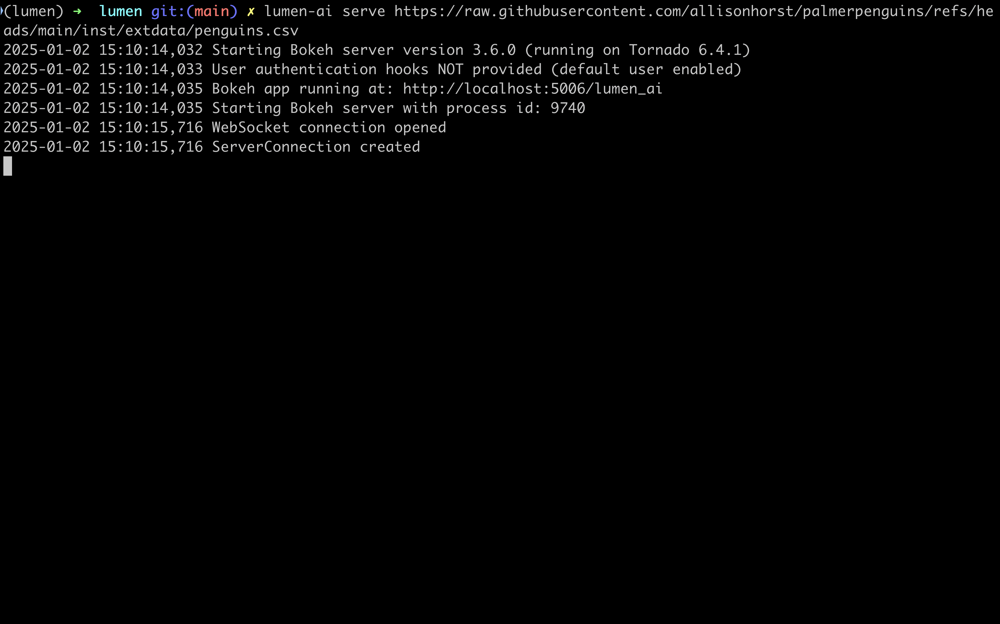
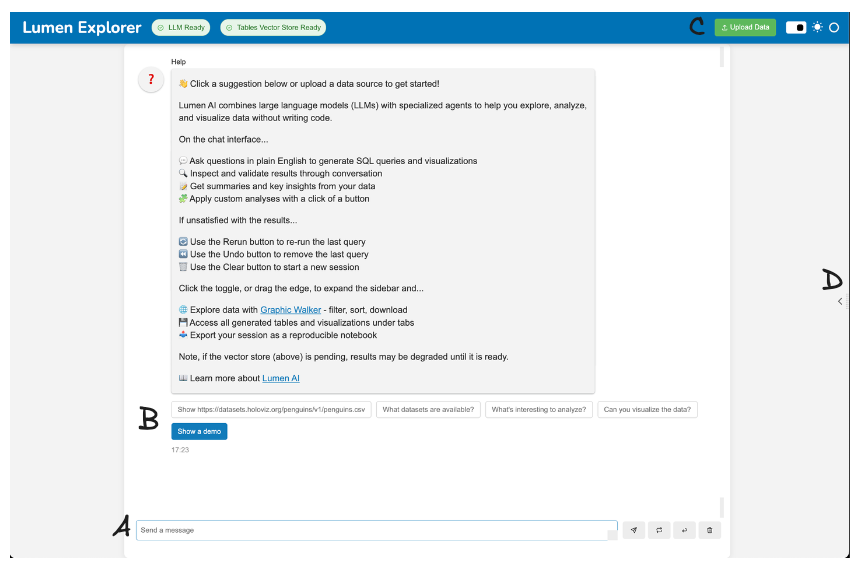
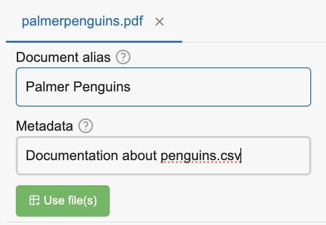
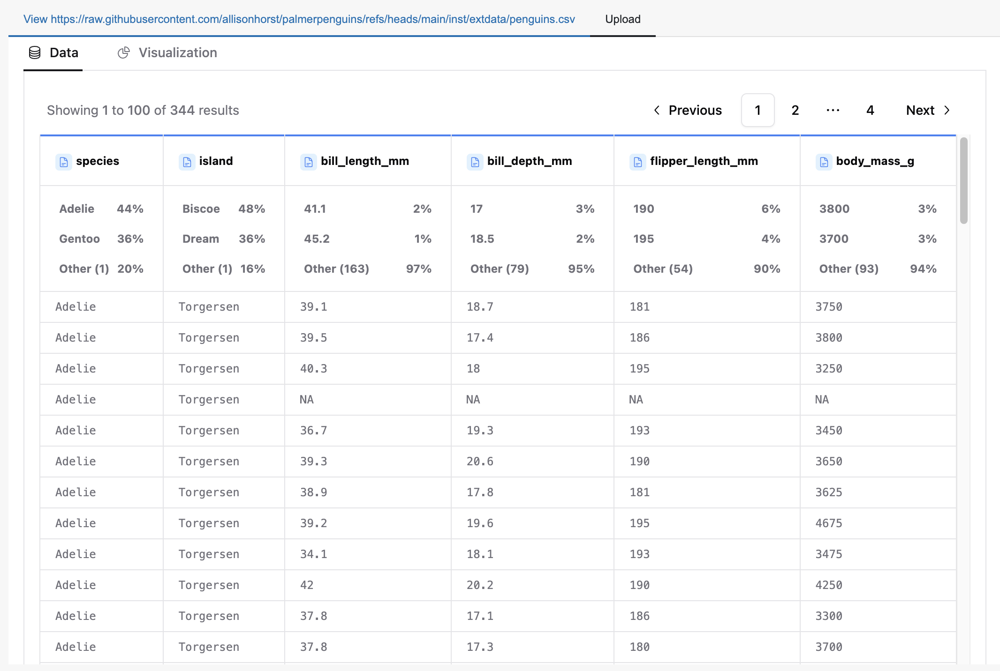
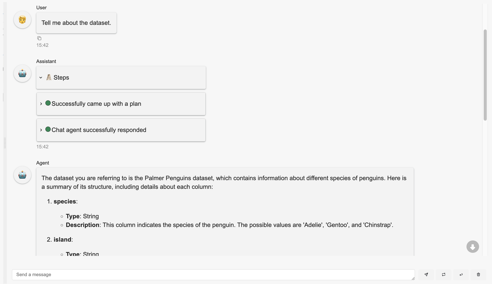
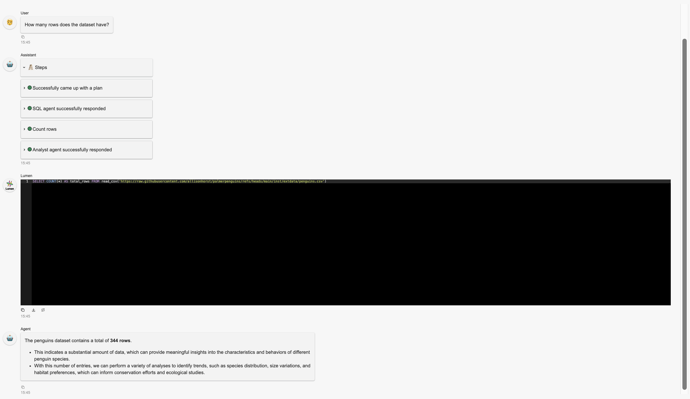
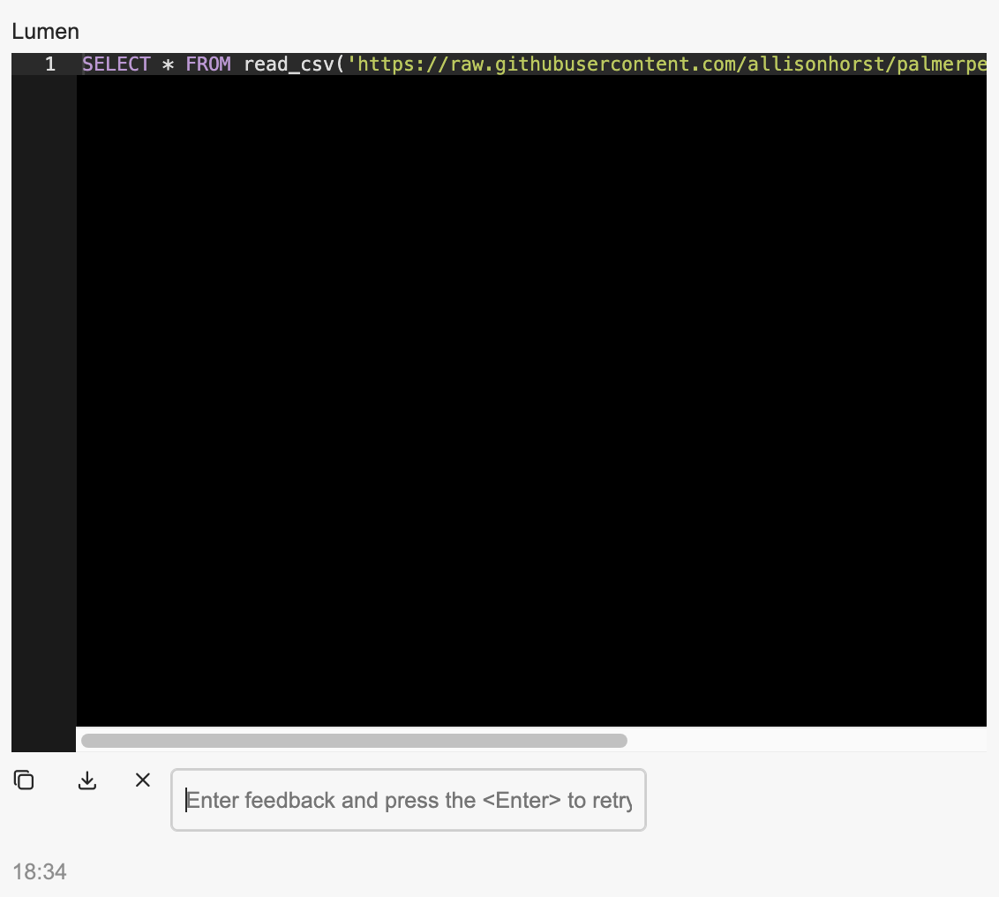
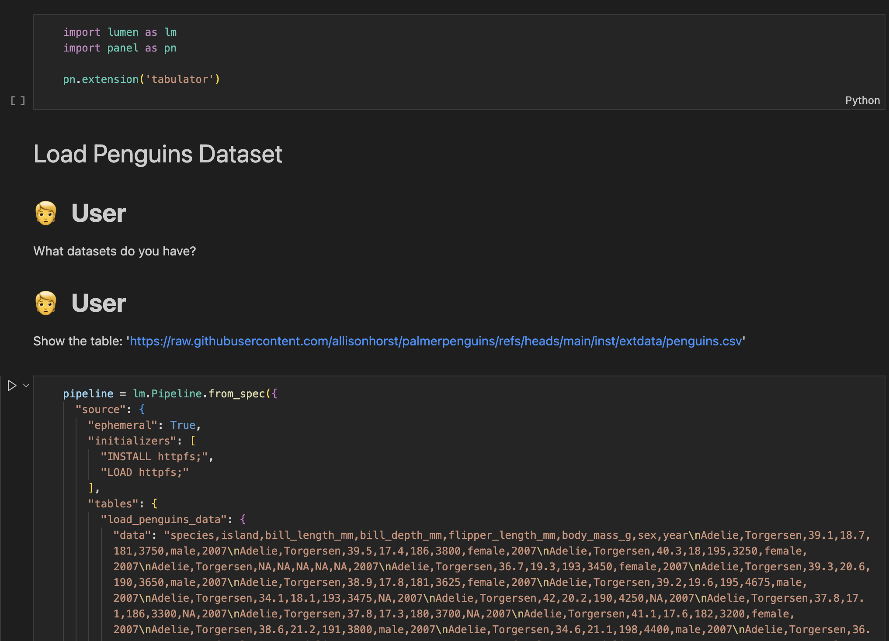

# {octicon}`zap;2em;sd-mr-1` Using Lumen AI

Powered by state-of-the-art large language models (LLMs), Lumen AI lets users chat with their tabular datasets, allowing users to explore and analyze their data without the need for complex programming or technical expertise.

## Quick Start

To get started with Lumen AI, users can launch the built-in chat interface through the command line interface (CLI) by calling:

```bash
lumen-ai serve
```

Alternatively users can launch the chat interface with a pre-loaded source. Here, we load the `penguins` dataset directly from the web:

```bash
lumen-ai serve https://raw.githubusercontent.com/allisonhorst/palmerpenguins/refs/heads/main/inst/extdata/penguins.csv
```

This will launch the chat interface on `localhost:5006`.



Upon loading the page, users have a few options to get started, but [Option D: Chat](#option-d-chat) is the main way to interact with the LLM--all the other options are supplementary.



### Option A: Upload Files

Upload additional files, such as datasets (CSVs, XLSX, Parquet, etc) and documents (DOCX, PDF, MD, etc), by dragging and dropping files or selecting them from the file browser.

Datasets will be loaded into the LLM's memory and can be referred to in the chat to generate insights and visualizations, while documents will be converted to text and indexed for search, allowing the LLM to refer to them to enrich its responses.



Upon uploading, a prompt will appear to ask the user to specify aliases for each file, and additionally metadata, if documents are uploaded. These aliases will be used to refer to the files in the chat while the metadata will be used to provide additional context to the LLMs on when to refer to the files.

### Option B: Explore Table(s)

If a dataset is available, whether pre-loaded or later uploaded, enter the name of the dataset and click "Explore table(s)".



This will allow users to create dynamic visualizations, analyze datasets, and build dashboards with [panel-graphic-walker](https://github.com/panel-extensions/panel-graphic-walker).

### Option C: Use Suggestions

Start a conversation with the LLM by selecting a suggestion button, such as "Tell me about the dataset."



Selecting a suggestion will automatically send the message, and the LLM will respond accordingly.

### Option D: Chat

Users can also type their own queries and send them to the LLM by pressing the "Send" button or pressing "Enter". This is the main way for the user to interact with the LLM.



The LLM will respond to the user's messages, providing insights, answering questions, and generating visualizations.

### Message Examples

Here are some ideas to get started with Lumen AI:

- "What datasets are available?"
- "Give me a summary of the dataset."
- "Show me the first 5 rows of the dataset."
- "What are the columns in the dataset?"
- "What is the distribution of the 'species' column?"
- "Show me a scatter plot of 'flipper_length_mm' vs 'body_mass_g'."

:::{admonition} Tip
:class: success

Unsure of what to ask? Ask the LLM "What could be interesting to explore?" to get inspired!
:::

It's also possible to combine multiple queries into a single message:

- "Group by 'species' and show me the average 'flipper_length_mm'. Then plot a bar chart of the result."
- "Filter the dataset for species 'Chinstrap' and calculate the median 'body_mass_g'. Then display and discuss the result."
- "Create a histogram of 'bill_length_mm' and a box plot of 'flipper_length_mm' side by side."
- "Add a new column calculating the ratio of 'flipper_length_mm' to 'body_mass_g'. Then plot a scatter plot of this ratio against 'bill_length_mm'."
- "Select records where 'body_mass_g' is greater than 3500 and 'flipper_length_mm' is less than 200. Then provide summary statistics for these filtered records."

:::{admonition} Tip
:class: success

If interested in what the LLM's chain of thoughts are, click on the chat steps' cards to expand them to see the LLM's reasoning.
:::

Each new computed result, i.e. derivation from the original sources, will result in a new "Exploration" tab, which can be accessed by clicking on the "Exploration" button.

### Output Refinement

Given the nature of the LLMs, the results may vary between runs, and the LLM may not always provide the desired results.

If the LLM is not providing the expected results, or if the user simply wants to provide an update or feedback:



- Press the retry icon and provide feedback to prompt the LLM to retry. Under the hood, this will provide all the previous messages, the last attempt's output, and the user's feedback, to the LLM, but also use a larger, more capable model to regenerate a response.
- Continue the conversation by sending a new message to the LLM. This will simply send the message to the LLM and receive a response, as usual.
- Manually correct the SQL query or Lumen specification to get the desired output by adding or removing lines, changing column names, etc. This will depend on the user's knowledge of SQL and Lumen specifications.

### Notebook Download

All interaction outputs can be exported by clicking the "Download Lumen_Explorer.ipynb" button located near the center. This action downloads a Jupyter notebook that can be executed to reproduce the results, provided the original sources and dependencies are available.

To export only the current exploration's output, click the "Download <exploration_slug>.ipynb" button in the top right corner.



The notebook comprises several cells:

- Markdown cells display user inputs and outputs from specific agents, such as `ChatAgent` and `AnalystAgent`.
- Code cells contain the Lumen specifications used to generate visualizations and tables.

## Command Line Interface

Below are some of the options that can be passed to the `serve` command, or run `lumen-ai serve --help` for all the available options.

### Source Tables

Users can specify datasets by passing file paths:

```bash
lumen-ai serve path/to/dataset.csv path/to/another/dataset.parquet
```

Wildcards are also supported:

```bash
lumen-ai serve path/to/datasets/*.csv
```

### LLM Providers

The desired LLM provider can be chosen by specifying the `--provider` option:

```bash
lumen-ai serve --provider mistral
```

Note the provider can be auto-detected from standard environment variable names, e.g. `OPENAI_API_KEY`, if the provider option is not specified.

### Agents

Additional agents can be provided with the `--agents` option:

```bash
lumen-ai serve --agents TableListAgent chatagent Sql
```

:::{admonition} Tip
:class: success

Within the CLI, the names of the agents are case insensitive and the suffix `agent` can be dropped, e.g. `ChatAgent` can be specified as `chatagent`, `Chatagent`, and `Chat`.
:::

## Python API

Users can also launch Lumen AI using the Python API:

```python
import lumen.ai as lmai

ui = lmai.ExplorerUI()
ui.servable()
```

Then, launch it by calling:

```bash
panel serve app.py
```

The benefit of using the Python API is that users have much more control in [configuring Lumen AI](configuring_lumen_ai).
