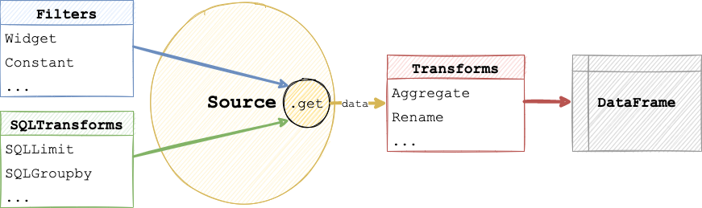

# Build a Pipeline in Python

```{admonition} What does this guide solve?
---
class: important
---
Although the primary interface for building a Lumen dashboard is the YAML specification file, this guide shows you an alternate approaches for building with Python. To learn more, visit the [Lumen in Python](../conceptual/lumen_python) Conceptual Guide.
```

## Overview

When building with Lumen in Python, the main object that defines a dashboard is the [`Pipeline`](../../reference/Pipeline). With this Pipeline object, you can specify the data source, filters, and transforms. There are two approaches to add these specifications to a `Pipeline` object, **declaratively or programmatically**. While the declarative approach is more compact, the programmatic approach allows you to seperate the pipeline creation steps.



## Declaratively specifying a pipeline

The declarative specification approach looks similar to a YAML file hierarchy, but consists of nested Python dictionary and list objects.

```{pyodide}
import lumen as lm

data_url = 'https://raw.githubusercontent.com/rfordatascience/tidytuesday/master/data/2020/2020-07-28/penguins.csv'

pipeline = lm.Pipeline.from_spec({
    'source': {
        'type': 'file',
        'tables': {
            'penguins': data_url
        }
    },
    'filters': [
        {'type': 'widget', 'field': 'species'},
        {'type': 'widget', 'field': 'island'},
        {'type': 'widget', 'field': 'sex'},
        {'type': 'widget', 'field': 'year'}
    ],
    'transforms': [
        {'type': 'aggregate', 'method': 'mean', 'by': ['species', 'sex', 'year']}
    ]
})
```

## Programmatically specifying a pipeline

The programmatic specification approach uses Lumen objects to build the pipeline step by step.

### Add source

First, add a valid `Source` to your `Pipeline`. A common choice is `FileSource`, which can load CSV, Excel, JSON and Parquet files, but see the [Source Reference](../architecture//source.html#:~:text=Source%20queries%20data.-,Source%20types%23,-class%20lumen.sources) for all options.

```{pyodide}
from lumen.sources import FileSource

data_url = 'https://raw.githubusercontent.com/rfordatascience/tidytuesday/master/data/2020/2020-07-28/penguins.csv'

pipeline = lm.Pipeline(source=FileSource(tables={'penguins': data_url}), table='penguins')
```

```{admonition} Preview the data
---
class: note
---
At any point after defining the source in your pipeline, you can inspect the data in a notebook with `pipeline.data`
```

```{pyodide}
pipeline.data.head()
```

### Add filter

Next, you can add `widgets` for certain columns of your source. When displaying the dashboard, these widgets will allows your dashboard users to filter the data. See the [Filter Reference](../architecture/filter) for all options.

```{pyodide}
pipeline.add_filter('widget', field='species')
pipeline.add_filter('widget', field='island')
pipeline.add_filter('widget', field='sex')
pipeline.add_filter('widget', field='year')
```

### Add transform

Now you can apply a `transform` to the data, such as computing the mean or selecting certain columns. See the [Transform Reference](../architecture/transform) for more.

```{pyodide}
columns = ['species', 'island', 'sex', 'year', 'bill_length_mm', 'bill_depth_mm']

pipeline.add_transform('columns', columns=columns)

pipeline.data.head()
```

```{admonition} Manually update dashboard
---
class: note
---
By default, every interaction will update the dashboard. If this behavior is unwanted, for instance, if you want to select multiple filter widgets and not have the dashboard update after every individual selection, set `auto_update=False` on the Pipeline. This will require you to manually trigger an update by clicking a button.
```

## Display the pipeline

Once you have built your pipeline it is extremely easy to view it interactively. As long as you have loaded the Panel extension with `pn.extension('tabulator')` simply displaying a `pipeline` in a notebook cell will render it:

```{pyodide}
import panel as pn

pn.extension('tabulator')

pipeline
```

If you are working in a local REPL or from a script you can also use `pipeline.show()` to preview it.

You can also easily render the control panel containing the filter widgets and variables separately:

```{pyodide}
pipeline.control_panel
```

## Related Resources

* [Branch a pipeline in Python](chain_python)
* [Build a dashboard in Python](../data_visualization/dashboard_python)
