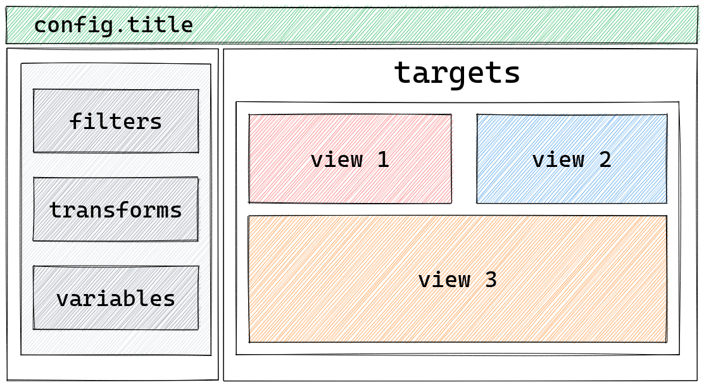

# How to define views

```{admonition} What does this guide solve?
---
class: important
---
This guide will show you how to define views on your dashboard
```

## Overview

A view is the final output of a dashboard, but to be able to create a view, at least one data [source](../../reference/source/index.md) is needed.
The following example source is a table containing data about individual penguins with various measurements.
This source could have been [filtered](../../reference/filter/index.md) or [transformed](../../reference/transform/index.md) but is omitted to keep the example simple.

The views are located in the `layouts` area and can take the form of various visual components.
Lumen includes many [view types](../../reference/view/index.md) and is built so that you can easily use components from the [Holoviz ecosystem](https://holoviz.org/), such as a [scatter plot from hvPlot](https://hvplot.holoviz.org/reference/pandas/scatter.html) or an [indicator from Panel](https://panel.holoviz.org/reference/index.html#indicators).



Below is an example of two views of the same data - a scatter plot and a table.

::::{tab-set}

:::{tab-item} YAML
:sync: yaml

```{code-block} yaml
---
emphasize-lines: 10-16
---
sources:
  penguin_source:
    type: file
    tables:
      penguin_table: https://raw.githubusercontent.com/rfordatascience/tidytuesday/master/data/2020/2020-07-28/penguins.csv

layouts:
  - title: Table
    source: penguin_source
    views:
      - type: hvplot
        table: penguin_table
        kind: scatter
        color: species
      - type: table
        table: penguin_table
```
:::

:::{tab-item} Python
:sync: python

```{code-block} python
---
emphasize-lines: 14
---
import panel as pn
from lumen.pipeline import Pipeline
from lumen.views import Table, hvPlotView

pn.extension("tabulator")

data_url = "https://raw.githubusercontent.com/rfordatascience/tidytuesday/master/data/2020/2020-07-28/penguins.csv"
pipeline = Pipeline.from_spec(
    {
        "source": {"type": "file", "tables": {"penguin_table": data_url}},
    }
)

pn.Column(hvPlotView(pipeline=pipeline), Table(pipeline=pipeline))
```

To arrange the Lumen dashboard views in Python, use [Panel](https://panel.holoviz.org/), as shown here.
:::

::::
