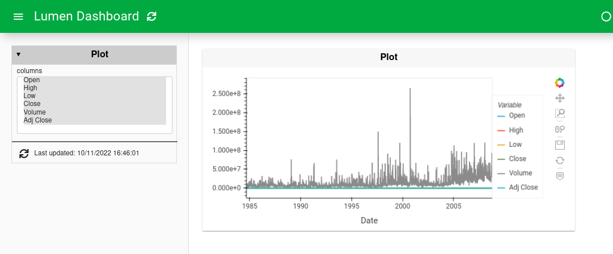
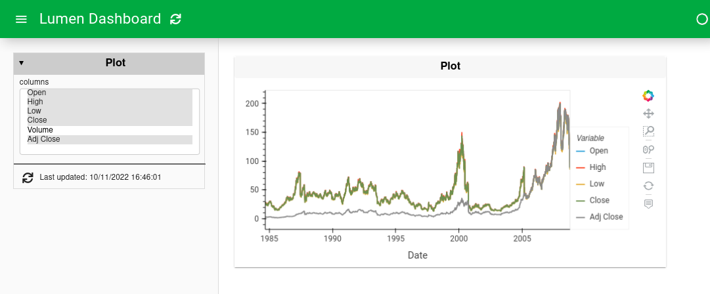
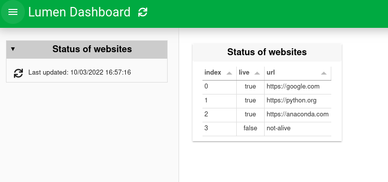
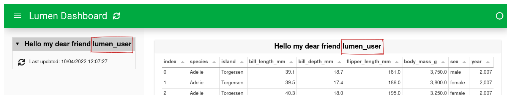
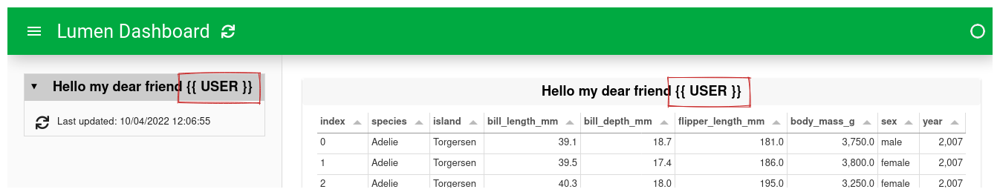
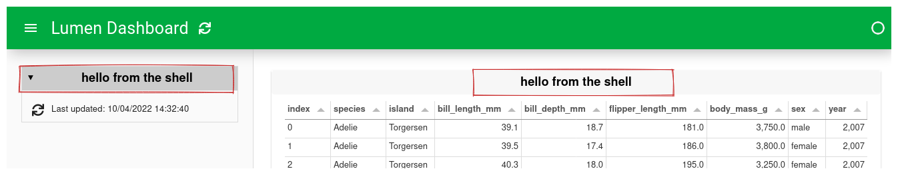

# How to use variables

```{admonition} What does this guide solve?
---
class: important
---
This guide shows you how to use one of the advanced features of Lumen: Variables.
```

## Overview

Variables are one of the most powerful features of Lumen. This guide will give you an overview of three different types of variables and how to reference them in the YAML specification.

## Variables

Variables give Lumen components a lot of flexibility. Variables can be defined in multiple ways. The simplest way to define a variable is in the variables block. When a variable is defined, it can be referenced throughout the rest of the specification. This is done by using `$variables.NAME`, where `NAME` is the unique name of the variable.

The data source is a remote dataset containing a `volume` column many magnitudes greater than the rest, making it impossible to see the other time series in the data. Removing `Volume` from the `columns` variable makes the other time series visible.

::::{tab-set}

:::{tab-item} YAML

```{code-block} yaml
---
emphasize-lines: 1-7, 24
---
variables:
  columns:
    type: widget
    kind: MultiSelect
    value: [Open,High,Low,Close,Volume,Adj Close]
    options: [Open,High,Low,Close,Volume,Adj Close]
    size: 7

sources:
  stock_data:
    type: file
    tables:
      ticker: https://raw.githubusercontent.com/matplotlib/sample_data/master/aapl.csv
    kwargs:
      index_col: Date
      parse_dates: [Date]

pipelines:
  ticker_pipe:
    source: stock_data
    table: ticker
    transforms:
      - type: columns
        columns: $variables.columns

layouts:
- title: Plot
  pipeline: ticker_pipe
  views:
    - type: hvplot
      table: ticker
```

:::

:::{tab-item} Preview - All columns

:::

:::{tab-item} Preview - Selected columns

:::

::::

## Sources as variables

Sources can also be used as a variable, below is a small example of this. The example consists of two sources:

1. The first is a CSV file with a single column containing different website URLs.
2. The second is a live source that checks whether the URLs from the first source are alive or dead.

::::{tab-set}

:::{tab-item} YAML

```{code-block} yaml
---
emphasize-lines: 7
---
sources:
  csv:
    type: file
    files: [websites.csv]
  live:
    type: live
    urls: $csv.websites.url

layouts:
- title: Status of websites
  source: live
  views:
    - type: table
```

:::

:::{tab-item} Preview

:::

:::{tab-item} websites.csv
```{code-block} csv
url
https://google.com
https://python.org
https://anaconda.com
not-alive
```
:::

::::

The reference to the variable is built up as:

1. The name of the source to reference, `csv` in this case.
2. The table's name `websites`, which is the filename without an extension.
3. Which column of the table to look at `url`.
4. Combine the last three parts, and you get the following variable `$csv.websites.url`.


## External variables (templating)

The last way to reference variables is by using external variables. There are six ways to do this, all of which use [Jinja2 templating](https://palletsprojects.com/p/jinja/) with the double curly brackets notation.

| Method               | How                    |
|----------------------|------------------------|
| Environment variable | `{{ env("USER") }}`    |
| Request cookies      | `{{ cookie("USER") }}` |
| Request header       | `{{ header("USER") }}` |
| OAuth user token     | `{{ oauth("USER") }}`  |

Furthermore, CLI arguments or shell commands can be used. See the sections below.

### Variables with the command line

To pass CLI arguments `--template-vars` should be used with `lumen serve`.

::::{tab-set}

:::{tab-item} YAML
```{code-block} yaml
---
emphasize-lines: 9
---
sources:
  source:
    type: file
    tables:
      table: https://raw.githubusercontent.com/rfordatascience/tidytuesday/master/data/2020/2020-07-28/penguins.csv

layouts:
- title: Hello my dear friend {{ USER }}
  source: source
  views:
    - type: table
      table: table
```

:::

:::{tab-item} Correct Preview
Ran with `lumen serve cli_example.yml --template-vars="{'USER': 'lumen_user'}"`

:::

:::{tab-item} Faulty Preview
Ran with `lumen serve cli_example.yml`

:::

::::


### Variables with a shell command

The shell command is done by `{{ shell(COMMAND) }}` and then uses the output of the command.
It is worth noting that the output will be trimmed of any trailing whitespace.
As a simple example, `echo` can be used as the shell command.

::::{tab-set}

:::{tab-item} YAML

```{code-block} yaml
---
emphasize-lines: 9
---
sources:
  source:
    type: file
    tables:
      table: https://raw.githubusercontent.com/rfordatascience/tidytuesday/master/data/2020/2020-07-28/penguins.csv

layouts:
- title: {{ shell("echo hello from the shell") }}
  source: source
  views:
    - type: table
      table: table
```

:::

:::{tab-item}  Preview

:::

::::

:::{admonition} Should I use `$` or `{{ }}` for reference?
---
class: tip
---
As a rule of thumb, internal variables are referenced with a starting dollar sign `$`, whereas external references use double curly brackets before and after `{{ }}`.
:::
