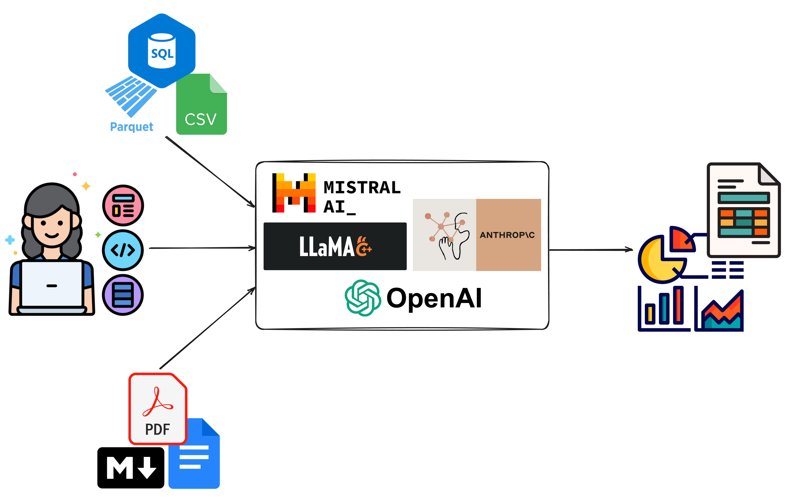

# Welcome to Lumen!



Lumen is a fully open-source and extensible agent based framework for chatting with data and for retrieval augmented generation (RAG). The declarative nature of Lumen's data model make it possible for LLMs to easily generate entire data transformation pipelines, visualizations and other many other types of output. Once generated the data pipelines and visual output can be easily serialized, making it possible to share them, to continue the analysis in a notebook and/or build entire dashboards.

- **Generate SQL**: Generate data pipelines on top of local or remote files, SQL databases or your data lake.
- **Provide context and embeddings**: Give Lumen access to your documents to give the LLM the context it needs.
- **Visualize your data**: Generate everything from charts to powerful data tables or entire **dashboards** using natural language.
- **Inspect, validate and edit results**: All LLM outputs can easily be inspected for mistakes, refined, and manually edited if needed.
- **Summarize results and key insights**: Have the LLM summarize key results and extract important insights.
- **Custom analyses, agents and tools**: Extend Lumen custom agents, tools, and analyses to generate deep insights tailored to your domain.

Lumen sets itself apart from other agent based frameworks in that it focuses on being fully open and extensible. With powerful internal primitives for expressing complex data transformations the LLM can gain insights into your datasets out-of-the box and can be further tailored with custom agents, analyses and tools to empower even non-programmers to perform complex analyses without having to code. The customization makes it possible to generate any type of output, allow the user and the LLM to perform analyses tailored to your domain and look up additional information and context easily. Since Lumen is built on [Panel](https://panel.holoviz.org) it can render almost any type of output with little to no effort, ensuring that even the most esoteric usecase is easily possible.

The declarative Lumen data model further sets it apart from other tools, making it easy for LLMs to populate custom components and making it easy for the user to share the results. Entire multi-step data transformation pipelines be they in SQL or Python can easily be captured and used to drive custom visualizations, interactive tables and more. Once generated the declarative nature of the Lumen specification allows them to be shared, reproducing them in a notebook or composing them through a drag-and-drop interface into a dashboard.

---

:::{figure} https://assets.holoviz.org/lumen/videos/intro.webm
Performing some exploration using Lumen AI.
:::

---

::::{grid} 1 2 2 4
:gutter: 1 1 1 2

:::{grid-item-card} {octicon}`desktop-download;2em;sd-mr-1` Installation
:link: installation
:link-type: doc

Install Lumen in a few easy steps
:::

:::{grid-item-card} {octicon}`zap;2em;sd-mr-1` Exploration with Lumen AI
:link: lumen_ai/getting_started/using_lumen_ai
:link-type: doc

How to explore your data with Lumen AI.
:::

:::{grid-item-card} {octicon}`tools;2em;sd-mr-1` Build a Lumen Spec dashboard
:link: lumen_spec/getting_started/build_dashboard
:link-type: doc

How to build a Lumen dashboard
:::

:::{grid-item-card} {octicon}`mortar-board;2em;sd-mr-1` Lumen Spec Core concepts
:link: lumen_spec/getting_started/core_concepts
:link-type: doc

Get an overview of the core concepts of Lumen
:::

:::{grid-item-card} {octicon}`git-commit;2em;sd-mr-1` Lumen Spec Data Pipelines
:link: lumen_spec/getting_started/pipelines
:link-type: doc

```{toctree}
:titlesonly:
:hidden:
:maxdepth: 2

installation
```

```{toctree}
:titlesonly:
:hidden:
:maxdepth: 1

lumen_ai/index
```

```{toctree}
:titlesonly:
:hidden:
:maxdepth: 1

lumen_spec/index
```

```{toctree}
:titlesonly:
:hidden:
:maxdepth: 2
:caption: Lumen

gallery/index
reference/index
background/index
```
