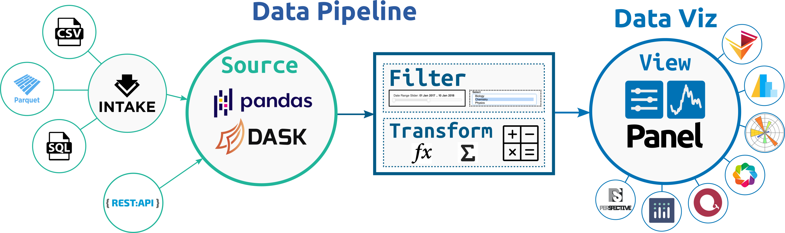

# Welcome to Lumen!



The Lumen project provides a framework for visual analytics, which allows users to build data-driven dashboards using a simple, yet highly expressive, declarative specification.

If you've used commerical BI tools you will know the pain of ensuring that the data is in the format required by the visualization components. When data is managed by different teams this means coordinating between teams and pushing the transformation into your database or data lake. Lumen aims to provide an highly extensible system around data intake, data processing and visualization that allows you to quickly iterate to gain insights in your data.

The power of Lumen comes from the ability to leverage the powerful data intake, data processing and data visualization libraries available in the PyData ecosystem.

- **Data Intake**: A flexible system for declaring data sources with strong integration with [Intake](https://intake.readthedocs.io/en/latest/), allows Lumen to query data from a wide range of sources including many file formats such as CSV or Parquet but also SQL and many others.
- **Data Processing**: Internally Lumen stores data as DataFrame objects, allowing users to leverage familiar APIs for filtering and transforming data using [Pandas](https://pandas.pydata.org/) while also providing the ability to scale these transformations out to a cluster thanks to [Dask](https://dask.org/) but also allows you to dynamically generate SQL queries to push the computation into your database.
- **Data Visualization**: Since Lumen is built on [Panel](https://panel.holoviz.org) all the most popular plotting libraries and many other components such as powerful datagrids and BI indicators are supported.

The core strengths of Lumen include:

- **Flexibility**: The design of Lumen allows flexibly combining data intake, data processing and data visualization into a simple declarative pipeline.
- **Extensibility**: Every part of Lumen is designed to be extended letting you define custom Source, Filter, Transform and View components.
- **Scalability**: Lumen is designed with performance in mind and supports scalable Dask DataFrames out of the box, letting you scale to datasets larger than memory or even scale out to a cluster.
- **Security**: Lumen ships with a wide range of OAuth providers out of the box, making it a breeze to add authentication to your applications.

Build reusable components to drive your visual analytics that can be reused even by team members who are not Python experts.

## Examples

::::{grid} 2 2 5 5
:gutter: 1

:::{grid-item-card} London Bike Points
:link: gallery/bikes
:link-type: doc

```{image} ./_static/bikes.png
```
:::

:::{grid-item-card} NYC Taxi
:link: gallery/nyc_taxi
:link-type: doc

```{image} ./_static/nyc_taxi.png
```
:::

:::{grid-item-card} Penguins
:link: gallery/penguins
:link-type: doc

```{image} ./_static/penguins.png
```
:::

:::{grid-item-card} Precipitation
:link: gallery/precip
:link-type: doc

```{image} ./_static/precip.png
```
:::

:::{grid-item-card} Seattle Weather
:link: gallery/seattle
:link-type: doc

```{image} ./_static/seattle.png
```
:::

::::

## Architecture

Lumen is organized into a small number of simple object types which can be easily subclassed and extended:

* `Source`: A `Source` provides any number of tables along with a JSON schema describing the contents of those tables.
* `Filter`: A `Filter` object is given the schema of a field in one of the tables and generates queries which filter the data supplied by a `Source`.
* `View`: A `View` can query a table from a `Source` and generates a viewable representation.
* `Transform`: A `Transform` can apply arbitrary transformation to the tables.

```{toctree}
---
hidden: true
---
Home <self>
Getting Started <getting_started/index>
How to <how_to/index>
Reference <reference/index>
Background <background/index>
Gallery <gallery/index>
```
