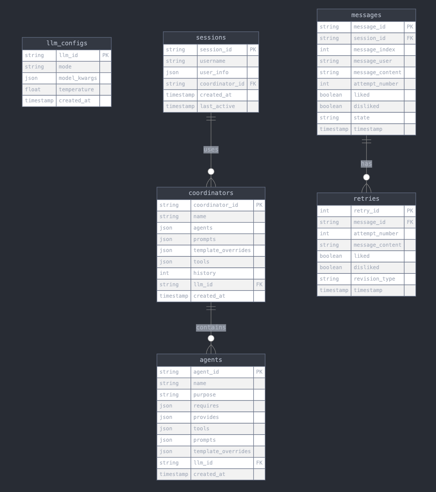

# Adding Telemetry

This guide explains how to add telemetry capabilities to your Lumen AI applications using the `ChatLogs` class.

## Overview

The `ChatLogs` class provides a comprehensive system for tracking and analyzing interactions in Lumen AI applications. It stores data in a SQLite database that you can query for insights into performance, usage patterns, and quality of AI responses.

Key capabilities:

- Message tracking (including revisions and feedback)
- Session metrics (duration, response times, etc.)
- Configuration logging (LLMs, agents, coordinators)
- Historical data analysis

## Integration Example

Here's how to activate telemetry in your Lumen AI app:

```python
from lumen.ai.ui.explorer import ExplorerUI

# Quick integration for ExplorerUI
lmai.ExplorerUI(
    logs_db_path="lumen.db",
).servable()
```

## Telemetry Data & Analysis

The `ChatLogs` system automatically tracks various metrics about your app's usage.



Here's how to access and interpret this data.

### Messages & Message History

**Description**: Track all messages exchanged in a session, including user queries, system messages, and AI responses. Message history lets you see how messages were revised over time.

**Access Method**:

```python
# Get all messages from a session
messages_df = chat_logs.view_messages(session_id)

# Get message revision history
history_df = chat_logs.view_message_history(message_id)
```

**Example Output**:

Messages in a Session:

| message_id | message_index | message_user | message_content (truncated) | attempt_number | liked | disliked | state | timestamp |
|------------|---------------|--------------|----------------------------|----------------|-------|----------|-------|-----------|
| 5627391168 | 0 | Help | Welcome to LumenAI; get started by... | 0 | 0 | 0 | initial | 2025-02-24 19:14:35 |
| 5800069216 | 1 | System | Alert='Initializing LLM ⌛' | 0 | 0 | 0 | initial | 2025-02-24 19:14:36 |
| 5801311120 | 2 | User | What datasets are available? | 0 | 0 | 0 | initial | 2025-02-24 19:14:36 |
| 5800983344 | 3 | Assistant | # Steps## Plan with 1 steps created\nThe user... | 0 | 0 | 0 | initial | 2025-02-24 19:14:42 |
| 5804233104 | 4 | Lumen | # Table\n\|    \| Table... | 0 | 0 | 0 | initial | 2025-02-24 19:14:42 |
| 5554539888 | 5 | User | Can you show me the table | 0 | 0 | 0 | initial | 2025-02-24 19:16:15 |
| 5816383344 | 6 | Assistant | # Steps## Plan with 2 steps created\nThe user... | 0 | 0 | 0 | initial | 2025-02-24 19:16:28 |
| 5824469984 | 7 | Lumen | SQLOutput:\n```sql\nSELECT\n easting,\n nort... | 2 | 1 | 0 | edited | 2025-02-24 19:16:24 |
| 5900435328 | 8 | Agent | The dataset contains 72,357 rows and 29 column... | 0 | 1 | 0 | initial | 2025-02-24 19:16:28 |

Message Revision History:

| version | message_content (truncated) | liked | disliked | timestamp | revision_type |
|---------|----------------------------|-------|----------|-----------|---------------|
| 0 | SQLOutput:\n```sql\nSELECT\n *\nFROM READ_PAR... | 0 | 0 | 2025-02-24 19:16:37 | edited |
| 1 | SQLOutput:\n```sql\nSELECT\n p_cap\nFROM READ... | 0 | 0 | 2025-02-24 19:16:37 | edited |
| 2 | SQLOutput:\n```sql\nSELECT\n easting,\n north... | 1 | 0 | 2025-02-24 19:17:00 | edited |

States:

| State | Description |
|-------|-------------|
| `initial` | Default state for new messages when first created |
| `edited` | Message was manually edited by a user or agent |
| `reran` | The rerun button was clicked |
| `undone` | The undo button was clicked |
| `cleared` | The clear button was clicked |

### Session Information

**Description**: Get detailed metrics about a session, including duration, message counts, response times, and user engagement data.

**Access Method**:

```python
# Get metrics for a specific session
session_df = chat_logs.view_sessions(session_id)

# Get all sessions
all_sessions_df = chat_logs.view_sessions("all")
```

**Example Output**:

| session_id | username | coordinator_id | created_at | duration_s | user_msgs | asst_msgs | total_likes | avg_asst_resp_s |
|------------|----------|----------------|------------|------------|-----------|-----------|-------------|-----------------|
| 0x14f724 | anonymous | dfaa453b101ed3c8 | 2025-02-24 19:14:35 | 113 | 2 | 7 | 2 | 10 |

**Tracked Metrics**:

- Session duration (duration_s)
- Message counts (user_msgs, asst_msgs)
- User feedback (total_likes, total_dislikes)
- Response times (avg_asst_resp_s, min_asst_resp_s, max_asst_resp_s)
- User engagement metrics (avg_user_resp_s)
- Message modifications (edited_msgs, retried_msgs, undone_msgs)

### Agent & Coordinator Information

**Description**: Examine the architecture of your application by viewing the agents and their configurations within a coordinator.

**Access Method**:

```python
# View agents in a coordinator
agents_df = chat_logs.view_coordinator_agents(coordinator_id)
```

**Example Output**:

| agent_id | name | purpose (truncated) | requires | llm_id | llm_mode |
|----------|------|---------------------|----------|--------|----------|
| 87f99eeba9cb7f76 | TableListAgent | Renders a list of all availables tables... | [source] | fdf989bad3365960 | Mode.TOOLS |
| bcbf229f82e094a3 | ChatAgent | Chats and provides info about high level data... | [] | fdf989bad3365960 | Mode.TOOLS |
| c0ad2a193dc0d694 | DocumentListAgent | Renders a list of all availables documents... | [document_sources] | fdf989bad3365960 | Mode.TOOLS |

### Detailed Component Information

**Description**: Drill down into specific components to see their detailed configurations, including prompts, LLM settings, and dependencies.

**Access Method**:

```python
# Get detailed session information including nested objects
session_info = chat_logs.get_session_info(session_id)
session_info.pprint()  # Pretty print all details

# Drill down into specific components
coordinator_id = session_info.coordinator.coordinator_id
coordinator_config = chat_logs.get_coordinator_config(coordinator_id)

# Get LLM configuration
if session_info.coordinator and session_info.coordinator.llm:
    llm_id = session_info.coordinator.llm.llm_id
    llm_config = chat_logs.get_llm_config(llm_id)

# Get agent configurations
if session_info.coordinator and session_info.coordinator.agents:
    for agent in session_info.coordinator.agents:
        agent_id = agent.agent_id
        agent_config = chat_logs.get_agent_config(agent_id)
```

### Data Export

**Description**: Export telemetry data for analysis in external tools.

**Access Method**:

```python
import pandas as pd

# Export session data
sessions_df = chat_logs.view_sessions("all")
sessions_df.to_csv("sessions_export.csv")
```

## Advanced Usage

### Direct Integration with ChatLogs

You can also integrate with the ChatLogs class directly for more control:

```python
from lumen.ai.coordinator import Coordinator
from lumen.ai.logs import ChatLogs

# Setup
coordinator = Coordinator(...)
chat_logs = ChatLogs(filename="lumen_app.db")
session_id = chat_logs.register_coordinator(coordinator)

# In your message handlers
def on_user_message(message_data):
    chat_logs.upsert(
        message_id=message_data.id,
        session_id=session_id,
        message_index=message_data.index,
        message_user="User",
        message=message_data.content
    )

def on_assistant_message(message_data):
    chat_logs.upsert(
        message_id=message_data.id,
        session_id=session_id,
        message_index=message_data.index,
        message_user="Assistant",
        message=message_data.content
    )

# In your feedback handler
def on_message_feedback(message_id, liked=False, disliked=False):
    chat_logs.update_status(
        message_id=message_id,
        liked=liked,
        disliked=disliked
    )
```

### Log Messages

```python
# Log a user message
chat_logs.upsert(
    message_id="msg_123",
    session_id=session_id,
    message_index=0,
    message_user="User",
    message=user_message  # String or ChatMessage
)

# Log an assistant response
chat_logs.upsert(
    message_id="msg_124",
    session_id=session_id,
    message_index=1,
    message_user="Assistant",
    message=assistant_response
)
```

### Track Feedback and Revisions

```python
# Log a revised message
chat_logs.update_retry(
    message_id="msg_124",
    message=new_response
)

# Record user feedback
chat_logs.update_status(
    message_id="msg_124",
    liked=True,
    state="edited"
)
```
