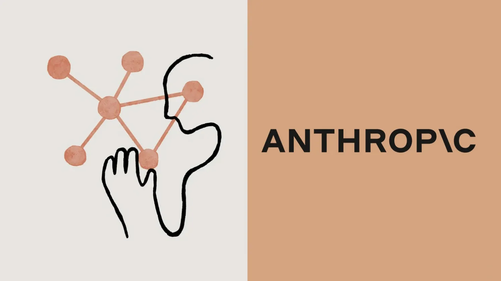

# Configuring LLM Providers

Lumen AI can use a wide range of LLM providers and different models. Discover how-to configure your favorite provider, either by running a model in the cloud or locally.

::::{grid} 1 2 2 3
:gutter: 1 1 1 2

:::{grid-item-card} Use OpenAI
:link: openai
:link-type: doc

Learn how to configure the OpenAI as the LLM provider used by Lumen AI.


:::

:::{grid-item-card} Use Mistral
:link: mistral
:link-type: doc

Learn how to configure the Mistral as the LLM provider used by Lumen AI.

:::

:::{grid-item-card} Use Anthropic
:link: anthropic
:link-type: doc

Learn how to configure the OpenAI as the LLM provider used by Lumen AI.

:::

:::{grid-item-card} Use Azure AI
:link: azure
:link-type: doc

Learn how to configure the Azure AI as the LLM provider used by Lumen AI.

:::

:::{grid-item-card} Use Llama.cpp
:link: llama_cpp
:link-type: doc

Learn how to configure the Llama.cpp as the LLM provider used by Lumen AI.

:::

:::{grid-item-card} Use OpenAI compatible endpoints
:link: endpoint
:link-type: doc

Learn how to configure the OpenAI as the LLM provider used by Lumen AI.
:::

::::

```{toctree}
---
hidden: true
---
openai
mistral
anthropic
azure
endpoint
llama_cpp
```
