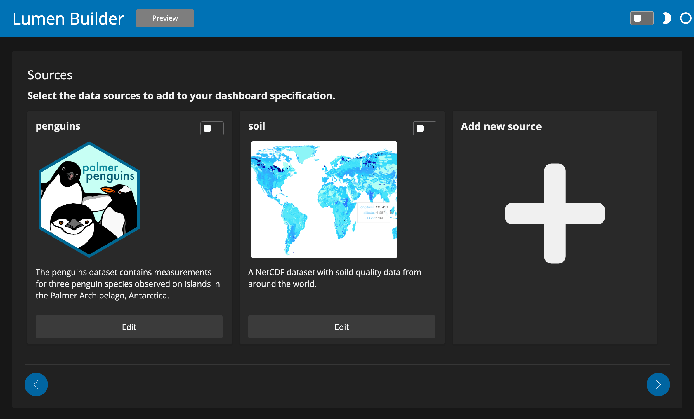
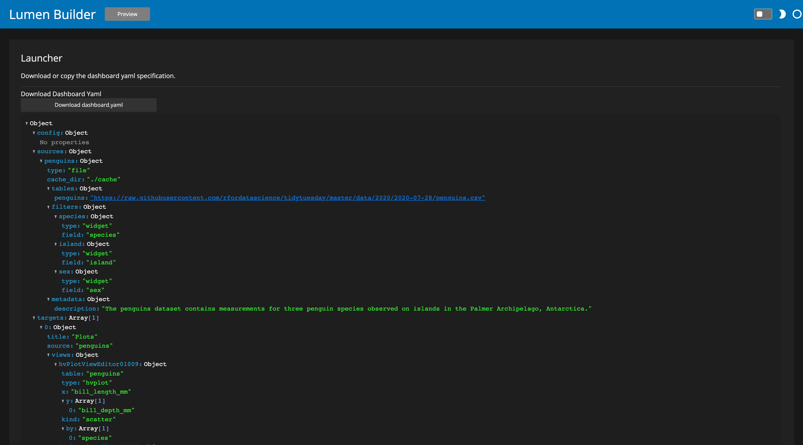

# UI

The Builder UI for Lumen makes it possible to build entire dashboards using a visual UI. The Builder is highly configurable and can be pre-populated with existing dashboards and pre-defined components, making it easy to edit or assemble a new dashboard using data sources, views, filters and variables that have already been set up.

## Launching the Builder UI

To launch into the builder UI you simply run:

```bash
lumen builder
```

in the directory where you have placed your [configuration](configuration.md).

## Step-by-step

This step-by-step guide will take you through the process of building a dashboard with the Builder UI.

### Dashboard Gallery

When you open up the Builder the first thing you will be greeted with is the dashboard gallery. This will allow you to either pick an existing dashboard template that you want to modify OR start by creating a completely new dashboard.

:::{figure-md} dashboard-gallery


The Dashboard gallery provides an overview of pre-defined dashboards and the ability to start with a new completely new template.
:::

Once you have selected either an existing dashboard or decided to create on from scratch you are launched into the builder pipeline.

### Config Editor

The Config editor lets you control high-level configuration options for your new dashboard such as the title, logo, template and theme.

:::{figure-md} config-editor


The Config editor includes a number of fields such as the title, logo, template and theme for your new dashboard.
:::

:::{admonition} Tip
:class: success

If you are unsure what a particular configuration option or parameter does try hovering over the widget to see additional explanation.
:::

### Variable Editor

The `Variable` editor is the first step that lets you declare actual components for your dashboard. Declaring components for your dashboard usually follows the same steps, either select pre-configured components or declare the type and name of a new component and then use the widget forms that are created to configure the new component. Variable definitions are useful to set up all kinds of dynamic behaviors in your dashboards, whether it is simply to fetch credentials of your data sources from an environment variable or to declare widgets that will let you dynamically control updates to various other components.

:::{figure-md} variable-editor


The Variable editor allows selecting, adding and removing variables definitions from your dashboard.
:::

:::{admonition} Tip
:class: success

Throughout the Builder UI pre-configured sources can easily be added to your dashboard simply by enabling the toggle at the top-right of each gallery item.
:::

### Source Editor

The `Source` editor is an important step towards building your dashboard as it will declare all the data sources for your dashboard. You will have the choice to pick between pre-configured sources that have been defined on your Builder deployment or define your own source.

:::{figure-md} source-editor



The Source Editor display a gallery to add pre-configured sources or define a new source to be added to the dashboard.
:::

When editing a `Source` or defining a new one a modal will pop up that lets you define the parameters of the `Source` and preview the various tables returned by the source.

:::{figure-md} source-example


A preview of a `FileSource` that points to a CSV file of penguins.csv containing information about individual penguins collected by Palmer et al.
:::

### View Editor

Once you have defined your data sources it is time to declare some views to add to your dashboard. The `View` editor (much like the `Source and `Variable` editors before it) will let you either select existing pre-configured views or declare entirely new views.

:::{figure-md} view-editor


The View Editor display a gallery to add pre-configured views or define a new views to be added to the dashboard.
:::

When adding a new `View` or editing an existing one the familiar modal will pop up. One you have selected the `Source` and table that you want to create a `View` from, select the type of view you want to create, give it a name and then use the editor that opens to configure the parameters of your view. As an example, below we have created an `hvPlotView` using the hvPlot Explorer UI:

:::{figure-md} view-example


An example of declaring a new `hvPlotView` built using the hvPlot Explorer UI.
:::

### Layout Editor

The Layout editor allows configured one or more layout groups to be added to your dashboard.

:::{figure-md} layout-editor


In the layout editor you can add new layout groups or toggle existing layout groups to be included or not.
:::

When adding a new layout group a modal will pop up that will allow you to define a name for you new layout group and then select which views to include and how they should be arranged.

:::{figure-md} layout-example


Configuring a layout group containing two plots visualizing the penguins dataset.
:::

### Launcher

The launcher page is the final step in your journey towards declaring a dashboard. Depending on how your Lumen Builder deployment has been configured this will offer a number of options for either downloading the dashboard YAML specification, previewing it locally or deploying it.

:::{figure-md} launcher-gallery


The Launcher page display a list of deployment options. Here we see the option to either preview the dashboard locally or down the YAML specification.
:::

If we select the YAML launcher it will take us to a page that previews the YAML specification and offers a button to download it.

:::{figure-md} yaml-launcher



The YAML launcher component display a preview of the dashboard specification and allows you to download it.
:::

If we instead decide to preview it (and the Lumen Builder is running locally) it will pop up a new browser tab with a preview of the application we just built:

:::{figure-md} yaml-launcher


A preview of the dashboard that we built in this step-by-step guide.
:::


```{toctree}
---
hidden: true
---
configuration
```
