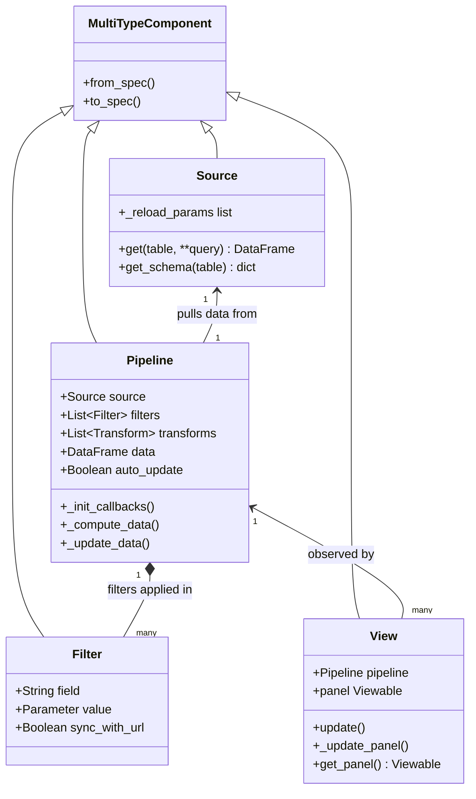
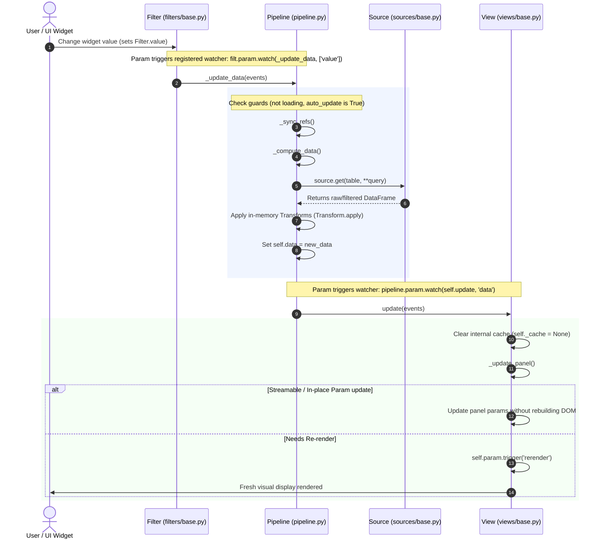

# Architecture and Internal Dataflow Guide

This document outlines the internal architecture of **Lumen**, the relationships between its primary core classes (`Source`, `Pipeline`, `Filter`, `View`), and the reactive lifecycle that drives component updates and UI re-rendering.

---

## 1. High-Level Architecture Overview

Lumen transforms raw data into interactive dashboards through a modular, declarative pipeline powered by [Param](https://param.holoviz.org/) and [Panel](https://panel.holoviz.org/).

The four core building blocks form a unidirectional dependency chain:

```
+---------------+        +------------------+        +-----------------+
|    Source     | -----> |     Pipeline     | -----> |      View       |
| (Data Intake) |        | (Reactive Engine)|        | (Visualization) |
+---------------+        +------------------+        +-----------------+
                                  ^
                                  |
                         +------------------+
                         |      Filter      |
                         |  (User Controls) |
                         +------------------+
```

### Component Roles & Responsibilities

| Component | Source File | Role | Key Methods & Attributes |
| :--- | :--- | :--- | :--- |
| **`Source`** | `lumen/sources/base.py` | Connects to external data systems (CSV, Parquet, SQL, REST APIs, memory) and fetches raw data tables and schemas. | `get(table, **query)`<br>`get_schema(table)`<br>`_reload_params` |
| **`Pipeline`** | `lumen/pipeline.py` | Orchestrates queries, applies filters and transforms, maintains state, and exposes reactive data streams. | `data` (param.DataFrame)<br>`_init_callbacks()`<br>`_update_data()`<br>`_compute_data()` |
| **`Filter`** | `lumen/filters/base.py` | Provides filtering constraints (often bound to UI widgets) that restrict rows or values queryable by the pipeline. | `value` (param.Parameter)<br>`field`<br>`panel` / `widget` |
| **`View`** | `lumen/views/base.py` | Visualizes the pipeline data as charts, indicators, or tables (hvPlot, HoloViews, Bokeh, Vega, etc.). | `pipeline`<br>`update()`<br>`_update_panel()`<br>`get_panel()` |

---

## 2. Component Class Relationships



1. **Source $\rightarrow$ Pipeline**: A `Pipeline` is instantiated with a target `source` and `table`. The pipeline queries the source schema on initialization and registers watchers on `source._reload_params`.
2. **Filter $\rightarrow$ Pipeline**: Filters are declared on or attached to a `Pipeline`. The pipeline binds callbacks to each filter's `value` parameter.
3. **Pipeline $\rightarrow$ View**: A `View` consumes a `Pipeline`. During `View.__init__`, the view registers an observer on `pipeline.param.data`. When `Pipeline.data` changes, `View.update()` is called automatically.

---

## 3. The Reactive Update Flow

The most critical workflow in Lumen is how a user interaction or parameter modification propagates through the system to re-render the view:

$$\text{Filter.value changes} \longrightarrow \text{Pipeline._init_callbacks triggers } \texttt{\_update\_data} \longrightarrow \text{Pipeline.data updates} \longrightarrow \text{View.update} \longrightarrow \text{Re-render}$$

### Detailed Sequence Diagram



### Deep-Dive: Code Step-by-Step

#### Step 1: Filter value changes
A user interacts with a widget, or code updates `filter.value`:
```python
# lumen/filters/base.py
class Filter(MultiTypeComponent):
    value = param.Parameter(doc="The current filter value.")
```

#### Step 2: Pipeline callback triggered
In `Pipeline.__init__`, `_init_callbacks()` connects filters and triggers to `_update_data`:
```python
# lumen/pipeline.py
def _init_callbacks(self):
    self.param.watch(self._update_data, ['filters', 'sql_transforms', 'transforms', 'table', 'update'])
    self.param.watch(self._sync_source, 'source')
    self._source_watcher = self.source.param.watch(self._update_data, self.source._reload_params)
    for filt in self.filters:
        filt.param.watch(self._update_data, ['value'])
    for transform in self.transforms + self.sql_transforms:
        transform.param.watch(self._update_data, list(transform.param))
```

#### Step 3: Pipeline recomputes data and assigns `self.data`
In `Pipeline._update_data`:
```python
# lumen/pipeline.py
@catch_and_notify
def _update_data(self, *events: param.parameterized.Event, force: bool = False):
    if self._update_widget is None or self._update_widget.loading:
        return
    if not force and not self.auto_update and not self.update:
        self._stale = True
        return

    self._update_widget.loading = True
    try:
        for f in self.filters + self.transforms + self.sql_transforms:
            f._sync_refs()

        new_data = self._compute_data()  # Queries Source and applies transforms
        self.data = new_data            # Assigns DataFrame param, firing Param events!
        self._stale = False
    finally:
        self._update_widget.loading = False
```

#### Step 4: View receives the change and updates
During `View.__init__`, the view registers an observer on `pipeline.param.data`:
```python
# lumen/views/base.py
class View(MultiTypeComponent, Viewer):
    def __init__(self, **params):
        ...
        if pipeline is not None:
            pipeline.param.watch(self.update, 'data')
            if self.loading_indicator:
                pipeline._update_widget.param.watch(self._update_loading, 'loading')
```

When `self.data` changes, `View.update()` runs:
```python
# lumen/views/base.py
def update(self, *events: param.parameterized.Event, invalidate_cache: bool = True):
    if invalidate_cache:
        self._cache = None
    stale = self._update_panel()
    self._initialized = True
    if stale:
        self.param.trigger('rerender')
```

---

## 4. Debugging Guide: "Why Didn't My View Update?"

When troubleshooting an unresponsive view or missing data updates, trace through this checklist of entry points in sequence:

| Checkpoint | What to inspect | Common Cause | Code Location |
| :--- | :--- | :--- | :--- |
| **1. Filter Watcher** | Did `filter.value` trigger? | Filter was added after pipeline initialization without `pipeline.add_filter()`. | `lumen/filters/base.py:Filter.value`<br>`lumen/pipeline.py:add_filter` |
| **2. Pipeline Gate** | Did `_update_data` exit early? | `pipeline.auto_update` is `False`, or pipeline is stuck in `loading=True`. | `lumen/pipeline.py:Pipeline._update_data` (line ~430) |
| **3. Source Retrieval** | Did `source.get()` return new data? | Source-level caching (`clear_cache`), or query conditions did not match. | `lumen/sources/base.py:Source.get`<br>`lumen/pipeline.py:_compute_data` |
| **4. In-place Mutation** | Was `self.data` assigned a new object? | Mutating `df` in-place (`df['x'] = ...`) may not fire Param change events if object identity is identical. Always assign a fresh copy. | `lumen/pipeline.py:Pipeline._update_data` |
| **5. View Registration** | Is `View.update` subscribed? | View was initialized without passing `pipeline`, or pipeline instance was reassigned without re-binding. | `lumen/views/base.py:View.__init__` (line ~216) |
| **6. Panel DOM Rerender** | Did `_update_panel()` trigger rerender? | `_update_panel()` returned `False` assuming in-place streaming or param update succeeded when a full rerender was required. | `lumen/views/base.py:View._update_panel`<br>`lumen/views/base.py:View.update` |

### Key Breakpoints for Debugging
1. **`lumen/pipeline.py:Pipeline._update_data`**: Set a breakpoint at the top of this method to see if the trigger event arrived from the filter.
2. **`lumen/pipeline.py:Pipeline._compute_data`**: Set a breakpoint here to verify what query was passed to `self.source.get()`.
3. **`lumen/views/base.py:View.update`**: Set a breakpoint here to ensure the pipeline successfully notified the view.
4. **`lumen/views/base.py:View._update_panel`**: Set a breakpoint to check whether the view updated its existing Panel pane or triggered a complete re-render.
    
