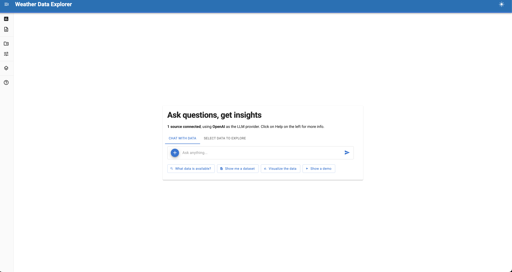

# :material-tune: Source Controls

**Source controls provide UI interfaces for loading data from external services.**

Controls let users interactively fetch data from APIs, databases, or specialized sources directly in the Lumen UI sidebar. They're essential for integrating external data that isn't available as static files or database connections.

## Why use source controls?

Source controls solve common data integration challenges:

- **External APIs** - Fetch data from REST APIs that require parameters or authentication
- **User selection** - Let users pick data subsets (years, regions, variables) before loading
- **Dynamic data** - Access real-time or frequently updated data sources
- **Complex workflows** - Handle multi-step data fetching and transformation
- **Authentication** - Manage API keys or credentials securely

## Built-in controls

| Control | Use for |
|---------|---------|
| `UploadControls` | Uploading local files (CSV, Excel, etc.) |
| `DownloadControls` | Fetching data from URLs or building custom controls |

## Key components

### Inherited from `BaseSourceControls`

| Component | Purpose |
|-----------|---------|
| `_error_placeholder` | Show error messages |
| `_message_placeholder` | Show success messages |
| `_progress_bar` | Loading indicator (or use `loading=True` on layout) |
| `_progress_description` | Progress text |
| `_count` | Counter for unique source names |
| `outputs` | Dict to store created sources |

### Required implementation steps

1. **Define parameters** - Use `param` types for user inputs
2. **Build UI** - Create widgets with Panel or Material-UI components
3. **Fetch data** - Use `asyncio.to_thread()` for blocking API calls
4. **Register source** - Create DuckDB source with `from_df()` 
5. **Update outputs** - Set `outputs` dict and trigger events

## Complete minimal example



```python
import asyncio
import pandas as pd
import panel as pn
import param
import lumen.ai as lmai
from datetime import date, timedelta
from lumen.ai.controls import DownloadControls
from lumen.sources.duckdb import DuckDBSource
from lumen.util import normalize_table_name
from panel_material_ui import Button, DatePicker, Column

pn.extension()


class WeatherControl(DownloadControls):
    """Fetch weather data from Iowa Environmental Mesonet."""
    
    start_date = param.Date(default=date.today() - timedelta(days=7))
    end_date = param.Date(default=date.today())
    
    label = '<span class="material-icons">wb_sunny</span> Weather Data'
    
    def __init__(self, **params):
        super().__init__(**params)
        
        self._start_picker = DatePicker.from_param(
            self.param.start_date, 
            label="Start Date"
        )
        self._end_picker = DatePicker.from_param(
            self.param.end_date,
            label="End Date"
        )
        self._fetch_button = Button(
            label="Fetch Weather Data",
            on_click=self._on_fetch
        )
        self._layout = Column(
            self._start_picker,
            self._end_picker,
            self._fetch_button
        )
    
    async def _on_fetch(self, event):
        """Fetch weather data from API."""
        with self._layout.param.update(loading=True):
            await asyncio.sleep(0.01)
            
            # Build API URL
            url = (
                f"https://mesonet.agron.iastate.edu/cgi-bin/request/daily.py?"
                f"stations=OAK&"
                f"sts={self.start_date.strftime('%Y-%m-%d')}&"
                f"ets={self.end_date.strftime('%Y-%m-%d')}&"
                f"network=CA_ASOS&format=csv"
            )
            
            # Fetch data
            df = await asyncio.to_thread(pd.read_csv, url)
            
            if df is not None and not df.empty:
                await self._add_table(df)
                self.param.trigger("upload_successful")
    
    async def _add_table(self, df):
        """Register DataFrame as DuckDB source."""
        table_name = normalize_table_name(
            f"weather_{self.start_date}_{self.end_date}"
        )
        source = DuckDBSource.from_df(tables={table_name: df})
        source.tables[table_name] = f"SELECT * FROM {table_name}"
        
        self.outputs["source"] = source
        self.outputs["sources"] = self.outputs.get("sources", []) + [source]
        self.outputs["table"] = table_name
        self.param.trigger("outputs")
    
    def __panel__(self):
        return self._layout


ui = lmai.ExplorerUI(
    source_controls=[WeatherControl],
    title="Weather Data Explorer",
)
ui.servable()
```

This example fetches real weather data from the Iowa Environmental Mesonet for Oakland, CA. Users can select date ranges and immediately query the data with natural language.

## Best practices

- **Use `asyncio.to_thread()`** instead of `run_in_executor()` for blocking calls
- **Show loading state** with `loading=True` on the layout or use progress bars
- **Handle errors gracefully** and display messages to users
- **Add metadata** to sources to help LLM agents understand the data
- **Validate inputs** before making expensive API calls
- **Cache API responses** when possible to avoid redundant calls
- **Normalize table names** with `normalize_table_name()` to ensure DuckDB compatibility
- **Use dynamic table names** that include parameters for clarity
- **Bind widgets with `from_param()`** for cleaner code

## See also

- [Data Sources](sources.md) — File and database connections
- [Tools](tools.md) — Custom functions for agents
- [Building a Census Data Explorer](../examples/tutorials/census_data_ai_explorer.md) — Complete walkthrough with minimal and full examples
