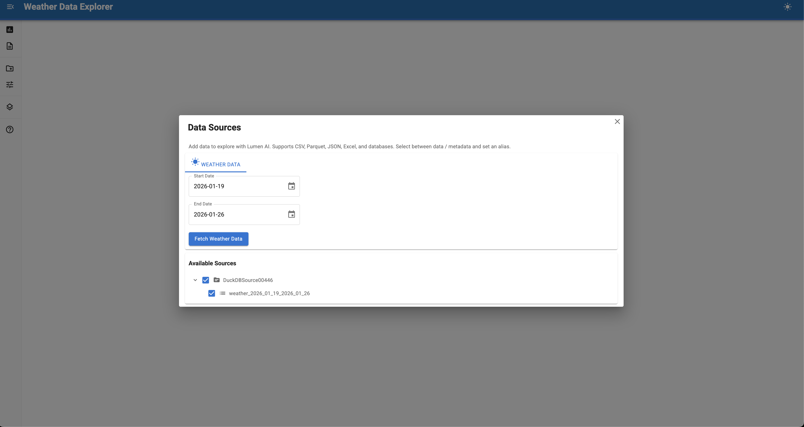

# :material-tune: Source Controls



**Source controls provide UI interfaces for loading data from external services.**

Controls let users interactively fetch data from APIs, databases, or specialized sources directly in the Lumen UI sidebar. They're essential for integrating external data that isn't available as static files or database connections.

### Why use source controls?

Source controls solve common data integration challenges:

- **External APIs** - Fetch data from REST APIs that require parameters or authentication
- **User selection** - Let users pick data subsets (years, regions, variables) before loading
- **Dynamic data** - Access real-time or frequently updated data sources
- **Complex workflows** - Handle multi-step data fetching and transformation
- **Authentication** - Manage API keys or credentials securely

Common use cases include:

- **Financial data APIs** (Federal Reserve, Yahoo Finance, etc.)
- **Weather and climate data** (NOAA, NASA, OpenWeather)
- **Scientific datasets** (genomics, astronomy, earth observation)
- **Government portals** (Census Bureau, Department of Labor)
- **Internal corporate APIs** and data warehouses

### Built-in controls

Lumen ships with a set of built-in source controls:

| Control | Type | Use for |
|---------|------|---------|
| `UploadSourceControls` | Concrete | Uploading local files (CSV, Excel, etc.) |
| `DownloadSourceControls` | Concrete | Fetching data from URLs (including Kaggle datasets) |
| `CodeSourceControls` | Concrete | Wrapping Python functions or object methods as data sources |
| `URLSourceControls` | Base class | Fetching data from URL templates |
| `RESTAPISourceControls` | Base class | Defining REST API endpoints manually |
| `OpenAPISourceControls` | Concrete | Auto-discovering endpoints from an OpenAPI spec |
| `CatalogSourceControls` | Base class | Browsing and loading from a pre-fetched dataset catalog |

`UploadSourceControls` stages selected files before processing. After selecting files, click `Upload file(s)` to process them, or `Clear selected` to reset the staged selection. `DownloadSourceControls` uses the inherited label, `Confirm file(s)`.

Both `UploadSourceControls` and `DownloadSourceControls` inherit from `FileSourceControls`, which classifies each file as either **data** or **metadata**:

- **Data files** (CSV, Parquet, Excel, GeoJSON, HTML, scientific formats, etc.) are parsed into DuckDB tables.
- **Metadata files** (`md`, `txt`, `yaml`, `yml`, `json`, `pdf`, `docx`, `doc`, `pptx`, `ppt`) or files whose name contains `_metadata`, `metadata_`, `readme`, or `schema` are added to the document vector store so the agent can retrieve their contents.

Extensions in both lists resolve to metadata, so a `.json` file is treated as metadata by default. For each file you can toggle between `data` and `metadata`, edit its table alias, and (for `.xlsx` files) pick the sheet to import.

#### Kaggle datasets

`DownloadSourceControls` can fetch datasets directly from Kaggle. Paste a Kaggle dataset URL into the URL input field:

```
https://www.kaggle.com/datasets/sharmajicoder/gen-z-social-media-usage-dataset
```

Each file in the dataset becomes a separate table in the same data source. This also works through the agent — users can ask the AI to load a Kaggle dataset by providing the URL.

Requires the `kagglehub` package:

```bash
pip install kagglehub
```

If `kagglehub` is not installed, the input placeholder stops advertising Kaggle URLs, and pasting one returns a message telling you to install the package.

### Creating custom controls

Custom controls inherit from `BaseSourceControls` and override two hooks:

| Hook | Purpose |
|------|---------|
| `_load()` | **Main hook** - fetch data and return a `SourceResult` |
| `_render_controls()` | Provide UI widgets (rendered above load button) |

The base class handles loading states, error display, progress, output registration, and event triggering automatically.

### Minimal example

```python
import asyncio

import param
import pandas as pd

import lumen.ai as lmai
from lumen.ai.controls import BaseSourceControls, SourceResult

from panel_material_ui import IntSlider, TextInput


class WeatherControl(BaseSourceControls):
    """Fetch weather data from an API."""

    station = param.String(default="NYC", doc="Weather station code in New York")
    year = param.Integer(default=2024, bounds=(2020, 2024))

    label = '<span class="material-icons">wb_sunny</span> Weather Data'
    load_button_label = "Fetch Weather"

    def _render_controls(self):
        """Provide widgets - rendered above the load button."""
        return [
            TextInput.from_param(self.param.station, label="Station", sizing_mode="stretch_width"),
            IntSlider.from_param(self.param.year, label="Year", sizing_mode="stretch_width"),
        ]

    async def _load(self) -> SourceResult:
        """Main hook - fetch data and return result."""
        self.progress("Fetching weather data...")

        url = (
            f"https://mesonet.agron.iastate.edu/cgi-bin/request/daily.py?"
            f"stations={self.station}&sts={self.year}-01-01&ets={self.year}-12-31&network=NY_ASOS&format=csv"
        )
        df = await asyncio.to_thread(pd.read_csv, url)
        if df.empty:
            return SourceResult.empty("No data returned")

        return SourceResult.from_dataframe(
            df,
            table_name=f"weather_{self.year}",
            year=self.year,
            source="mesonet_api",
            station=self.station,
        )


ui = lmai.ExplorerUI(source_controls=[WeatherControl])
ui.servable()
```

### SourceResult

`SourceResult` is the return type for `_load()` with convenient factory methods:

```python
# From a DataFrame (most common)
SourceResult.from_dataframe(df, "table_name", year=2023, source="api")

# From an existing DuckDB source
SourceResult.from_source(my_source, table="users")

# Empty result (no data loaded)
SourceResult.empty("No data returned from API")
```

### Progress reporting

The `self.progress()` helper provides a simple API:

```python
# Indeterminate (spinner)
self.progress("Loading metadata...")

# Determinate with percentage (0-100)
self.progress("Downloading...", value=50)

# Determinate with current/total (auto-calculates %)
self.progress("Downloading...", current=500, total=1000)

# Increment pattern for loops
self.progress("Processing files...", total=len(files))
for f in files:
    process(f)
    self.progress.increment()

# Clear progress
self.progress.clear()
```

### Class attributes

Customize appearance with class attributes:

| Attribute | Default | Purpose |
|-----------|---------|---------|
| `label` | `""` | HTML label shown in sidebar |
| `load_button_label` | `"Load Data"` | Button text |
| `load_button_icon` | `"download"` | Material icon name |
| `load_mode` | `"button"` | `"button"` or `"manual"` |

### Manual load mode

For controls where loading is triggered by something other than a button (like clicking a table row), use `load_mode="manual"`:

```python
class CatalogBrowser(BaseSourceControls):
    """Browse and select from a catalog."""

    load_mode = "manual"  # No load button

    def __init__(self, **params):
        super().__init__(**params)
        self._layout.loading = True  # Show spinner during init
        pn.state.onload(self._load_catalog)

    def _render_controls(self):
        self._table = Tabulator(on_click=self._on_click, ...)
        return [self._table]

    def _load_catalog(self):
        self._table.value = fetch_catalog()
        self._layout.loading = False

    async def _on_click(self, event):
        # Use _run_load() for lifecycle management
        await self._run_load(self._fetch_row(event.row))

    async def _fetch_row(self, row_idx) -> SourceResult:
        self.progress("Downloading...")
        data = await download(row_idx)
        return SourceResult.from_dataframe(data, "selected_data")
```

### Progressive disclosure and reactive updates

For complex controls, you may want to update options dynamically (e.g., changing the available years when a dataset is selected). Use `param.depends` with `watch=True`:

```python
@param.depends("dataset", watch=True)
def _update_year_options(self):
    new_options = fetch_years_for_dataset(self.dataset)
    self._year_select.options = new_options
```

### Best practices

- **Use `asyncio.to_thread()`** for blocking API calls to avoid freezing the UI
- **Report progress** with `self.progress()` for long operations
- **Return `SourceResult.empty()`** with a message when no data is available
- **Add metadata** to help LLM agents understand the data context
- **Validate inputs** before making expensive API calls
- **Cache API responses** when possible to avoid redundant calls
- **Use `normalize_table_name()`** to ensure DuckDB-compatible table names

## Catalog controls

`CatalogSourceControls` is a base class for controls that browse a pre-fetched catalog of datasets, letting users click a row to ingest that dataset. The `SourceAgent` can search and load entries from a natural-language query out of the box, using keyword matching over `search_columns`. Passing a `vector_store` embeds the entries in the background and upgrades that search to semantic matching.

Subclasses implement three methods:

| Method | Purpose |
|--------|---------|
| `_load_catalog()` | Fetch the catalog `DataFrame` once on session load |
| `_fetch_entry(entry)` | Download and process a single catalog entry, returning a `SourceResult` |
| `_entry_to_text(entry)` | (Optional) text representation used for vector embedding (defaults to joining `search_columns`) |

Class-level attributes configure the `Tabulator` browser:

| Attribute | Purpose |
|-----------|---------|
| `display_columns` | `{col: {"title": ..., "width": ..., "formatter": ...}}` |
| `filter_columns` | `{col: header_filter config}` for column filtering |
| `search_columns` | Column names concatenated for vector embedding |
| `detail_columns` | Column names shown in the expanded row detail view |

Semantic search is enabled separately by passing a `vector_store` to the constructor, as with every other control.

The catalog is fetched via `pn.state.onload`, so these controls only populate inside a served Panel session (`panel serve`), not in a plain script or notebook.

```python
import pandas as pd

from lumen.ai.controls import CatalogSourceControls, SourceResult
from lumen.util import normalize_table_name


class CensusCatalogControls(CatalogSourceControls):
    display_columns = {
        "name": {"title": "Dataset"},
        "year": {"title": "Year"},
    }
    search_columns = ["name", "description"]
    detail_columns = ["description", "url"]

    async def _load_catalog(self) -> pd.DataFrame:
        return await fetch_catalog()

    async def _fetch_entry(self, entry: pd.Series) -> SourceResult:
        df = await download(entry["url"])
        return SourceResult.from_dataframe(df, normalize_table_name(entry["name"]))
```

Agents ingest a dataset by searching the catalog via the control's tool exposed through `as_tools()`.

## Parametric controls

For common patterns like wrapping Python functions, fetching from URL templates, or calling REST endpoints, Lumen provides higher-level controls that handle widget generation automatically. These build on `ParametricSourceControls`, which renders widgets from function signatures or class-level parameters and exposes the same inputs to the `SourceAgent`.

### CodeSourceControls

Wrap Python functions or object methods as data sources. Signatures are introspected to generate widgets automatically.

**Pattern 1: Wrap standalone functions**

```python
from lumen.ai.controls import CodeSourceControls

def download_census_data(
    dataset: str = "acs/acs5",
    vintage: int = 2022,
    state: str = "*",
) -> pd.DataFrame:
    """Download Census data for US geographies."""
    import censusdis.data as ced
    return ced.download(dataset=dataset, vintage=vintage, state=state)

controls = CodeSourceControls(
    functions={"Download Census Data": download_census_data},
    table_name="census_data",
)
```

**Pattern 2: Wrap object methods**

```python
from massive import RESTClient

client = RESTClient(api_key=os.environ["MASSIVE_API_KEY"])

controls = CodeSourceControls(
    instance=client,
    methods=["list_aggs", "get_last_trade", "get_ticker_details"],
    table_name="prices",
)
```

**Customizing parameters with `param_overrides`**

Replace auto-detected parameter types with custom widgets.

```python
import param

controls = CodeSourceControls(
    instance=client,
    methods=["list_aggs"],
    param_overrides={
        "list_aggs": {
            # Full replacement with param.Selector
            "ticker": param.Selector(
                default="AAPL",
                objects=["AAPL", "MSFT", "NVDA", "GOOGL"],
            ),
            "timespan": param.Selector(
                default="day",
                objects=["minute", "hour", "day", "week"],
            ),
            # Dict merge for simple overrides
            "multiplier": {"default": 1, "bounds": (1, 100)},
            "limit": {"default": 5000, "bounds": (1, 50000)},
        },
    },
    skip_params=frozenset({"self", "cls", "return", "raw", "params"}),
)
```

| Parameter | Purpose |
|-----------|---------|
| `instance` | Object whose methods to expose |
| `methods` | List of method names to expose |
| `functions` | Single callable or `{name: callable}` dict |
| `param_overrides` | `{action_key: {param: override}}` &mdash; `action_key` is the method name (or function/dict key); override is a `param.Parameter` or dict of kwargs |
| `skip_params` | Parameter names to exclude from UI |
| `table_name` | Default table name for results |

### URLSourceControls

Subclass to fetch data from URL templates. Parameters declared as class attributes become UI widgets, and their values are interpolated into the URL.

```python
import datetime
import param
from lumen.ai.controls import URLSourceControls

class MesonetDailyControls(URLSourceControls):
    """Fetch daily weather observations from Iowa Environmental Mesonet."""

    url_template = (
        "https://mesonet.agron.iastate.edu/cgi-bin/request/daily.py"
        "?stations={stations}&network={network}&sts={sts}&ets={ets}&format=csv"
    )

    stations = param.String(default="SEA", doc="Station identifier(s)")

    network = param.Selector(
        default="WA_ASOS",
        objects=["CA_ASOS", "IL_ASOS", "NY_ASOS", "WA_ASOS"],
    )

    sts = param.CalendarDate(
        default=datetime.date.today() - datetime.timedelta(days=7),
        doc="Start date",
    )

    ets = param.CalendarDate(
        default=datetime.date.today() - datetime.timedelta(days=1),
        doc="End date",
    )

    label = '<span class="material-icons">thermostat</span> Weather Data'
```

**Preprocessing parameters**

Override `_fetch_data` to transform user input before the URL is built:

```python
class MesonetDailyControls(URLSourceControls):
    # ... params as above ...

    async def _fetch_data(self, action_name: str, **params) -> SourceResult:
        # IEM uses 3-letter FAA codes; strip ICAO 'K' prefix users often add
        raw = params.get("stations", "")
        params["stations"] = ",".join(
            s[1:] if len(s) == 4 and s.startswith("K") else s
            for s in (t.strip() for t in raw.split(","))
        )
        return await super()._fetch_data(action_name, **params)
```

| Class attribute | Purpose |
|-----------------|---------|
| `url_template` | URL with `{param_name}` placeholders |
| Class-level params | Become UI widgets; values interpolate into URL |
| `label` | HTML label in sidebar |

### RESTAPISourceControls

`RESTAPISourceControls` exposes manually-defined REST API endpoints. Each endpoint is described with `method`, `path`, `summary`, `description`, and `parameters`, and the control builds a callable (rendered as widgets) for each one.

```python
from lumen.ai.controls import RESTAPISourceControls

controls = RESTAPISourceControls(
    base_url="https://api.weather.gov",
    headers={"User-Agent": "MyApp/1.0"},
    endpoints={
        "Active Alerts": {
            "method": "get",
            "path": "/alerts/active",
            "description": "Fetch currently active alerts",
            "parameters": [
                {"name": "area", "in": "query", "type": "string",
                 "description": "State/territory code"},
                {"name": "status", "in": "query", "type": "string",
                 "enum": ["actual", "exercise", "test"], "default": "actual"},
            ],
        },
    },
)
```

| Parameter | Purpose |
|-----------|---------|
| `base_url` | Root URL for all API requests |
| `headers` | Default HTTP headers sent with every request |
| `endpoints` | `{display_name: endpoint_spec}`; each spec has `method`, `path`, `summary`, `description`, `parameters` |

Endpoint parameters support `enum` (rendered as a dropdown), `required`, `default`, and `description`. The base class renders every parameter as a string; override `_resolve_param_type()` to map the `type` field onto real Python types, as `OpenAPISourceControls` does.

### OpenAPISourceControls

`OpenAPISourceControls` fetches an OpenAPI 3.x spec on session load, resolves `$ref` references, and registers every path/method pair as an action, with no manual endpoint definitions needed. Like `CatalogSourceControls`, it fetches via `pn.state.onload` and so only populates under `panel serve`.

```python
from lumen.ai.controls import OpenAPISourceControls

controls = OpenAPISourceControls(
    spec_url="https://api.weather.gov/openapi.json",
    headers={"User-Agent": "MyApp/1.0"},
    include_paths=["/alerts", "/points"],
    exclude_paths=["/icons"],
)
```

| Parameter | Purpose |
|-----------|---------|
| `spec_url` | URL of the OpenAPI JSON spec |
| `include_paths` | Only include paths matching these prefixes |
| `exclude_paths` | Exclude paths matching these prefixes |
| `base_url` | (Optional) override the base URL from the spec |

For a full walkthrough see [Building a Weather API Explorer](../examples/tutorials/weather_openapi_explorer.md).

### Using with SourceAgent

When you pass `source_controls` to `ExplorerUI`, the `SourceAgent` can invoke them programmatically based on user queries:

```python
from lumen.ai.agents import SourceAgent
from lumen.ai.ui import ExplorerUI

ui = ExplorerUI(
    agents=[SourceAgent()],
    source_controls=[MesonetDailyControls(), UploadSourceControls()],
)
```

The agent sees each control's actions as tools and can call them with appropriate parameters extracted from the user's question.

### See also

- [Building a Census Data Explorer](../examples/tutorials/census_data_ai_explorer.md) — Complete walkthrough with BaseSourceControls
- [Building a Weather Data Explorer](../examples/tutorials/mesonet_weather_explorer.md) — URLSourceControls tutorial with preprocessing
- [Building a Weather API Explorer](../examples/tutorials/weather_openapi_explorer.md) — OpenAPISourceControls tutorial with auto-discovered endpoints
- [Building a Stock Market Data Explorer](../examples/tutorials/massive_stock_explorer.md) — CodeSourceControls tutorial wrapping a Python SDK
