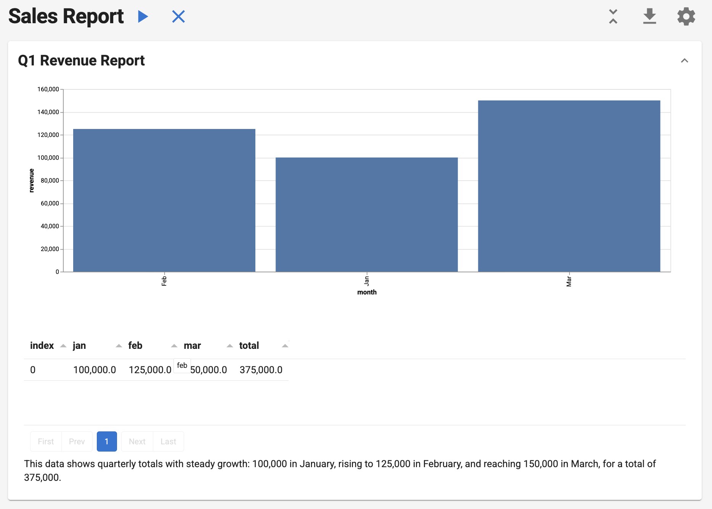
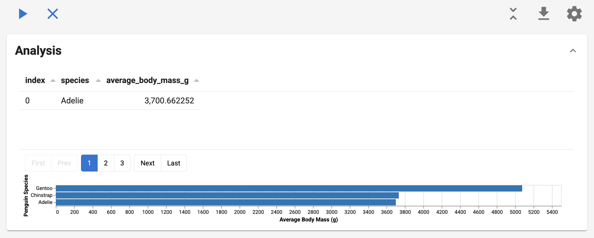

# :material-file-document: Reports



**One-click reproducible analytics that combine SQL precision with AI insights.**

Reports execute a sequence of tasks, pass data between them, and render as interactive documents. Each report can be executed, exported to notebooks, and deployed as a web application.

## Quick Start

Build your first report in minutes. This example loads a small dataset, composes a `Section` with a custom `Action` (for visualization) and a `SQLQuery` (for aggregation), passes results through shared context, and renders an interactive Vega-Lite chart. Run it locally, export to a notebook, or serve it as a web app.

```python
import pandas as pd
import panel as pn

from lumen.ai.llm import OpenAI
from lumen.ai.report import Action, Report, Section
from lumen.ai.actions import SQLQuery
from lumen.pipeline import Pipeline
from lumen.sources.duckdb import DuckDBSource
from lumen.views import VegaLiteView

pn.extension("vega")


class MonthlyRevenue(Action):
    async def _execute(self, context, **kwargs):
        df = pd.DataFrame({"month": ["Jan", "Feb", "Mar"], "revenue": [100000, 125000, 150000]})
        source = DuckDBSource.from_df(tables={"q1": df})
        pipeline = Pipeline(source=source, table="q1")
        chart = VegaLiteView(
            pipeline=pipeline,
            spec={
                "$schema": "https://vega.github.io/schema/vega-lite/v5.json",
                "mark": "bar",
                "encoding": {"x": {"field": "month", "type": "ordinal"}, "y": {"field": "revenue", "type": "quantitative"}},
                "width": "container",
            },
            sizing_mode="stretch_width",
            height=400,
        )
        return [chart], {"source": source}


report = Report(
    Section(
        MonthlyRevenue(title="Monthly Revenue"),
        SQLQuery(
            sql_expr="""
            SELECT
            SUM(CASE WHEN month = 'Jan' THEN revenue ELSE 0 END) AS jan,
            SUM(CASE WHEN month = 'Feb' THEN revenue ELSE 0 END) AS feb,
            SUM(CASE WHEN month = 'Mar' THEN revenue ELSE 0 END) AS mar,
            SUM(revenue) AS total
            FROM q1
        """,
            table="q1_total",
            llm=OpenAI(),
        ),
        title="Q1 Revenue Report",
    ),
    title="Sales Report",
)

await report.execute()
report.show()
```

## Structure

Reports follow a three-level hierarchy:

```
Report (level 1)
└── Section (level 2)
    └── Task (level 3): Action, ActorTask, or SQLQuery
```

## Why Reports?

| Pain Point | How Reports Solve It |
|------------|---------------------|
| "Our weekly metrics are generated manually" | Automate with one-click execution |
| "Analysis isn't reproducible" | Same inputs → same outputs, every time |
| "Can't share analysis with non-coders" | Export to Jupyter notebooks instantly |
| "AI analysis is inconsistent" | Combine deterministic SQL with AI insights |
| "Reports are siloed in notebooks" | Serve as interactive web apps |

**Report** is the top-level container with controls to execute, clear, collapse/expand, export, and configure. **Section** groups related tasks as collapsible accordions. **Task** is a unit of work.

## Task Types

### SQLQuery

No custom code needed—just SQL:

```python
from lumen.ai.actions import SQLQuery
from lumen.ai.llm import OpenAI
from lumen.sources.duckdb import DuckDBSource

source = DuckDBSource(uri="sales.db")

SQLQuery(
    source=source,
    table="sales_summary",
    sql_expr="SELECT region, SUM(amount) as total FROM sales GROUP BY region",
    title="Sales by Region",
    llm=OpenAI()  # Required for AI-generated captions
)
```

Outputs `source`, `pipeline`, `data`, `metaset`, and `table` to context for downstream tasks.

### Action

Subclass `Action` for custom Python logic:

```python
from lumen.ai.report import Action
from panel.pane import Markdown

class MyAction(Action):
    async def _execute(self, context, **kwargs):
        result = do_something()
        return [Markdown(f"Result: {result}")], {"my_result": result}
```

Return `(outputs, context_updates)`. Use `[]` for no outputs, `{}` for no context updates.

Example:

```python
import panel as pn
from lumen.ai.report import Action, Report, Section
from lumen.ai.views import LumenEditor
from lumen.pipeline import Pipeline
from lumen.sources.duckdb import DuckDBSource
from lumen.views.base import VegaLiteView

pn.extension("tabulator", "vega")

class LoadDataAction(Action):
    async def _execute(self, context, **kwargs):
        source = DuckDBSource(tables={"penguins": "https://datasets.holoviz.org/penguins/v1/penguins.csv"})
        pipeline = Pipeline(source=source, table="penguins")
        return [pipeline.__panel__()], {"source": source}

class AnalyzeAction(Action):
    async def _execute(self, context, **kwargs):
        source = context["source"]
        avg_source = source.create_sql_expr_source(
            tables={"avg_data": "SELECT species, AVG(CAST(NULLIF(body_mass_g, 'NA') AS DOUBLE)) AS avg_mass FROM penguins GROUP BY species"}
        )
        pipeline = Pipeline(source=avg_source, table="avg_data")
        chart = VegaLiteView(
            pipeline=pipeline,
            spec={
                "$schema": "https://vega.github.io/schema/vega-lite/v5.json",
                "mark": "bar",
                "encoding": {
                    "x": {"field": "species", "type": "nominal"},
                    "y": {"field": "avg_mass", "type": "quantitative"},
                },
            },
            sizing_mode="stretch_width",
        )
        return [LumenEditor(component=chart, title="Avg Body Mass by Species")], {}

report = Report(
    Section(LoadDataAction(title="Load"), AnalyzeAction(title="Analyze"), title="Penguins")
)
report.show()
```

### ActorTask



Wrap any Agent for LLM-powered analysis:

```python
from lumen.ai.report import ActorTask
from lumen.ai.agents import SQLAgent, ChatAgent

Section(
    ActorTask(SQLAgent(), title="Query", instruction="Get sales by region"),
    ActorTask(ChatAgent(), title="Summarize", instruction="Explain the trends"),
)
```

```python
from lumen.ai.report import ActorTask, Report, Section
from lumen.ai.agents import SQLAgent, VegaLiteAgent
from lumen.sources.duckdb import DuckDBSource
from lumen.ai.schemas import get_metaset
from lumen.ai.llm import OpenAI

llm = OpenAI()
source = DuckDBSource(tables={"penguins": "https://datasets.holoviz.org/penguins/v1/penguins.csv"})
metaset = await get_metaset([source], tables=source.get_tables())

report = Report(
    Section(
        ActorTask(
            SQLAgent(llm=llm),
            title="Query Data",
            instruction="Get average body mass by species",
            context={"source": source, "sources": [source], "metaset": metaset}
        ),
        ActorTask(
            VegaLiteAgent(llm=llm),
            instruction="Create a bar chart of the results",
            context={},
        ),
        title="Analysis",
    )
)
await report.execute()
report.show()
```

### Choosing the Right Type

| Scenario | Use |
|----------|-----|
| Known SQL query | `SQLQuery` — fastest, no LLM call |
| Natural language → SQL | `ActorTask` + `SQLAgent` |
| Interpretation, summaries | `ActorTask` + `ChatAgent` |
| Custom Python logic | `Action` |

## Best Practices

**Action granularity:** Group by analytical question, not output type. One action can return multiple outputs (table + chart + summary).

**Section organization:** Each section answers one business question. Keep 2-5 related tasks per section.

**Context flow:** Pass derived metrics, not just raw data. Use descriptive keys (`total_revenue` not `val`).

**AI instructions:** Be specific about format and scope:

```python
# ❌ Vague
ActorTask(ChatAgent(), instruction="Analyze the data")

# ✅ Specific
ActorTask(ChatAgent(), instruction="""
Based on the metrics above:
1. Top 3 trends (bullet points)
2. Top 3 risks (High/Medium/Low)
Keep under 200 words.
""")
```

**Error handling:** Use `abort_on_error=True` (default) for dependent tasks, `abort_on_error=False` for independent analyses that shouldn't block each other.

**Performance:** Prefer `SQLQuery` over `ActorTask` for known queries. Use `prepare()` for expensive one-time setup.

## Context

Tasks communicate through a shared context dictionary.

**Declaring dependencies** with schemas:

```python
from lumen.ai.context import ContextModel
from typing import NotRequired

class MyInputs(ContextModel):
    pipeline: object        # Required
    sql: NotRequired[str]   # Optional

class MyAction(Action):
    input_schema = MyInputs

    async def _execute(self, context, **kwargs):
        pipeline = context["pipeline"]
        return [], {}
```

**Invalidation:** When a task's output changes, downstream tasks automatically re-run. Manually invalidate with `report.invalidate(["key"])`.

## Running and Exporting

**UI controls:** Execute (▶), Clear (✕), Collapse/Expand, Export (↓), Settings (⚙)

**Run locally:**

```python
report.show(port=5006)
```

**Deploy:**

```python
report.servable()
```

**Export to notebook:**

```python
await report.execute()
with open("report.ipynb", "w") as f:
    f.write(report.to_notebook())
```

**Validate before running:**

```python
from lumen.ai.context import ContextError

try:
    report.validate(context={"source": my_source})
except ContextError as e:
    print(f"Missing dependencies: {e}")
```

## Modifying Reports

```python
section.append(NewAction())
section.insert(0, FirstAction())
section.remove(old_action)
report1.merge(report2)
```

## Lifecycle Methods

| Method | Purpose |
|--------|---------|
| `prepare(context)` | Async setup before first execution |
| `_execute(context)` | Your implementation |
| `reset()` | Clear outputs |
| `cleanup()` | Final cleanup on removal |

## Troubleshooting

| Problem | Solution |
|---------|----------|
| "Task has unmet requirements" | Add a task that provides the required context key, or mark field as `NotRequired` |
| Context not updating | Return a tuple: `return [output], {"key": value}` |
| Notebook export fails | Call `execute()` before `to_notebook()` |
| SQLQuery shows no caption | Pass an `llm` parameter |
