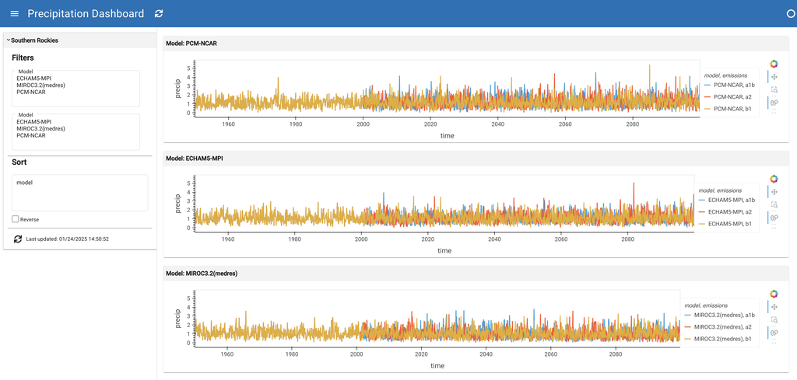

# :material-water: Precipitation

US precipitation data with geographic visualizations and temporal analysis.



## Features

- **Geographic visualization** - Precipitation patterns across the US
- **Time series** - Historical precipitation trends
- **Regional analysis** - Compare different areas

## YAML Specification

```yaml title="precipitation.yaml" linenums="1"
--8<-- "examples/gallery/precip/precipitation.yaml"
```

## Run this example

Save the YAML above as `precipitation.yaml` and run:

```bash
lumen serve precipitation.yaml --show
```

[Download YAML](https://github.com/holoviz/lumen/blob/main/examples/gallery/precip/precipitation.yaml){ .md-button }
