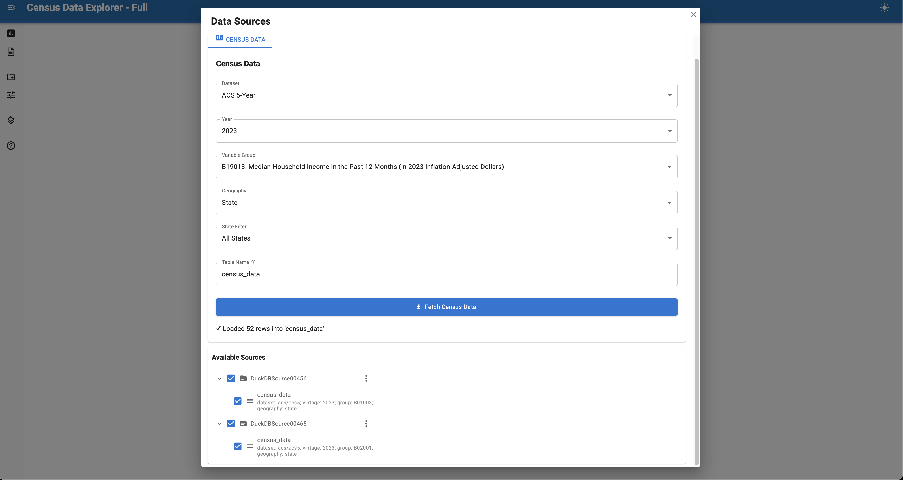
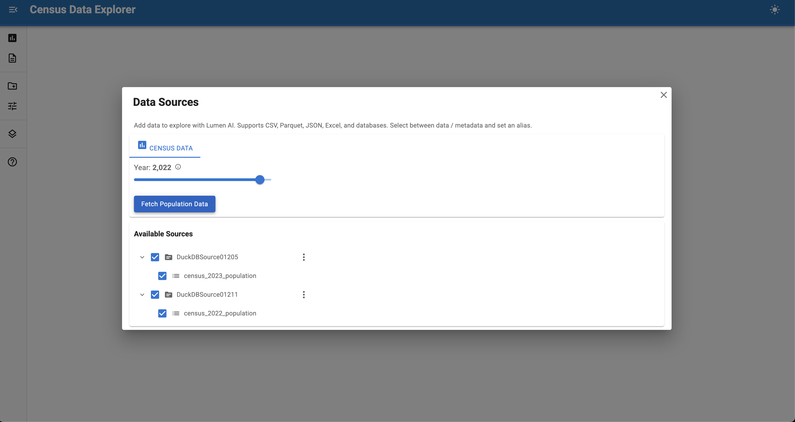

# :material-map: Building a Census Data AI Explorer



Build a data exploration application that integrates U.S. Census Bureau data using Lumen AI.

This tutorial creates a custom data source control that lets you fetch demographic data through a simple interface.

## Final result

A chat interface that can fetch and analyze U.S. Census data with custom controls for selecting datasets and years.

**Time**: 15-20 minutes

## What you'll build

A custom data source control that integrates with the Census API and lets users explore demographic data through natural language queries. The tutorial follows three steps:

1. **Start with a minimal example** - Build a basic year selector with ~70 lines of runnable code
2. **Understand the components** - Learn how each part works
3. **Extend to full version** - Add dynamic options and more features

Each step introduces key Lumen AI concepts for building custom data source integrations.

## Why custom data source controls?

Lumen AI ships with built-in support for common data sources like CSV files, DuckDB, and SQL databases. But what if your data lives behind an API that requires authentication, has complex query parameters, or needs real-time fetching?

**Custom data source controls** let you (see [Source Controls](../../configuration/ui.md#source-controls)):

- **Connect to external APIs** - Fetch data from REST APIs, government data portals, or proprietary services
- **Add interactive parameters** - Let users select years, regions, variables, or filters before loading data
- **Handle authentication** - Manage API keys, OAuth tokens, or other credentials securely
- **Transform on-the-fly** - Process and clean data as it arrives
- **Cache intelligently** - Store expensive API responses to avoid redundant calls

This tutorial uses the U.S. Census Bureau API as an example, but the same patterns apply to:

- Financial data APIs (Federal Reserve, Yahoo Finance)
- Weather and climate data (NOAA, NASA)
- Scientific datasets (genomics, astronomy, earth observation)
- Internal corporate APIs and data warehouses

Once you create a custom control, users can fetch data through a simple UI without writing code, then immediately ask natural language questions about it using Lumen AI's conversational interface.

## Prerequisites

Install the required packages:

```bash
pip install lumen-ai censusdis
```

## 1. Minimal runnable example



Copy this complete example to `census_explorer.py` and run it with `panel serve census_explorer.py --show`:

``` py title="census_explorer.py" linenums="1"
import asyncio
import censusdis.data as ced
import panel as pn
import param
import lumen.ai as lmai
from lumen.ai.controls import DownloadControls
from lumen.sources.duckdb import DuckDBSource
from panel_material_ui import Button, IntSlider, Column

pn.extension()


class CensusControls(DownloadControls):
    """Fetch U.S. Census population data."""
    
    vintage = param.Integer(default=2023, bounds=(2011, 2023), doc="Year of data")
    label = '<span class="material-icons">assessment</span> Census Data'
    
    def __init__(self, **params):
        super().__init__(**params)
        
        self._year_select = IntSlider.from_param(self.param.vintage, label="Year")
        self._fetch_button = Button(label="Fetch Population Data", on_click=self._on_fetch)
        self._layout = Column(self._year_select, self._fetch_button)
    
    async def _on_fetch(self, event):
        """Fetch census population data."""
        with self._layout.param.update(loading=True):
            await asyncio.sleep(0.01)
            df = await asyncio.to_thread(
                ced.download,
                dataset="acs/acs5",  # ACS 5-Year
                vintage=self.vintage,
                download_variables=["NAME"],
                group="B01003",  # Total population
                state="*",  # All states
            )
            if df is not None and not df.empty:
                await self._add_table(df)
                self.param.trigger("upload_successful")
    
    async def _add_table(self, df):
        """Register DataFrame as a DuckDB source."""
        table_name = f"census_{self.vintage}_population"
        source = DuckDBSource.from_df(tables={table_name: df})
        source.tables[table_name] = f"SELECT * FROM {table_name}"
        self.outputs["source"] = source
        self.outputs["sources"] = self.outputs.get("sources", []) + [source]
        self.outputs["table"] = table_name
        self.param.trigger("outputs")
    
    def __panel__(self):
        return self._layout


ui = lmai.ExplorerUI(
    source_controls=[CensusControls],
    title="Census Data Explorer",
    log_level="DEBUG",
)

ui.servable()
```

This ~70 line example is immediately runnable! Try clicking on "Sources" in the sidebar, selecting the desired year, and clicking "Fetch Population Data".

Once the data loads, you can ask question like:

- "What is the total population?"
- "Show me the top 10 states by population"
- "Which state has the largest population?"

## 2. Understanding the components

Let's break down the key concepts:

### Custom controls

**Custom controls** extend data sources by subclassing `lmai.controls.DownloadControls` (see [Source Controls](../../configuration/ui.md#source-controls)):

```python
class CensusControls(DownloadControls):
    vintage = param.Integer(default=2023, bounds=(2011, 2023), doc="Year of data")
    label = '<span class="material-icons">assessment</span> Census Data'
```

The `bounds` parameter defines the valid range for the slider. The label appears in the sidebar with a Material Design icon.

### UI components

**IntSlider with from_param** creates a bound widget directly from the parameter:

```python
self._year_select = IntSlider.from_param(self.param.vintage, label="Year")
```

This automatically handles two-way binding between the widget and parameter.

**Inline button setup** is more concise:

```python
self._fetch_button = Button(label="Fetch Population Data", on_click=self._on_fetch)
```

**Column layout** arranges components vertically:

```python
self._layout = Column(self._year_select, self._fetch_button)
```

### Data fetching

**Loading indicator** with context manager:

```python
with self._layout.param.update(loading=True):
    await asyncio.sleep(0.01)  # Ensure UI updates
    df = await asyncio.to_thread(ced.download(...))
```

**Don't block the main thread** by using `asyncio.to_thread()`:

```python
df = await asyncio.to_thread(
    ced.download,
    dataset="acs/acs5",  # ACS 5-Year dataset
    vintage=self.vintage,
    download_variables=["NAME"],  # Include place names
    group="B01003",  # Total population variable group
    state="*",  # All states
)
```

### DuckDB integration

**Simplified source creation** with `from_df()`:

```python
table_name = f"census_{self.vintage}_population"
source = DuckDBSource.from_df(tables={table_name: df})
source.tables[table_name] = f"SELECT * FROM {table_name}"

# Make available to Lumen AI
self.outputs["source"] = source
self.outputs["table"] = table_name
self.param.trigger("outputs")
```

Note the dynamic table name that includes the year for clarity.

## 3. Extend to full version

The minimal example uses fixed values: ACS 5-Year dataset, population data (group B01003), state geography. The full example below adds nice-to-have features like progress bars and error messages, plus:

**Dynamic variable groups** - Load and display all available Census variable groups:

```python
def _get_group_options(self):
    """Fetch variable groups and return {label: value} dict."""
    cache_key = (self.dataset, self.vintage)
    
    if cache_key not in self._groups_cache:
        groups_df = ced.variables.all_groups(self.dataset, self.vintage)
        self._groups_cache[cache_key] = {
            row["GROUP"]: row["DESCRIPTION"]
            for _, row in groups_df.iterrows()
        }
    
    groups = self._groups_cache[cache_key]
    return {f"{code}: {groups[code]}": code for code in groups.keys()}
```

**Multiple datasets** - Choose between ACS 1-Year and 5-Year:

```python
from censusdis.datasets import ACS1, ACS5

dataset = param.Selector(default=ACS5, objects=[ACS5, ACS1])
```

**Geography levels** - Select state, county, tract, block group, etc.:

```python
import censusdis.geography as cgeo

def _get_geo_options(self):
    """Fetch geographies and return {label: value} dict."""
    geo_specs = cgeo.geo_path_snake_specs(self.dataset, self.vintage)
    # Return unique leaf geographies with friendly names
```

**State filtering** - Limit data to specific states:

```python
from censusdis.states import NAMES_FROM_IDS

STATES = {"All States": "*", **{name: fips for fips, name in NAMES_FROM_IDS.items()}}
state_filter = param.String(default="All States")
```

**Reactive updates** - Options update when dataset/year changes:

```python
@param.depends("dataset", "vintage", watch=True)
def _on_dataset_vintage_change(self):
    """Update group and geo options when dataset or vintage changes."""
    self._group_select.options = self._get_group_options()
    self._geo_select.options = self._get_geo_options()
```

## Full example

Here's a complete implementation with all the features described above:

``` py title="census_explorer_full.py" linenums="1"
"""
Census Data Explorer - Full Example
Complete implementation with dynamic options and features
"""

import asyncio
import censusdis.data as ced
import censusdis.geography as cgeo
import panel as pn
import param
import lumen.ai as lmai
from censusdis.datasets import ACS1, ACS5
from censusdis.states import NAMES_FROM_IDS
from lumen.ai.controls import DownloadControls
from lumen.sources.duckdb import DuckDBSource
from lumen.util import normalize_table_name
from panel_material_ui import Button, FlexBox, Select, TextInput, Markdown

pn.extension()

# State FIPS codes
STATES = {"All States": "*", **{name: fips for fips, name in NAMES_FROM_IDS.items()}}

# Available years per dataset
DATASET_YEARS = {
    ACS5: [2023, 2022, 2021, 2020, 2019, 2018, 2017, 2016, 2015, 2014, 2013, 2012, 2011],
    ACS1: [2023, 2022, 2021, 2019, 2018, 2017, 2016, 2015, 2014, 2013, 2012, 2011],
}

class CensusControlsFull(DownloadControls):
    """Full-featured Census data control with dynamic options."""
    
    dataset = param.Selector(default=ACS5, objects=[ACS5, ACS1], doc="Census dataset")
    vintage = param.Integer(default=2023, doc="Year of data")
    group = param.String(default="B01003", doc="Variable group code")
    geography = param.String(default="state", doc="Geographic level")
    state_filter = param.String(default="All States", doc="State to filter by")
    table_alias = param.String(default="census_data", doc="Table name in database")
    
    label = '<span class="material-icons">assessment</span> Census Data'
    
    def __init__(self, **params):
        super().__init__(**params)
        
        # Caches for API data
        self._groups_cache = {}
        self._geo_cache = {}
        
        # Load initial options
        group_options = self._get_group_options()
        geo_options = self._get_geo_options()
        year_options = self._get_year_options()
        
        # Build UI
        self._dataset_select = Select(
            value=self.dataset,
            options={"ACS 5-Year": ACS5, "ACS 1-Year": ACS1},
            label="Dataset",
            sizing_mode="stretch_width",
        )
        
        self._vintage_select = Select(
            value=self.vintage,
            options=year_options,
            label="Year",
            sizing_mode="stretch_width",
        )
        
        self._group_select = Select(
            value=self.group,
            options=group_options,
            label="Variable Group",
            sizing_mode="stretch_width",
        )
        
        self._geo_select = Select(
            value=self.geography,
            options=geo_options,
            label="Geography",
            sizing_mode="stretch_width",
        )
        
        self._state_select = Select(
            value=self.state_filter,
            options={name: name for name in STATES.keys()},
            label="State Filter",
            sizing_mode="stretch_width",
        )
        
        self._alias_input = TextInput.from_param(
            self.param.table_alias,
            label="Table Name",
            sizing_mode="stretch_width",
        )
        
        self._fetch_button = Button(
            label="Fetch Census Data",
            icon="download",
            color="primary",
            sizing_mode="stretch_width",
            height=42,
        )
        self._fetch_button.on_click(self._on_fetch)
        
        self._layout = FlexBox(
            Markdown("### Census Data"),
            FlexBox(
                self._dataset_select,
                self._vintage_select,
                flex_direction="row",
                gap="10px",
                sizing_mode="stretch_width",
            ),
            self._group_select,
            FlexBox(
                self._geo_select,
                self._state_select,
                flex_direction="row",
                gap="10px",
                sizing_mode="stretch_width",
            ),
            self._alias_input,
            self._fetch_button,
            self._error_placeholder,
            self._message_placeholder,
            self._progress_bar,
            self._progress_description,
            flex_direction="column",
            gap="10px",
            sizing_mode="stretch_width",
            margin=(10, 10),
        )
        
        # Link widgets to params
        self._dataset_select.link(self, value='dataset')
        self._vintage_select.link(self, value='vintage')
        self._group_select.link(self, value='group')
        self._geo_select.link(self, value='geography')
        self._state_select.link(self, value='state_filter')
    
    def _get_year_options(self):
        """Get available years for current dataset."""
        years = DATASET_YEARS.get(self.dataset, [2023])
        return {str(y): y for y in years}
    
    def _get_group_options(self):
        """Fetch variable groups from Census API."""
        cache_key = (self.dataset, self.vintage)
        
        if cache_key not in self._groups_cache:
            try:
                groups_df = ced.variables.all_groups(self.dataset, self.vintage)
                self._groups_cache[cache_key] = {
                    row["GROUP"]: row["DESCRIPTION"]
                    for _, row in groups_df.iterrows()
                }
            except Exception as e:
                print(f"Failed to load groups: {e}")
                self._groups_cache[cache_key] = {}
        
        groups = self._groups_cache[cache_key]
        
        # Prioritize common groups
        popular = ["B01003", "B01001", "B19013", "B02001", "B25001", "B15003", "B17001"]
        options = {}
        
        for code in popular:
            if code in groups:
                options[f"{code}: {groups[code]}"] = code
        
        for code in sorted(groups.keys()):
            if code not in popular and len(options) < 500:
                options[f"{code}: {groups[code]}"] = code
        
        return options
    
    def _get_geo_options(self):
        """Fetch geographies from Census API."""
        cache_key = (self.dataset, self.vintage)
        
        if cache_key not in self._geo_cache:
            try:
                self._geo_cache[cache_key] = cgeo.geo_path_snake_specs(self.dataset, self.vintage)
            except Exception as e:
                print(f"Failed to load geographies: {e}")
                self._geo_cache[cache_key] = {}
        
        geo_specs = self._geo_cache[cache_key]
        
        friendly_names = {
            "state": "State",
            "county": "County",
            "tract": "Census Tract",
            "block_group": "Block Group",
            "place": "Place (City/Town)",
            "county_subdivision": "County Subdivision",
            "us": "United States (National)",
            "region": "Region",
            "division": "Division",
        }
        
        # Get unique leaf geographies
        options = {}
        seen = set()
        for hierarchy in geo_specs.values():
            leaf = hierarchy[-1]
            if leaf not in seen:
                seen.add(leaf)
                label = friendly_names.get(leaf, leaf.replace("_", " ").title())
                options[label] = leaf
        
        return options
    
    @param.depends("dataset", watch=True)
    def _on_dataset_change(self):
        """Update year options when dataset changes."""
        new_year_options = self._get_year_options()
        self._vintage_select.options = new_year_options
        
        if self.vintage not in new_year_options.values():
            first_year = list(new_year_options.values())[0]
            self._vintage_select.value = first_year
            self.vintage = first_year
    
    @param.depends("dataset", "vintage", watch=True)
    def _on_dataset_vintage_change(self):
        """Update group and geo options when dataset or vintage changes."""
        new_group_options = self._get_group_options()
        current_group = self.group
        self._group_select.options = new_group_options
        if current_group in new_group_options.values():
            self._group_select.value = current_group
        elif new_group_options:
            self._group_select.value = list(new_group_options.values())[0]
        
        new_geo_options = self._get_geo_options()
        current_geo = self.geography
        self._geo_select.options = new_geo_options
        if current_geo in new_geo_options.values():
            self._geo_select.value = current_geo
        elif new_geo_options:
            self._geo_select.value = list(new_geo_options.values())[0]
    
    def _build_geo_kwargs(self):
        """Build geography kwargs for ced.download."""
        cache_key = (self.dataset, self.vintage)
        geo_specs = self._geo_cache.get(cache_key, {})
        
        # Find hierarchy ending with selected geography
        target_geo = self.geography
        hierarchy = None
        for h in geo_specs.values():
            if h[-1] == target_geo:
                hierarchy = h
                break
        
        if not hierarchy:
            return {"state": "*"}
        
        # Build kwargs
        kwargs = {}
        state_fips = STATES.get(self.state_filter, "*")
        
        for level in hierarchy:
            if level == "state":
                kwargs["state"] = state_fips
            else:
                kwargs[level] = "*"
        
        return kwargs
    
    async def _on_fetch(self, event):
        """Fetch census data."""
        if not self.group:
            self._error_placeholder.object = "⚠️ Please select a variable group"
            self._error_placeholder.visible = True
            return
        
        self._error_placeholder.visible = False
        self._message_placeholder.visible = False
        self._progress_bar.visible = True
        self._progress_bar.variant = "indeterminate"
        self._progress_description.object = "Fetching data..."
        self._progress_description.visible = True
        self._fetch_button.disabled = True
        
        try:
            geo_kwargs = self._build_geo_kwargs()
            
            df = await asyncio.to_thread(
                ced.download,
                dataset=self.dataset,
                vintage=self.vintage,
                download_variables=["NAME"],
                group=self.group,
                **geo_kwargs,
            )
            
            if df is None or df.empty:
                self._error_placeholder.object = "⚠️ No data returned"
                self._error_placeholder.visible = True
                return
            
            await self._add_table(df)
            self._message_placeholder.object = f"✓ Loaded {len(df):,} rows into '{self.table_alias}'"
            self._message_placeholder.visible = True
            self.param.trigger("upload_successful")
            
        except Exception as e:
            self._error_placeholder.object = f"⚠️ Error: {e}"
            self._error_placeholder.visible = True
        finally:
            self._progress_bar.visible = False
            self._progress_description.visible = False
            self._fetch_button.disabled = False
    
    async def _add_table(self, df):
        """Register DataFrame as a DuckDB source."""
        table_name = normalize_table_name(self.table_alias)
        source = DuckDBSource.from_df(tables={table_name: df})
        source.tables[table_name] = f"SELECT * FROM {table_name}"
        
        source.metadata = {
            table_name: {
                "dataset": self.dataset,
                "vintage": self.vintage,
                "group": self.group,
                "geography": self.geography,
            }
        }
        
        self.outputs["source"] = source
        self.outputs["sources"] = self.outputs.get("sources", []) + [source]
        self.outputs["table"] = table_name
        self.param.trigger("outputs")
        self._last_table = table_name
        self._count += 1
    
    def __panel__(self):
        return self._layout


ui = lmai.ExplorerUI(
    source_controls=[CensusControlsFull],
    title="Census Data Explorer - Full",
    suggestions=[
        ("bar_chart", "Show the top 10 states by population"),
        ("compare_arrows", "Compare different demographic variables"),
        ("question_mark", "What are the demographic patterns?"),
    ],
    log_level="DEBUG",
)

ui.servable()
```

This complete version includes all the features discussed: dynamic variable groups, multiple datasets, geography selection, state filtering, progress indicators, error handling, and reactive UI updates.

## Next steps

Extend this example by:

- **Add custom analyses**: Create specialized visualizations for demographic data (see [Analyses configuration](../../configuration/analyses.md))
- **Customize agents**: Add domain expertise about Census variables and geography (see [Agents configuration](../../configuration/agents.md))
- **Multiple sources**: Combine Census data with other datasets for richer analysis (see [Sources configuration](../../configuration/sources.md))

## See also

- [Source Controls](../../configuration/ui.md#source-controls) — Complete guide to creating custom source controls
- [Data Sources](../../configuration/sources.md) — File and database connections  
- [Custom Analyses](../../configuration/analyses.md) — Building specialized visualizations
