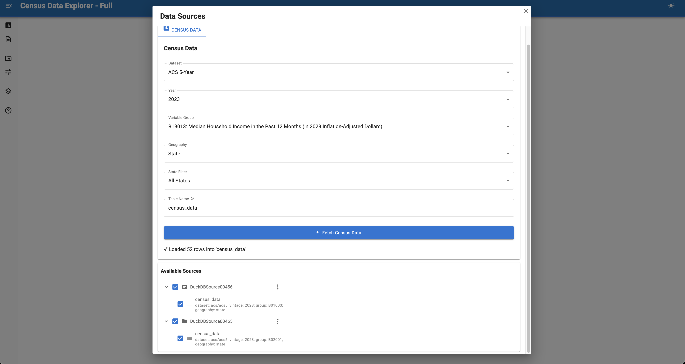
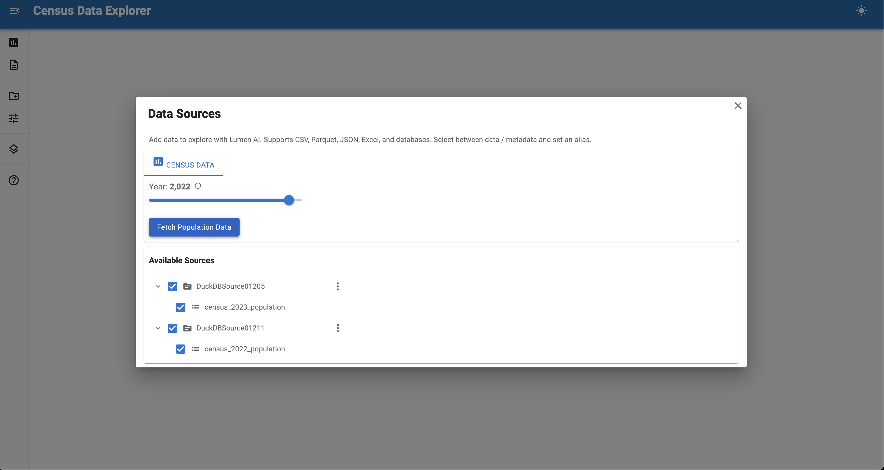

# :material-map: Building a Census Data AI Explorer



Build a data exploration application that integrates U.S. Census Bureau data using Lumen AI.

This tutorial creates a custom source control that lets you fetch demographic data through a simple interface with reactive options that update based on your selections.

## Final result

A chat interface that can fetch and analyze U.S. Census data with controls for selecting datasets, years, variable groups, and geographies.

**Time**: 15-20 minutes

## What you'll build

A custom source control that integrates with the Census API and lets users explore demographic data through natural language queries. The tutorial follows three steps:

1. **Start with a minimal example** - Use `CodeSourceControls` to wrap Census functions with ~40 lines
2. **Understand the components** - Learn how `CodeSourceControls` introspects function signatures
3. **Add reactive options** - Subclass to add dynamic dropdowns that update based on dataset/year selection

For a detailed reference on creating custom controls, see the [Source Controls](../../configuration/controls.md) documentation.

## Why this tutorial?

Lumen AI has built-in support for many data formats, but some data lives behind APIs that require specific parameters or dynamic filtering. By building a custom **Source Control**, you can:

- **Connect to external APIs** (like the U.S. Census Bureau)
- **Add interactive parameters** for users to select subsets of data
- **Expose data to LLM agents** so they can answer questions about it immediately

## Prerequisites

Install the required packages:

```bash
pip install lumen-ai censusdis
```

## 1. Minimal example with CodeSourceControls



The simplest approach wraps standalone functions with `CodeSourceControls`. Copy this to `census_explorer.py` and run with `panel serve census_explorer.py --show`:

``` py title="census_explorer.py" linenums="1"
import pandas as pd
import param

import lumen.ai as lmai
from lumen.ai.agents import SourceAgent
from lumen.ai.controls import CodeSourceControls, UploadSourceControls


def download_census_data(
    dataset: str = "acs/acs5",
    vintage: int = 2022,
    state: str = "*",
    group: str = "B01003",
) -> pd.DataFrame:
    """
    Download Census data for US geographies.

    Args:
        dataset: Census dataset (e.g., "acs/acs5" for ACS 5-year).
        vintage: Year of data (e.g., 2022).
        state: State FIPS code or "*" for all states.
        group: Variable group code (e.g., "B01003" for total population).
    """
    import censusdis.data as ced

    return ced.download(
        dataset=dataset,
        vintage=vintage,
        download_variables=["NAME"],
        group=group,
        state=state,
    )


ui = lmai.ExplorerUI(
    agents=[SourceAgent()],
    source_controls=[
        CodeSourceControls(
            functions={"Download Census Data": download_census_data},
            param_overrides={
                "Download Census Data": {
                    "dataset": param.Selector(
                        default="acs/acs5",
                        objects=["acs/acs5", "acs/acs1", "dec/pl"],
                    ),
                    "vintage": param.Selector(
                        default=2022,
                        objects=[2022, 2021, 2020, 2019, 2018],
                    ),
                },
            },
            table_name="census_data",
        ),
        UploadSourceControls(),
    ],
    title="Census Data Explorer",
)

ui.servable()
```

This ~55 line example is immediately runnable. Click "Sources" in the sidebar, select options, and click "Fetch Data".

Once the data loads, ask questions like:

- "What is the total population?"
- "Show me the top 10 states by population"
- "Which state has the smallest population?"

## 2. Understanding CodeSourceControls

`CodeSourceControls` wraps Python functions as data sources:

1. **Function signature → widgets**: Parameters become UI controls automatically
2. **Docstring → agent context**: The LLM uses your docstring to understand when to call the function
3. **Return value → table**: DataFrames are registered as queryable tables

### How `param_overrides` works

By default, `CodeSourceControls` infers widget types from function annotations:
- `str` → text input
- `int` → number input
- `bool` → checkbox

Use `param_overrides` to replace with richer widgets:

```python
param_overrides={
    "Download Census Data": {
        # Full replacement with Selector dropdown
        "dataset": param.Selector(default="acs/acs5", objects=[...]),
        # Dict merge to modify existing param
        "vintage": {"default": 2023, "bounds": (2010, 2023)},
    },
}
```

## 3. Adding reactive options

The minimal example has static dropdowns. But Census variable groups depend on the dataset and year - selecting ACS 2022 vs 2018 may offer different groups.

Subclass `CodeSourceControls` to add reactive behavior:

``` py title="census_explorer_reactive.py" linenums="1"
import pandas as pd
import param

import lumen.ai as lmai
from lumen.ai.agents import SourceAgent
from lumen.ai.controls import CodeSourceControls, UploadSourceControls


def download_census_data(
    dataset: str = "acs/acs5",
    vintage: int = 2022,
    state: str = "*",
    group: str = "B01003",
) -> pd.DataFrame:
    """Download Census data for US geographies."""
    import censusdis.data as ced

    return ced.download(
        dataset=dataset,
        vintage=vintage,
        download_variables=["NAME"],
        group=group,
        state=state,
    )


class CensusdisControls(CodeSourceControls):
    """Census controls with reactive group options."""

    label = '<span class="material-icons">assessment</span> Census Data'

    def __init__(self, **params):
        self._groups_cache = {}
        super().__init__(**params)

    def _setup_actions(self):
        super()._setup_actions()  # (1)!

        model = self._action_models.get("Download Census Data")
        if model:
            # Watch dataset and vintage, update group options
            model.param.watch(self._on_dataset_vintage_change, ["dataset", "vintage"])
            self._update_group_options(model)

    def _on_dataset_vintage_change(self, event):
        model = self._action_models["Download Census Data"]
        self._update_group_options(model)

    def _update_group_options(self, model):
        """Fetch and update group options based on current dataset/vintage."""
        groups = self._fetch_groups(model.dataset, model.vintage)
        current = model.group
        model.param.group.objects = list(groups.keys())
        # Preserve selection if still valid
        if current in groups:
            model.group = current
        elif groups:
            model.group = list(groups.keys())[0]

    def _fetch_groups(self, dataset: str, vintage: int) -> dict:
        """Fetch variable groups from Census API with caching."""
        import censusdis.data as ced

        key = (dataset, vintage)
        if key not in self._groups_cache:
            try:
                groups_df = ced.variables.all_groups(dataset, vintage)
                self._groups_cache[key] = {
                    row["GROUP"]: row["DESCRIPTION"]
                    for _, row in groups_df.iterrows()
                }
            except Exception:
                self._groups_cache[key] = {"B01003": "Total Population"}
        return self._groups_cache[key]


ui = lmai.ExplorerUI(
    agents=[SourceAgent()],
    source_controls=[
        CensusdisControls(
            functions={"Download Census Data": download_census_data},
            param_overrides={
                "Download Census Data": {
                    "dataset": param.Selector(
                        default="acs/acs5",
                        objects=["acs/acs5", "acs/acs1"],
                    ),
                    "vintage": param.Selector(
                        default=2022,
                        objects=[2022, 2021, 2020, 2019, 2018],
                    ),
                    "group": param.Selector(
                        default="B01003",
                        objects=["B01003"],  # Will be updated reactively
                    ),
                },
            },
            table_name="census_data",
        ),
        UploadSourceControls(),
    ],
    title="Census Data Explorer",
)

ui.servable()
```

1. Call `super()._setup_actions()` first - this creates `_action_models` from the functions

### Key patterns

**Override `_setup_actions()`** to add watchers after action models are created:

```python
def _setup_actions(self):
    super()._setup_actions()  # Creates _action_models
    model = self._action_models.get("Action Name")
    model.param.watch(self._on_change, ["param1", "param2"])
```

**Access action models** via `self._action_models[action_name]`:

```python
model = self._action_models["Download Census Data"]
model.param.group.objects = ["B01003", "B19013"]  # Update options
model.group = "B01003"  # Set value
```

**Cache API responses** to avoid redundant calls:

```python
def _fetch_groups(self, dataset, vintage):
    key = (dataset, vintage)
    if key not in self._groups_cache:
        self._groups_cache[key] = fetch_from_api(dataset, vintage)
    return self._groups_cache[key]
```

## Full example with multiple functions

Here's a complete implementation with multiple Census functions and reactive options:

``` py title="census_explorer_full.py" linenums="1"
"""
Census Data Explorer - Full Example
Multiple functions with reactive options
"""

import pandas as pd
import param

import lumen.ai as lmai
from lumen.ai.agents import SourceAgent
from lumen.ai.controls import CodeSourceControls, UploadSourceControls


# ─────────────────────────────────────────────────────────────────────────────
# Census functions to expose
# ─────────────────────────────────────────────────────────────────────────────


def download_census_data(
    dataset: str = "acs/acs5",
    vintage: int = 2022,
    state: str = "*",
    county: str = "",
    group: str = "B01003",
) -> pd.DataFrame:
    """
    Download Census data for US geographies.

    Common variable groups:
    - B01003: Total population
    - B19013: Median household income
    - B25001: Total housing units
    - B25077: Median home value

    Args:
        dataset: Census dataset ("acs/acs5" for 5-year ACS, "acs/acs1" for 1-year).
        vintage: Year of data (e.g., 2022). ACS5 2022 covers 2018-2022.
        state: State FIPS code or "*" for all. Examples: "06"=CA, "36"=NY, "53"=WA.
        county: County FIPS code, "*" for all counties, or empty for state-level.
        group: Variable group code.
    """
    import censusdis.data as ced

    geo_kwargs = {"state": state}
    if county:
        geo_kwargs["county"] = county

    return ced.download(
        dataset=dataset,
        vintage=vintage,
        download_variables=["NAME"],
        group=group,
        **geo_kwargs,
    )


def get_geography_names(
    dataset: str = "acs/acs5",
    vintage: int = 2022,
    state: str = "*",
) -> pd.DataFrame:
    """
    Get human-readable names for geographies (useful for looking up FIPS codes).

    Args:
        dataset: Census dataset.
        vintage: Year of data.
        state: State FIPS code or "*" for all states.
    """
    import censusdis.data as ced

    return ced.geography_names(dataset, vintage, state=state)


# ─────────────────────────────────────────────────────────────────────────────
# Custom controls with reactive options
# ─────────────────────────────────────────────────────────────────────────────


class CensusdisControls(CodeSourceControls):
    """Census controls with reactive group options based on dataset/vintage."""

    label = '<span class="material-icons">assessment</span> Census Data'

    def __init__(self, **params):
        self._groups_cache = {}
        super().__init__(**params)

    def _setup_actions(self):
        super()._setup_actions()

        # Add watchers for Download Census Data action
        model = self._action_models.get("Download Census Data")
        if model:
            model.param.watch(self._on_dataset_vintage_change, ["dataset", "vintage"])
            self._update_group_options(model)

    def _on_dataset_vintage_change(self, event):
        model = self._action_models["Download Census Data"]
        self._update_group_options(model)

    def _update_group_options(self, model):
        """Fetch and update group options based on current dataset/vintage."""
        groups = self._fetch_groups(model.dataset, model.vintage)

        # Prioritize common groups at the top
        popular = ["B01003", "B19013", "B25001", "B25077", "B01001", "B02001"]
        ordered = [g for g in popular if g in groups]
        ordered.extend(g for g in sorted(groups.keys()) if g not in popular)

        current = model.group
        model.param.group.objects = ordered[:200]  # Limit for performance

        if current in ordered:
            model.group = current
        elif ordered:
            model.group = ordered[0]

    def _fetch_groups(self, dataset: str, vintage: int) -> dict:
        """Fetch variable groups from Census API with caching."""
        import censusdis.data as ced

        key = (dataset, vintage)
        if key not in self._groups_cache:
            try:
                groups_df = ced.variables.all_groups(dataset, vintage)
                self._groups_cache[key] = {
                    row["GROUP"]: row["DESCRIPTION"]
                    for _, row in groups_df.iterrows()
                }
            except Exception as e:
                print(f"Failed to fetch groups: {e}")
                self._groups_cache[key] = {"B01003": "Total Population"}
        return self._groups_cache[key]


# ─────────────────────────────────────────────────────────────────────────────
# Application
# ─────────────────────────────────────────────────────────────────────────────


ui = lmai.ExplorerUI(
    agents=[SourceAgent()],
    source_controls=[
        CensusdisControls(
            functions={
                "Download Census Data": download_census_data,
                "Get Geography Names": get_geography_names,
            },
            param_overrides={
                "Download Census Data": {
                    "dataset": param.Selector(
                        default="acs/acs5",
                        objects=["acs/acs5", "acs/acs1"],
                        doc="Census dataset",
                    ),
                    "vintage": param.Selector(
                        default=2022,
                        objects=[2022, 2021, 2020, 2019, 2018, 2017, 2016, 2015],
                        doc="Year of data",
                    ),
                    "group": param.Selector(
                        default="B01003",
                        objects=["B01003"],
                        doc="Variable group code",
                    ),
                },
                "Get Geography Names": {
                    "dataset": param.Selector(
                        default="acs/acs5",
                        objects=["acs/acs5", "acs/acs1"],
                    ),
                    "vintage": param.Selector(
                        default=2022,
                        objects=[2022, 2021, 2020, 2019, 2018],
                    ),
                },
            },
            table_name="census_data",
        ),
        UploadSourceControls(),
    ],
    title="Census Data Explorer",
    log_level="DEBUG",
)

ui.servable()
```

## Next steps

Extend this example by:

- **Add more geographies**: Expose tract, block group, and place-level data
- **Add custom analyses**: Create specialized visualizations for demographic data (see [Analyses configuration](../../configuration/analyses.md))
- **Combine with other sources**: Join Census data with your own datasets

## See also

- [Source Controls](../../configuration/controls.md) — Complete guide to source controls including `CodeSourceControls` and `URLSourceControls`
- [Mesonet Weather Explorer](mesonet_weather_explorer.md) — URLSourceControls tutorial with preprocessing
- [Agents](../../configuration/agents.md) — Configuring SourceAgent and other agents
