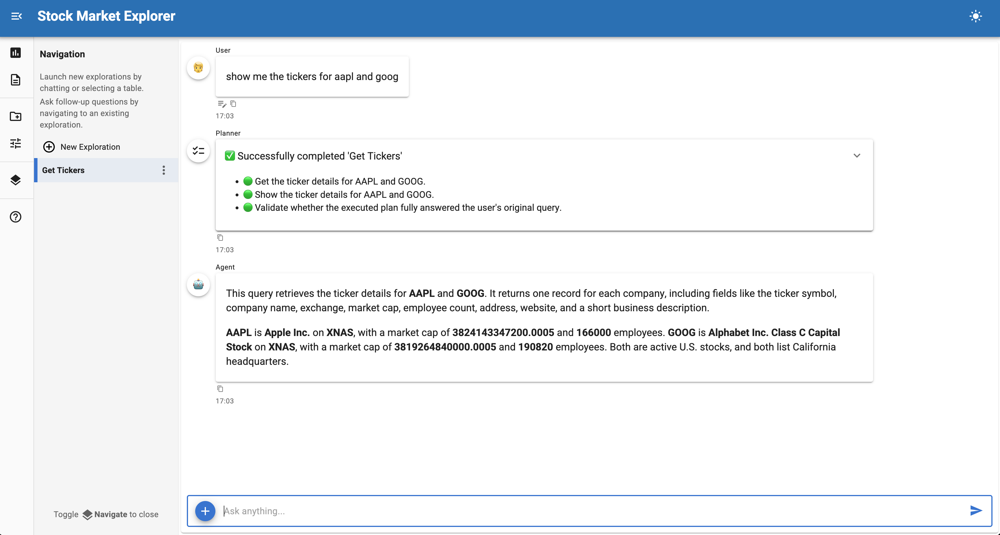

# :material-chart-line: Building a Stock Market Data Explorer



Build a data exploration application that wraps the [Massive](https://massive.com/) Python SDK using `CodeSourceControls`.

This tutorial creates a stock data explorer by passing an SDK client instance and method names to `CodeSourceControls`, which introspects the method signatures and generates UI widgets automatically. No manual endpoint definitions needed — the SDK does the heavy lifting.

## Final result

A chat interface with stock market actions (aggregate bars, last trade, ticker details) that users can query through auto-generated widgets, then explore with natural language questions.

**Time**: 10-15 minutes

## What you'll build

A stock market explorer that wraps three methods from the `massive` Python SDK. The tutorial follows three steps:

1. **Start with a minimal example** - Wrap SDK methods with ~30 lines of code
2. **Understand how CodeSourceControls works** - Learn how method signatures become widgets
3. **Customize with param_overrides** - Replace text inputs with dropdowns and bounded sliders

For a detailed reference on source controls, see the [Source Controls](../../configuration/controls.md) documentation.

## Why CodeSourceControls with an SDK?

When a Python SDK already exists for your API, wrapping it with `CodeSourceControls` is the fastest path:

- **Zero endpoint definitions** - Method signatures are introspected automatically
- **Full SDK features** - Pagination, retries, auth, and response parsing come free
- **Typed parameters** - SDK type hints become appropriate widgets
- **Docstrings as context** - The LLM reads method docstrings to understand when to call each action

Compare this with [`RESTAPISourceControls`](../../configuration/controls.md#restapi-source-controls) (manual endpoint dicts) or [`OpenAPISourceControls`](weather_openapi_explorer.md) (auto-discovery from a spec). `CodeSourceControls` is best when you already have a Python client.

## Prerequisites

Install the required packages and set your API key:

```bash
pip install lumen-ai massive
export MASSIVE_API_KEY="your_api_key_here"
```

Get a free API key from [massive.com](https://massive.com/).

## 1. Minimal runnable example

Copy this to `massive_explorer.py` and run with `panel serve massive_explorer.py --show`:

``` py title="massive_explorer.py" linenums="1"
import os

from massive import RESTClient

from lumen.ai.agents import SourceAgent
from lumen.ai.controls import CodeSourceControls, UploadSourceControls
from lumen.ai.ui import ExplorerUI


client = RESTClient(api_key=os.environ["MASSIVE_API_KEY"])  # (1)!

controls = CodeSourceControls(
    instance=client,  # (2)!
    methods=["list_aggs", "get_last_trade", "get_ticker_details"],  # (3)!
    skip_params=frozenset({"self", "cls", "return", "raw", "params", "options"}),  # (4)!
    table_name="prices",
    label=(
        '<span class="material-icons" style="vertical-align: middle;">'
        "show_chart"
        "</span> Massive Stocks"
    ),
)

ui = ExplorerUI(
    agents=[SourceAgent()],
    source_controls=[controls, UploadSourceControls()],
    title="Stock Market Explorer",
    log_level="DEBUG",
)

ui.servable()
```

1. Create the SDK client with your API key
2. `instance` passes the client object — its bound methods will be exposed as actions
3. `methods` lists which method names to expose. Each becomes a selectable action in the UI.
4. `skip_params` excludes SDK-internal parameters that users shouldn't see

Click "Sources" in the sidebar, pick an action (e.g. "List Aggs"), fill in the parameters, and click "Fetch Data". Once data loads, try asking:

- "Show me a line chart of close prices over time"
- "What was the highest volume day?"
- "What is Apple's market cap?"

## 2. Understanding CodeSourceControls

`CodeSourceControls` wraps Python methods as data source actions.

### How method signatures become widgets

For each method name in `methods`, `CodeSourceControls`:

1. **Gets the bound method** from `instance` (e.g. `client.list_aggs`)
2. **Introspects the signature** — parameter names, type annotations, and defaults become widget definitions
3. **Reads the docstring** — the LLM agent uses it to understand when to call the method
4. **Converts the return value** — DataFrames (or objects convertible to DataFrames) are registered as queryable tables

### Default widget type mapping

| Python annotation | Widget rendered |
|------------------|-----------------|
| `str` | Text input |
| `int` | Number input |
| `float` | Number input |
| `bool` | Checkbox |
| `datetime.date` | Date picker |
| No annotation | Text input (default) |

### The `skip_params` argument

SDK methods often have internal parameters that shouldn't appear in the UI. The Massive SDK's `list_aggs` method, for example, has `raw`, `params`, and `options` parameters that control response format and SDK behavior. `skip_params` hides these:

```python
skip_params=frozenset({"self", "cls", "return", "raw", "params", "options"})
```

### Action display names

Method names are converted to display names by replacing underscores with spaces and title-casing: `list_aggs` → "List Aggs", `get_last_trade` → "Get Last Trade".

## 3. Customizing with param_overrides

The minimal example generates text inputs for most parameters. `param_overrides` replaces these with richer widgets — dropdowns, bounded sliders, and pre-filled defaults:

``` py title="massive_explorer_full.py" linenums="1"
"""
Stock Market Explorer - Full Example
Massive SDK with param_overrides for richer widgets
"""

import os

import param

from massive import RESTClient

from lumen.ai.agents import SourceAgent
from lumen.ai.controls import CodeSourceControls, UploadSourceControls
from lumen.ai.ui import ExplorerUI


client = RESTClient(api_key=os.environ["MASSIVE_API_KEY"])

controls = CodeSourceControls(
    instance=client,
    methods=["list_aggs", "get_last_trade", "get_ticker_details"],
    param_overrides={
        "List Aggs": {  # (1)!
            "ticker": param.Selector(  # (2)!
                default="AAPL",
                objects=["AAPL", "MSFT", "NVDA", "GOOGL", "TSLA", "AMZN"],
            ),
            "timespan": param.Selector(
                default="day",
                objects=["minute", "hour", "day", "week", "month"],
            ),
            "multiplier": {"default": 1, "bounds": (1, 100)},  # (3)!
            "from_": {"default": "2024-01-01"},
            "to": {"default": "2024-12-31"},
            "limit": {"default": 5000, "bounds": (1, 50000)},
        },
    },
    skip_params=frozenset({"self", "cls", "return", "raw", "params", "options"}),
    table_name="prices",
    label=(
        '<span class="material-icons" style="vertical-align: middle;">'
        "show_chart"
        "</span> Massive Stocks"
    ),
)

ui = ExplorerUI(
    agents=[SourceAgent()],
    source_controls=[controls, UploadSourceControls()],
    title="Stock Market Explorer",
    log_level="DEBUG",
)

ui.servable()
```

1. Keys in `param_overrides` match the display name (title-cased method name)
2. Full replacement — a `param.Selector` replaces the auto-detected `param.String` with a dropdown
3. Dict merge — modifies the existing parameter's `default` and `bounds` without full replacement

### Two override styles

**Full replacement** passes a `param.Parameter` instance. The auto-detected parameter is replaced entirely:

```python
"ticker": param.Selector(default="AAPL", objects=["AAPL", "MSFT", ...])
```

**Dict merge** passes a dict of keyword overrides. These are merged into the auto-detected parameter:

```python
"multiplier": {"default": 1, "bounds": (1, 100)}
```

Use full replacement when you want a different widget type (e.g. text input → dropdown). Use dict merge when you just want to adjust defaults or bounds.

### Wrapping standalone functions

`CodeSourceControls` also works with standalone functions (not just object methods). Use the `functions` parameter instead of `instance` + `methods`:

```python
def download_data(ticker: str = "AAPL", year: int = 2024) -> pd.DataFrame:
    """Download stock data for a ticker."""
    ...

controls = CodeSourceControls(
    functions={"Download Data": download_data},
    table_name="stock_data",
)
```

See the [Census Data Explorer](census_data_ai_explorer.md) tutorial for a complete example of this pattern with reactive options.

## Next steps

Extend this example by:

- **Add more methods** - The Massive SDK has methods for options, forex, crypto, and more
- **Add reactive options** - Subclass `CodeSourceControls` to update ticker lists dynamically (see [Census Data Explorer](census_data_ai_explorer.md))
- **Combine with OpenAPI** - Add an `OpenAPISourceControls` for endpoints without SDK wrappers (see [Weather API Explorer](weather_openapi_explorer.md))
- **Add custom analyses** - Create specialized financial visualizations (see [Analyses configuration](../../configuration/analyses.md))

## See also

- [Source Controls](../../configuration/controls.md) — Complete guide to source controls including `CodeSourceControls`
- [Weather API Explorer](weather_openapi_explorer.md) — OpenAPISourceControls tutorial with auto-discovery
- [Census Data Explorer](census_data_ai_explorer.md) — CodeSourceControls with reactive options
- [Mesonet Weather Explorer](mesonet_weather_explorer.md) — URLSourceControls with preprocessing
