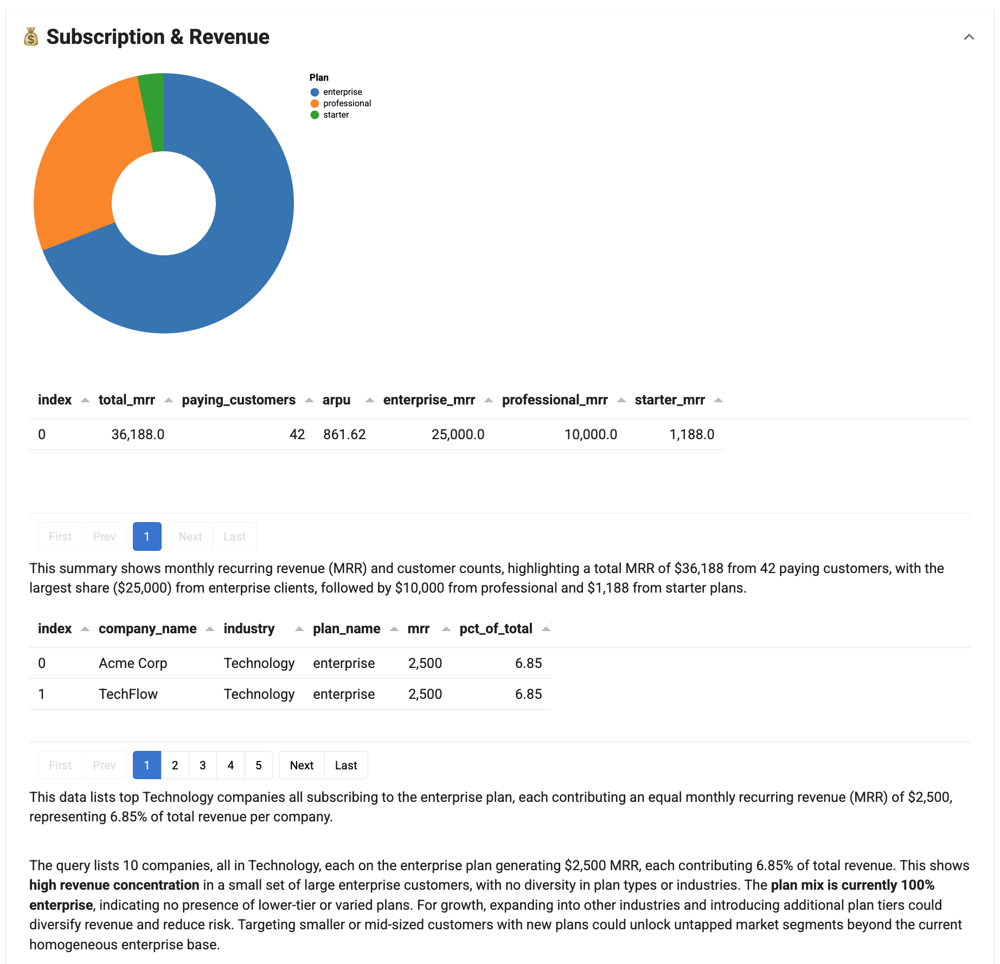

# :material-office-building: Building a SaaS Executive Dashboard

Executive dashboards often start as one-off analyses that become recurring requests—"Can you update the metrics for Monday's meeting?" turns into hours of manual work each week. Lumen Reports solves this by making dashboards reproducible with a single click: define your queries and visualizations once, then execute them whenever you need fresh results.

This tutorial builds an executive dashboard for CloudSync, a fictional B2B SaaS company. You'll combine SQL queries for precise metrics, custom visualizations for trends, and AI-generated insights—all exportable as Jupyter notebooks or deployable as web apps.

## Final result



**Time**: 15-20 minutes

## What you'll build

An interactive executive dashboard with three collapsible sections that combine SQL queries, custom visualizations, and AI-generated insights. The tutorial walks through setting up a DuckDB data source, creating custom Actions for visualizations, adding SQLQuery tasks for deterministic metrics, integrating ChatAgent for AI insights, and assembling everything into a deployable report. Each step introduces key Lumen Reports concepts with links to detailed configuration guides.

## Prerequisites

Install the required packages:

```bash
pip install lumen-ai panel
```

## 1. DuckDB provides in-memory data for prototyping

DuckDBSource connects to databases or creates sources from DataFrames. The sample data below represents a typical SaaS company—in production, you would connect to your actual database.

**Key concepts:** DuckDBSource connects to DuckDB databases or creates in-memory sources from DataFrames (see [Sources configuration](../../configuration/sources.md)). The `from_df()` method creates a source from pandas DataFrames for prototyping.

``` py title="saas_dashboard.py" linenums="1"
import pandas as pd
import panel as pn

from lumen.ai.llm import OpenAI
from lumen.ai.report import Action, Report, Section, ActorTask
from lumen.ai.actions import SQLQuery
from lumen.ai.agents import ChatAgent
from lumen.ai.views import LumenOutput
from lumen.pipeline import Pipeline
from lumen.sources.duckdb import DuckDBSource
from lumen.views import VegaLiteView

pn.extension("tabulator", "vega")

# Sample data for CloudSync SaaS company
customers_df = pd.DataFrame({
    "customer_id": [f"C{str(i).zfill(4)}" for i in range(1, 51)],
    "company_name": [
        "Acme Corp", "TechFlow", "DataPrime", "CloudNine", "SyncWave",
        "ByteForce", "NetSphere", "CodeCraft", "InfoPulse", "DigiCore",
        "WebMatrix", "AppVault", "LogicHub", "CyberEdge", "PixelWorks",
        "StreamLine", "NodeStack", "ApiFirst", "DevOps Inc", "ScaleUp Co",
        "GrowthLab", "StartupXYZ", "InnovateCo", "FutureTech", "SmartSys",
        "RapidDev", "AgileTeam", "SprintCo", "LaunchPad", "RocketFuel",
        "TurboCode", "FastTrack", "QuickByte", "SwiftApp", "ZoomData",
        "FlashNet", "InstantIO", "RealTime", "LiveSync", "HotDeploy",
        "CoolStack", "FreshCode", "NewWave", "NextGen", "TopTier",
        "EliteTech", "PrimeSoft", "AlphaNet", "BetaLabs", "GammaSys"
    ],
    "industry": (["Technology"] * 15 + ["Healthcare"] * 10 + ["Finance"] * 10 + 
                 ["Retail"] * 8 + ["Manufacturing"] * 7),
    "signup_date": pd.to_datetime([
        "2023-01-15", "2023-02-20", "2023-02-28", "2023-03-10", "2023-03-22",
        "2023-04-05", "2023-04-18", "2023-05-01", "2023-05-15", "2023-06-01",
        "2023-06-20", "2023-07-08", "2023-07-25", "2023-08-12", "2023-08-30",
        "2023-09-15", "2023-09-28", "2023-10-10", "2023-10-25", "2023-11-05",
        "2023-11-20", "2023-12-01", "2023-12-15", "2024-01-08", "2024-01-22",
        "2024-02-05", "2024-02-19", "2024-03-04", "2024-03-18", "2024-04-01",
        "2024-04-15", "2024-05-01", "2024-05-15", "2024-06-01", "2024-06-15",
        "2024-07-01", "2024-07-15", "2024-08-01", "2024-08-15", "2024-09-01",
        "2024-09-15", "2024-10-01", "2024-10-15", "2024-11-01", "2024-11-15",
        "2024-12-01", "2024-12-15", "2025-01-05", "2025-01-10", "2025-01-15"
    ]),
    "region": (["North America"] * 20 + ["Europe"] * 15 + 
               ["Asia Pacific"] * 10 + ["Latin America"] * 5),
    "company_size": (["enterprise"] * 10 + ["smb"] * 25 + ["startup"] * 15),
    "status": (["active"] * 42 + ["churned"] * 5 + ["trial"] * 3)
})

subscriptions_df = pd.DataFrame({
    "subscription_id": [f"S{str(i).zfill(4)}" for i in range(1, 51)],
    "customer_id": [f"C{str(i).zfill(4)}" for i in range(1, 51)],
    "plan_name": (["enterprise"] * 10 + ["professional"] * 20 + ["starter"] * 20),
    "mrr": ([2500] * 10 + [500] * 20 + [99] * 20),
    "start_date": customers_df["signup_date"].tolist(),
    "end_date": [None] * 45 + ["2024-12-01"] * 5,
    "billing_cycle": (["annual"] * 15 + ["monthly"] * 35)
})

employees_df = pd.DataFrame({
    "employee_id": [f"E{str(i).zfill(3)}" for i in range(1, 36)],
    "name": [
        "Alice Chen", "Bob Smith", "Carol Davis", "Dan Wilson", "Eva Martinez",
        "Frank Brown", "Grace Lee", "Henry Taylor", "Ivy Anderson", "Jack Thomas",
        "Kate Johnson", "Leo Garcia", "Mia Robinson", "Noah Clark", "Olivia Lewis",
        "Paul Walker", "Quinn Hall", "Rose Allen", "Sam Young", "Tina King",
        "Uma Wright", "Vic Scott", "Wendy Green", "Xavier Adams", "Yara Baker",
        "Zack Nelson", "Amy Hill", "Ben Moore", "Chloe Jackson", "Derek White",
        "Emma Harris", "Felix Martin", "Gina Thompson", "Hugo Garcia", "Iris Lee"
    ],
    "department": (["engineering"] * 14 + ["sales"] * 8 + 
                   ["support"] * 7 + ["marketing"] * 6),
    "role": (
        ["Senior Engineer"] * 4 + ["Engineer"] * 6 + ["Junior Engineer"] * 4 +
        ["Sales Director"] * 2 + ["Account Executive"] * 6 +
        ["Support Lead"] * 2 + ["Support Specialist"] * 5 +
        ["Marketing Manager"] * 2 + ["Marketing Specialist"] * 4
    ),
    "hire_date": pd.to_datetime([
        "2022-01-15", "2022-03-01", "2022-06-15", "2022-09-01", "2023-01-10",
        "2023-02-15", "2023-04-01", "2023-05-15", "2023-07-01", "2023-08-15",
        "2023-09-01", "2023-10-15", "2023-11-01", "2023-12-01", "2024-01-15",
        "2024-02-01", "2024-03-15", "2024-04-01", "2024-05-01", "2024-06-01",
        "2024-07-01", "2024-08-01", "2024-09-01", "2024-09-15", "2024-10-01",
        "2024-10-15", "2024-11-01", "2024-11-15", "2024-12-01", "2024-12-15",
        "2025-01-02", "2025-01-05", "2025-01-08", "2025-01-10", "2025-01-12"
    ]),
    "salary": (
        [150000] * 4 + [120000] * 6 + [85000] * 4 +
        [140000] * 2 + [95000] * 6 +
        [90000] * 2 + [55000] * 5 +
        [110000] * 2 + [70000] * 4
    ),
    "status": ["active"] * 33 + ["on_leave"] * 2
})

source = DuckDBSource.from_df(tables={
    "customers": customers_df,
    "subscriptions": subscriptions_df,
    "employees": employees_df
})

llm = OpenAI()  # (1)!
```

1. The LLM is used for AI-generated captions on `SQLQuery` and insights from `ChatAgent`

## 2. Custom Actions enable specialized visualizations

Actions let you write custom Python logic for specialized visualizations. The `CustomerAcquisitionChart` below shows growth trends by subclassing `Action` and implementing `_execute`.

**Key concepts:** Custom Actions extend Lumen Reports by subclassing `Action` (see [Reports configuration](../../configuration/reports.md)). The `_execute` method contains visualization logic and returns `(outputs, context_updates)`. Tasks communicate through a shared context dictionary. LumenOutput wraps components with titles for the report UI.

``` py title="saas_dashboard.py" linenums="98"
class CustomerAcquisitionChart(Action):
    """Visualize customer acquisition trends by company size."""

    async def _execute(self, context, **kwargs):
        src = context["source"]  # (1)!
        
        acquisition_src = src.create_sql_expr_source(tables={
            "acquisition": """
                SELECT 
                    DATE_TRUNC('month', signup_date) AS month,
                    company_size,
                    COUNT(*) AS new_customers
                FROM customers
                WHERE status != 'churned'
                GROUP BY month, company_size
                ORDER BY month
            """
        })
        
        pipeline = Pipeline(source=acquisition_src, table="acquisition")
        
        chart = VegaLiteView(
            pipeline=pipeline,
            spec={
                "$schema": "https://vega.github.io/schema/vega-lite/v5.json",
                "mark": "bar",
                "encoding": {
                    "x": {"field": "month", "type": "temporal", "title": "Month"},
                    "y": {"field": "new_customers", "type": "quantitative", 
                          "title": "New Customers"},
                    "color": {
                        "field": "company_size", 
                        "type": "nominal", 
                        "title": "Segment",
                        "scale": {"scheme": "tableau10"}
                    }
                },
                "width": "container",
                "height": 300
            },
            sizing_mode="stretch_width",
            height=350
        )
        
        return [LumenOutput(component=chart, title="Customer Acquisition by Segment")], {}  # (2)!
```

1. Access shared data from the context dictionary
2. Return a tuple of `(outputs, context_updates)` — use `{}` when not updating context

### MRR donut chart shows revenue distribution by plan

``` py title="saas_dashboard.py" linenums="143"
class MRRDonutChart(Action):
    """Visualize MRR distribution by plan as a donut chart."""

    async def _execute(self, context, **kwargs):
        src = context["source"]
        
        mrr_src = src.create_sql_expr_source(tables={
            "mrr_by_plan": """
                SELECT 
                    s.plan_name,
                    SUM(s.mrr) AS total_mrr,
                    COUNT(*) AS subscriptions
                FROM subscriptions s
                JOIN customers c ON s.customer_id = c.customer_id
                WHERE c.status = 'active' AND s.end_date IS NULL
                GROUP BY s.plan_name
            """
        })
        
        pipeline = Pipeline(source=mrr_src, table="mrr_by_plan")
        
        chart = VegaLiteView(
            pipeline=pipeline,
            spec={
                "$schema": "https://vega.github.io/schema/vega-lite/v5.json",
                "mark": {"type": "arc", "innerRadius": 60},
                "encoding": {
                    "theta": {"field": "total_mrr", "type": "quantitative"},
                    "color": {
                        "field": "plan_name", 
                        "type": "nominal", 
                        "title": "Plan",
                        "scale": {"scheme": "category10"}
                    },
                    "tooltip": [
                        {"field": "plan_name", "title": "Plan"},
                        {"field": "total_mrr", "title": "MRR", "format": "$,.0f"},
                        {"field": "subscriptions", "title": "Count"}
                    ]
                },
                "width": 300,
                "height": 300
            },
            height=350
        )
        
        return [LumenOutput(component=chart, title="MRR by Plan")], {}
```

### Headcount bar chart shows team composition

``` py title="saas_dashboard.py" linenums="191"
class HeadcountChart(Action):
    """Visualize headcount distribution by department."""

    async def _execute(self, context, **kwargs):
        src = context["source"]
        
        dept_src = src.create_sql_expr_source(tables={
            "headcount": """
                SELECT 
                    department,
                    COUNT(*) AS headcount,
                    ROUND(AVG(salary), 0) AS avg_salary
                FROM employees
                WHERE status = 'active'
                GROUP BY department
                ORDER BY headcount DESC
            """
        })
        
        pipeline = Pipeline(source=dept_src, table="headcount")
        
        chart = VegaLiteView(
            pipeline=pipeline,
            spec={
                "$schema": "https://vega.github.io/schema/vega-lite/v5.json",
                "mark": {"type": "bar", "cornerRadiusEnd": 4},
                "encoding": {
                    "y": {"field": "department", "type": "nominal", 
                          "sort": "-x", "title": "Department"},
                    "x": {"field": "headcount", "type": "quantitative", 
                          "title": "Employees"},
                    "color": {
                        "field": "department", 
                        "type": "nominal", 
                        "legend": None,
                        "scale": {"scheme": "tableau10"}
                    },
                    "tooltip": [
                        {"field": "department", "title": "Department"},
                        {"field": "headcount", "title": "Headcount"},
                        {"field": "avg_salary", "title": "Avg Salary", "format": "$,.0f"}
                    ]
                },
                "width": "container",
                "height": 200
            },
            sizing_mode="stretch_width",
            height=250
        )
        
        return [LumenOutput(component=chart, title="Headcount by Department")], {}
```

## 3. SQLQuery executes deterministic metrics without custom code

SQLQuery provides SQL execution with AI-generated captions—use it for known metrics that don't require custom visualization logic.

**Key concepts:** SQLQuery executes SQL and displays results as tables (see [Reports configuration](../../configuration/reports.md)). The `llm` parameter enables AI-generated captions explaining the results. The `source` parameter specifies the data source to query against.

``` py title="saas_dashboard.py" linenums="243"
# Customer metrics
customer_by_region = SQLQuery(
    source=source,
    table="customers_by_region",
    sql_expr="""
        SELECT 
            region,
            COUNT(*) AS total_customers,
            SUM(CASE WHEN status = 'active' THEN 1 ELSE 0 END) AS active,
            SUM(CASE WHEN status = 'churned' THEN 1 ELSE 0 END) AS churned,
            ROUND(100.0 * SUM(CASE WHEN status = 'churned' THEN 1 ELSE 0 END) 
                  / COUNT(*), 1) AS churn_rate_pct
        FROM customers
        GROUP BY region
        ORDER BY total_customers DESC
    """,
    title="Customers by Region",
    llm=llm
)

customer_by_industry = SQLQuery(
    source=source,
    table="customers_by_industry",
    sql_expr="""
        SELECT 
            industry,
            company_size,
            COUNT(*) AS customer_count
        FROM customers
        WHERE status = 'active'
        GROUP BY industry, company_size
        ORDER BY customer_count DESC
    """,
    title="Active Customers by Industry & Size",
    llm=llm
)

# Revenue metrics
revenue_summary = SQLQuery(
    source=source,
    table="revenue_summary",
    sql_expr="""
        SELECT 
            SUM(s.mrr) AS total_mrr,
            COUNT(DISTINCT s.customer_id) AS paying_customers,
            ROUND(SUM(s.mrr) / COUNT(DISTINCT s.customer_id), 2) AS arpu,
            SUM(CASE WHEN s.plan_name = 'enterprise' THEN s.mrr ELSE 0 END) 
                AS enterprise_mrr,
            SUM(CASE WHEN s.plan_name = 'professional' THEN s.mrr ELSE 0 END) 
                AS professional_mrr,
            SUM(CASE WHEN s.plan_name = 'starter' THEN s.mrr ELSE 0 END) 
                AS starter_mrr
        FROM subscriptions s
        JOIN customers c ON s.customer_id = c.customer_id
        WHERE c.status = 'active' AND s.end_date IS NULL
    """,
    title="Revenue Summary",
    llm=llm
)

top_customers = SQLQuery(
    source=source,
    table="top_customers",
    sql_expr="""
        SELECT 
            c.company_name,
            c.industry,
            s.plan_name,
            s.mrr,
            ROUND(100.0 * s.mrr / (SELECT SUM(mrr) FROM subscriptions 
                  WHERE end_date IS NULL), 2) AS pct_of_total
        FROM customers c
        JOIN subscriptions s ON c.customer_id = s.customer_id
        WHERE c.status = 'active' AND s.end_date IS NULL
        ORDER BY s.mrr DESC
        LIMIT 10
    """,
    title="Top 10 Customers by MRR",
    llm=llm
)

# Employee metrics
employee_summary = SQLQuery(
    source=source,
    table="employee_summary",
    sql_expr="""
        SELECT 
            COUNT(*) AS total_employees,
            SUM(CASE WHEN status = 'active' THEN 1 ELSE 0 END) AS active,
            SUM(CASE WHEN hire_date >= CURRENT_DATE - INTERVAL '90 days' 
                THEN 1 ELSE 0 END) AS recent_hires,
            ROUND(AVG(salary), 0) AS avg_salary,
            ROUND(AVG(DATEDIFF('day', hire_date, CURRENT_DATE)), 0) 
                AS avg_tenure_days
        FROM employees
    """,
    title="Workforce Summary",
    llm=llm
)

compensation_by_role = SQLQuery(
    source=source,
    table="compensation",
    sql_expr="""
        SELECT 
            department,
            role,
            COUNT(*) AS count,
            MIN(salary) AS min_salary,
            ROUND(AVG(salary), 0) AS avg_salary,
            MAX(salary) AS max_salary
        FROM employees
        WHERE status = 'active'
        GROUP BY department, role
        ORDER BY department, avg_salary DESC
    """,
    title="Compensation by Role",
    llm=llm
)
```

## 4. ActorTask wraps agents for AI-powered analysis

ActorTask wraps any Agent for use in Reports. ChatAgent generates narrative insights based on the data.

**Key concepts:** ActorTask wraps any Agent for use in Reports (see [Reports configuration](../../configuration/reports.md)). ChatAgent generates natural language responses. The `instruction` parameter guides the AI on what to analyze and how to format the response.

``` py title="saas_dashboard.py" linenums="355"
customer_insights = ActorTask(
    ChatAgent(llm=llm),
    title="Customer Insights",
    instruction="""
        Based on the customer data above, provide a brief analysis:
        1. Key growth trends (2-3 points)
        2. Regional performance highlights  
        3. One actionable recommendation
        Keep response under 150 words.
    """
)

revenue_insights = ActorTask(
    ChatAgent(llm=llm),
    title="Revenue Insights",
    instruction="""
        Analyze the subscription and revenue data to identify:
        1. Revenue concentration observations
        2. Plan mix analysis
        3. Growth opportunities
        Be specific with numbers. Keep under 150 words.
    """
)

team_insights = ActorTask(
    ChatAgent(llm=llm),
    title="Team Insights",
    instruction="""
        Based on the employee data, summarize:
        1. Team structure observations
        2. Hiring momentum
        3. Compensation insights
        Keep factual and under 150 words.
    """
)
```

## 5. Report and Section containers organize tasks into collapsible groups

Report is the top-level container with controls to execute, export, and configure. Sections group related tasks as collapsible accordions.

**Key concepts:** Report is the top-level container with execution, export, and configuration controls. Section groups related tasks as collapsible accordions. The `context` parameter shares data across all tasks in the report. Task ordering matters—each task can access outputs from previous tasks.

``` py title="saas_dashboard.py" linenums="389"
report = Report(
    # Section 1: Customer Analytics
    Section(
        CustomerAcquisitionChart(title="Acquisition Trends"),
        customer_by_region,
        customer_by_industry,
        customer_insights,
        title="📊 Customer Analytics"
    ),
    
    # Section 2: Subscription & Revenue
    Section(
        MRRDonutChart(title="MRR Distribution"),
        revenue_summary,
        top_customers,
        revenue_insights,
        title="💰 Subscription & Revenue"
    ),
    
    # Section 3: Employee Analytics
    Section(
        HeadcountChart(title="Team Composition"),
        employee_summary,
        compensation_by_role,
        team_insights,
        title="👥 Employee Analytics"
    ),
    
    title="CloudSync Executive Dashboard",
    context={"source": source}  # (1)!
)

# Run the report
async def main():
    await report.execute()
    report.show(port=5006)

if __name__ == "__main__":
    import asyncio
    asyncio.run(main())
```

1. The `context` parameter makes `source` available to all tasks via `context["source"]`

## Run the dashboard with Panel serve

```bash
panel serve saas_dashboard.py --show
```

Your browser opens to the executive dashboard. The controls at the top let you execute all sections (▶), clear outputs (✕), export to Jupyter notebook (↓), and configure options (⚙). Click section headers to expand or collapse each area.

## Complete code

``` py title="saas_dashboard.py"
"""
CloudSync Executive Dashboard
Build a one-click reproducible analytics dashboard using Lumen Reports.
"""

import pandas as pd
import panel as pn

from lumen.ai.llm import OpenAI
from lumen.ai.report import Action, Report, Section, ActorTask
from lumen.ai.actions import SQLQuery
from lumen.ai.agents import ChatAgent
from lumen.ai.views import LumenOutput
from lumen.pipeline import Pipeline
from lumen.sources.duckdb import DuckDBSource
from lumen.views import VegaLiteView

pn.extension("tabulator", "vega")


# =============================================================================
# DATA SOURCE
# =============================================================================

customers_df = pd.DataFrame({
    "customer_id": [f"C{str(i).zfill(4)}" for i in range(1, 51)],
    "company_name": [
        "Acme Corp", "TechFlow", "DataPrime", "CloudNine", "SyncWave",
        "ByteForce", "NetSphere", "CodeCraft", "InfoPulse", "DigiCore",
        "WebMatrix", "AppVault", "LogicHub", "CyberEdge", "PixelWorks",
        "StreamLine", "NodeStack", "ApiFirst", "DevOps Inc", "ScaleUp Co",
        "GrowthLab", "StartupXYZ", "InnovateCo", "FutureTech", "SmartSys",
        "RapidDev", "AgileTeam", "SprintCo", "LaunchPad", "RocketFuel",
        "TurboCode", "FastTrack", "QuickByte", "SwiftApp", "ZoomData",
        "FlashNet", "InstantIO", "RealTime", "LiveSync", "HotDeploy",
        "CoolStack", "FreshCode", "NewWave", "NextGen", "TopTier",
        "EliteTech", "PrimeSoft", "AlphaNet", "BetaLabs", "GammaSys"
    ],
    "industry": (["Technology"] * 15 + ["Healthcare"] * 10 + ["Finance"] * 10 + 
                 ["Retail"] * 8 + ["Manufacturing"] * 7),
    "signup_date": pd.to_datetime([
        "2023-01-15", "2023-02-20", "2023-02-28", "2023-03-10", "2023-03-22",
        "2023-04-05", "2023-04-18", "2023-05-01", "2023-05-15", "2023-06-01",
        "2023-06-20", "2023-07-08", "2023-07-25", "2023-08-12", "2023-08-30",
        "2023-09-15", "2023-09-28", "2023-10-10", "2023-10-25", "2023-11-05",
        "2023-11-20", "2023-12-01", "2023-12-15", "2024-01-08", "2024-01-22",
        "2024-02-05", "2024-02-19", "2024-03-04", "2024-03-18", "2024-04-01",
        "2024-04-15", "2024-05-01", "2024-05-15", "2024-06-01", "2024-06-15",
        "2024-07-01", "2024-07-15", "2024-08-01", "2024-08-15", "2024-09-01",
        "2024-09-15", "2024-10-01", "2024-10-15", "2024-11-01", "2024-11-15",
        "2024-12-01", "2024-12-15", "2025-01-05", "2025-01-10", "2025-01-15"
    ]),
    "region": (["North America"] * 20 + ["Europe"] * 15 + 
               ["Asia Pacific"] * 10 + ["Latin America"] * 5),
    "company_size": (["enterprise"] * 10 + ["smb"] * 25 + ["startup"] * 15),
    "status": (["active"] * 42 + ["churned"] * 5 + ["trial"] * 3)
})

subscriptions_df = pd.DataFrame({
    "subscription_id": [f"S{str(i).zfill(4)}" for i in range(1, 51)],
    "customer_id": [f"C{str(i).zfill(4)}" for i in range(1, 51)],
    "plan_name": (["enterprise"] * 10 + ["professional"] * 20 + ["starter"] * 20),
    "mrr": ([2500] * 10 + [500] * 20 + [99] * 20),
    "start_date": customers_df["signup_date"].tolist(),
    "end_date": [None] * 45 + ["2024-12-01"] * 5,
    "billing_cycle": (["annual"] * 15 + ["monthly"] * 35)
})

employees_df = pd.DataFrame({
    "employee_id": [f"E{str(i).zfill(3)}" for i in range(1, 36)],
    "name": [
        "Alice Chen", "Bob Smith", "Carol Davis", "Dan Wilson", "Eva Martinez",
        "Frank Brown", "Grace Lee", "Henry Taylor", "Ivy Anderson", "Jack Thomas",
        "Kate Johnson", "Leo Garcia", "Mia Robinson", "Noah Clark", "Olivia Lewis",
        "Paul Walker", "Quinn Hall", "Rose Allen", "Sam Young", "Tina King",
        "Uma Wright", "Vic Scott", "Wendy Green", "Xavier Adams", "Yara Baker",
        "Zack Nelson", "Amy Hill", "Ben Moore", "Chloe Jackson", "Derek White",
        "Emma Harris", "Felix Martin", "Gina Thompson", "Hugo Garcia", "Iris Lee"
    ],
    "department": (["engineering"] * 14 + ["sales"] * 8 + 
                   ["support"] * 7 + ["marketing"] * 6),
    "role": (
        ["Senior Engineer"] * 4 + ["Engineer"] * 6 + ["Junior Engineer"] * 4 +
        ["Sales Director"] * 2 + ["Account Executive"] * 6 +
        ["Support Lead"] * 2 + ["Support Specialist"] * 5 +
        ["Marketing Manager"] * 2 + ["Marketing Specialist"] * 4
    ),
    "hire_date": pd.to_datetime([
        "2022-01-15", "2022-03-01", "2022-06-15", "2022-09-01", "2023-01-10",
        "2023-02-15", "2023-04-01", "2023-05-15", "2023-07-01", "2023-08-15",
        "2023-09-01", "2023-10-15", "2023-11-01", "2023-12-01", "2024-01-15",
        "2024-02-01", "2024-03-15", "2024-04-01", "2024-05-01", "2024-06-01",
        "2024-07-01", "2024-08-01", "2024-09-01", "2024-09-15", "2024-10-01",
        "2024-10-15", "2024-11-01", "2024-11-15", "2024-12-01", "2024-12-15",
        "2025-01-02", "2025-01-05", "2025-01-08", "2025-01-10", "2025-01-12"
    ]),
    "salary": (
        [150000] * 4 + [120000] * 6 + [85000] * 4 +
        [140000] * 2 + [95000] * 6 +
        [90000] * 2 + [55000] * 5 +
        [110000] * 2 + [70000] * 4
    ),
    "status": ["active"] * 33 + ["on_leave"] * 2
})

source = DuckDBSource.from_df(tables={
    "customers": customers_df,
    "subscriptions": subscriptions_df,
    "employees": employees_df
})

llm = OpenAI()


# =============================================================================
# CUSTOM ACTIONS
# =============================================================================

class CustomerAcquisitionChart(Action):
    """Visualize customer acquisition trends by company size."""

    async def _execute(self, context, **kwargs):
        src = context["source"]
        
        acquisition_src = src.create_sql_expr_source(tables={
            "acquisition": """
                SELECT 
                    DATE_TRUNC('month', signup_date) AS month,
                    company_size,
                    COUNT(*) AS new_customers
                FROM customers
                WHERE status != 'churned'
                GROUP BY month, company_size
                ORDER BY month
            """
        })
        
        pipeline = Pipeline(source=acquisition_src, table="acquisition")
        
        chart = VegaLiteView(
            pipeline=pipeline,
            spec={
                "$schema": "https://vega.github.io/schema/vega-lite/v5.json",
                "mark": "bar",
                "encoding": {
                    "x": {"field": "month", "type": "temporal", "title": "Month"},
                    "y": {"field": "new_customers", "type": "quantitative", 
                          "title": "New Customers"},
                    "color": {
                        "field": "company_size", 
                        "type": "nominal", 
                        "title": "Segment",
                        "scale": {"scheme": "tableau10"}
                    }
                },
                "width": "container",
                "height": 300
            },
            sizing_mode="stretch_width",
            height=350
        )
        
        return [LumenOutput(component=chart, title="Customer Acquisition by Segment")], {}


class MRRDonutChart(Action):
    """Visualize MRR distribution by plan as a donut chart."""

    async def _execute(self, context, **kwargs):
        src = context["source"]
        
        mrr_src = src.create_sql_expr_source(tables={
            "mrr_by_plan": """
                SELECT 
                    s.plan_name,
                    SUM(s.mrr) AS total_mrr,
                    COUNT(*) AS subscriptions
                FROM subscriptions s
                JOIN customers c ON s.customer_id = c.customer_id
                WHERE c.status = 'active' AND s.end_date IS NULL
                GROUP BY s.plan_name
            """
        })
        
        pipeline = Pipeline(source=mrr_src, table="mrr_by_plan")
        
        chart = VegaLiteView(
            pipeline=pipeline,
            spec={
                "$schema": "https://vega.github.io/schema/vega-lite/v5.json",
                "mark": {"type": "arc", "innerRadius": 60},
                "encoding": {
                    "theta": {"field": "total_mrr", "type": "quantitative"},
                    "color": {
                        "field": "plan_name", 
                        "type": "nominal", 
                        "title": "Plan",
                        "scale": {"scheme": "category10"}
                    },
                    "tooltip": [
                        {"field": "plan_name", "title": "Plan"},
                        {"field": "total_mrr", "title": "MRR", "format": "$,.0f"},
                        {"field": "subscriptions", "title": "Count"}
                    ]
                },
                "width": 300,
                "height": 300
            },
            height=350
        )
        
        return [LumenOutput(component=chart, title="MRR by Plan")], {}


class HeadcountChart(Action):
    """Visualize headcount distribution by department."""

    async def _execute(self, context, **kwargs):
        src = context["source"]
        
        dept_src = src.create_sql_expr_source(tables={
            "headcount": """
                SELECT 
                    department,
                    COUNT(*) AS headcount,
                    ROUND(AVG(salary), 0) AS avg_salary
                FROM employees
                WHERE status = 'active'
                GROUP BY department
                ORDER BY headcount DESC
            """
        })
        
        pipeline = Pipeline(source=dept_src, table="headcount")
        
        chart = VegaLiteView(
            pipeline=pipeline,
            spec={
                "$schema": "https://vega.github.io/schema/vega-lite/v5.json",
                "mark": {"type": "bar", "cornerRadiusEnd": 4},
                "encoding": {
                    "y": {"field": "department", "type": "nominal", 
                          "sort": "-x", "title": "Department"},
                    "x": {"field": "headcount", "type": "quantitative", 
                          "title": "Employees"},
                    "color": {
                        "field": "department", 
                        "type": "nominal", 
                        "legend": None,
                        "scale": {"scheme": "tableau10"}
                    },
                    "tooltip": [
                        {"field": "department", "title": "Department"},
                        {"field": "headcount", "title": "Headcount"},
                        {"field": "avg_salary", "title": "Avg Salary", "format": "$,.0f"}
                    ]
                },
                "width": "container",
                "height": 200
            },
            sizing_mode="stretch_width",
            height=250
        )
        
        return [LumenOutput(component=chart, title="Headcount by Department")], {}


# =============================================================================
# SQL QUERIES
# =============================================================================

customer_by_region = SQLQuery(
    source=source,
    table="customers_by_region",
    sql_expr="""
        SELECT 
            region,
            COUNT(*) AS total_customers,
            SUM(CASE WHEN status = 'active' THEN 1 ELSE 0 END) AS active,
            SUM(CASE WHEN status = 'churned' THEN 1 ELSE 0 END) AS churned,
            ROUND(100.0 * SUM(CASE WHEN status = 'churned' THEN 1 ELSE 0 END) 
                  / COUNT(*), 1) AS churn_rate_pct
        FROM customers
        GROUP BY region
        ORDER BY total_customers DESC
    """,
    title="Customers by Region",
    llm=llm
)

customer_by_industry = SQLQuery(
    source=source,
    table="customers_by_industry",
    sql_expr="""
        SELECT 
            industry,
            company_size,
            COUNT(*) AS customer_count
        FROM customers
        WHERE status = 'active'
        GROUP BY industry, company_size
        ORDER BY customer_count DESC
    """,
    title="Active Customers by Industry & Size",
    llm=llm
)

revenue_summary = SQLQuery(
    source=source,
    table="revenue_summary",
    sql_expr="""
        SELECT 
            SUM(s.mrr) AS total_mrr,
            COUNT(DISTINCT s.customer_id) AS paying_customers,
            ROUND(SUM(s.mrr) / COUNT(DISTINCT s.customer_id), 2) AS arpu,
            SUM(CASE WHEN s.plan_name = 'enterprise' THEN s.mrr ELSE 0 END) 
                AS enterprise_mrr,
            SUM(CASE WHEN s.plan_name = 'professional' THEN s.mrr ELSE 0 END) 
                AS professional_mrr,
            SUM(CASE WHEN s.plan_name = 'starter' THEN s.mrr ELSE 0 END) 
                AS starter_mrr
        FROM subscriptions s
        JOIN customers c ON s.customer_id = c.customer_id
        WHERE c.status = 'active' AND s.end_date IS NULL
    """,
    title="Revenue Summary",
    llm=llm
)

top_customers = SQLQuery(
    source=source,
    table="top_customers",
    sql_expr="""
        SELECT 
            c.company_name,
            c.industry,
            s.plan_name,
            s.mrr,
            ROUND(100.0 * s.mrr / (SELECT SUM(mrr) FROM subscriptions 
                  WHERE end_date IS NULL), 2) AS pct_of_total
        FROM customers c
        JOIN subscriptions s ON c.customer_id = s.customer_id
        WHERE c.status = 'active' AND s.end_date IS NULL
        ORDER BY s.mrr DESC
        LIMIT 10
    """,
    title="Top 10 Customers by MRR",
    llm=llm
)

employee_summary = SQLQuery(
    source=source,
    table="employee_summary",
    sql_expr="""
        SELECT 
            COUNT(*) AS total_employees,
            SUM(CASE WHEN status = 'active' THEN 1 ELSE 0 END) AS active,
            SUM(CASE WHEN hire_date >= CURRENT_DATE - INTERVAL '90 days' 
                THEN 1 ELSE 0 END) AS recent_hires,
            ROUND(AVG(salary), 0) AS avg_salary,
            ROUND(AVG(DATEDIFF('day', hire_date, CURRENT_DATE)), 0) 
                AS avg_tenure_days
        FROM employees
    """,
    title="Workforce Summary",
    llm=llm
)

compensation_by_role = SQLQuery(
    source=source,
    table="compensation",
    sql_expr="""
        SELECT 
            department,
            role,
            COUNT(*) AS count,
            MIN(salary) AS min_salary,
            ROUND(AVG(salary), 0) AS avg_salary,
            MAX(salary) AS max_salary
        FROM employees
        WHERE status = 'active'
        GROUP BY department, role
        ORDER BY department, avg_salary DESC
    """,
    title="Compensation by Role",
    llm=llm
)


# =============================================================================
# REPORT ASSEMBLY
# =============================================================================

report = Report(
    Section(
        CustomerAcquisitionChart(title="Acquisition Trends"),
        customer_by_region,
        customer_by_industry,
        ActorTask(
            ChatAgent(llm=llm),
            title="Customer Insights",
            instruction="""
                Based on the customer data above, provide a brief analysis:
                1. Key growth trends (2-3 points)
                2. Regional performance highlights  
                3. One actionable recommendation
                Keep response under 150 words.
            """
        ),
        title="📊 Customer Analytics"
    ),
    Section(
        MRRDonutChart(title="MRR Distribution"),
        revenue_summary,
        top_customers,
        ActorTask(
            ChatAgent(llm=llm),
            title="Revenue Insights",
            instruction="""
                Analyze the subscription and revenue data to identify:
                1. Revenue concentration observations
                2. Plan mix analysis
                3. Growth opportunities
                Be specific with numbers. Keep under 150 words.
            """
        ),
        title="💰 Subscription & Revenue"
    ),
    Section(
        HeadcountChart(title="Team Composition"),
        employee_summary,
        compensation_by_role,
        ActorTask(
            ChatAgent(llm=llm),
            title="Team Insights",
            instruction="""
                Based on the employee data, summarize:
                1. Team structure observations
                2. Hiring momentum
                3. Compensation insights
                Keep factual and under 150 words.
            """
        ),
        title="👥 Employee Analytics"
    ),
    title="CloudSync Executive Dashboard",
    context={"source": source}
)


async def main():
    await report.execute()
    report.show(port=5006)

if __name__ == "__main__":
    import asyncio
    asyncio.run(main())
```

## Next steps

Extend the dashboard by implementing cohort analysis, LTV calculations, or revenue forecasting. Add nested reports for drill-down analysis. Connect to your actual database using [Sources configuration](../../configuration/sources.md). Schedule execution and export to notebooks. Learn more about styling in [Views configuration](../../configuration/views.md).
