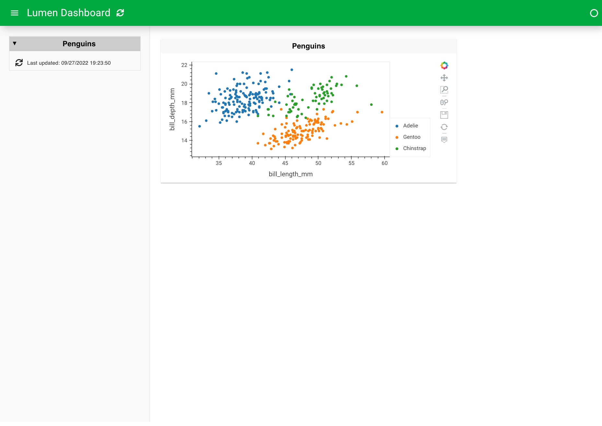
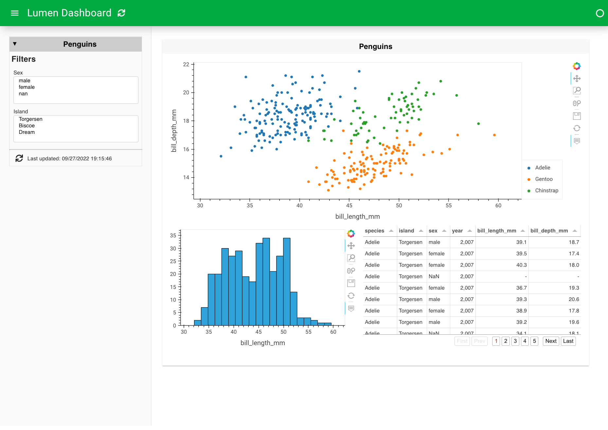

# Build an App
This guide will guide you through the steps of how to build a Lumen app that will look like this:


## Building the app
This section will walk through the steps to creating the app.
Create a file named `penguins.yaml`.
The first thing which is needed is a source. Here we will add a penguin source from a file that contains a penguin's table.

Then launch the app with `lumen serve penguins.yaml --autoreload` in your terminal and open `http://localhost:5006` in your browser of choice.
By using `--autoreload`, the dashboard automatically refreshes and updates the application whenever we make changes to the YAML file.


::::{tab-set}
:::{tab-item} YAML
:sync: yaml
``` {code-block} yaml

sources:
  penguin_source:
    type: file
    tables:
      table_penguin: https://raw.githubusercontent.com/rfordatascience/tidytuesday/master/data/2020/2020-07-28/penguins.csv
```
:::

:::{tab-item} Preview
:sync: preview


:::
::::

This returns an empty dashboard because we don't have a targeted view.
The simplest view to add is a table with the penguin's table in it.


::::{tab-set}
:::{tab-item} YAML
:sync: yaml
``` {code-block} yaml
:emphasize-lines: 7-12

sources:
  penguin_source:
    type: file
    tables:
      table_penguin: https://raw.githubusercontent.com/rfordatascience/tidytuesday/master/data/2020/2020-07-28/penguins.csv

targets:
  - title: Penguins
    source: penguin_source
    views:
      - type: table
        table: penguin_table

```
:::

:::{tab-item} Preview
:sync: preview


:::
::::


The table gives a good understanding of the data, but to really understand it, we have to visualize it.
This can be done with a [hvplot](https://hvplot.holoviz.org/) view and is as easy as replacing the table type with a hvplot type.

::::{tab-set}
:::{tab-item} YAML
:sync: yaml
``` {code-block} yaml
:emphasize-lines: 11

sources:
  penguin_source:
    type: file
    tables:
      table_penguin: https://raw.githubusercontent.com/rfordatascience/tidytuesday/master/data/2020/2020-07-28/penguins.csv

targets:
  - title: Penguins
    source: penguin_source
    views:
      - type: hvplot
        table: penguin_table
```
:::

:::{tab-item} Preview
:sync: preview


:::
::::


This plot is a bit overwhelming, so instead of plotting everything in one plot, we can plot `bill_length_mm` on the x-axis and `bill_depth_mm` on the y-axis.
Furthermore, we can color based on the specie and change the kind of the plot to scatter.

::::{tab-set}
:::{tab-item} YAML
:sync: yaml

``` {code-block} yaml
:emphasize-lines: 13-17
sources:
  penguin_source:
    type: file
    tables:
      table_penguin: https://raw.githubusercontent.com/rfordatascience/tidytuesday/master/data/2020/2020-07-28/penguins.csv

targets:
  - title: Penguins
    source: penguin_source
    views:
      - type: hvplot
        table: penguin_table
        x: bill_length_mm
        y: bill_depth_mm
        kind: scatter
        color: species
```
:::

:::{tab-item} Preview
:sync: preview


:::
::::


Let's now set up two filters based on sex and the island of the penguins, which is done by adding a pipeline with these filters.

::::{tab-set}
:::{tab-item} YAML
:sync: yaml

``` {code-block} yaml
:emphasize-lines: 7-15

sources:
  penguin_source:
    type: file
    tables:
      penguin_table: https://raw.githubusercontent.com/rfordatascience/tidytuesday/master/data/2020/2020-07-28/penguins.csv

pipelines:
  penguin_pipeline:
    source: penguin_source
    table: penguin_table
    filters:
      - type: widget
        field: sex
      - type: widget
        field: island

targets:
  - title: Penguins
    pipeline: penguin_pipeline
    views:
      - type: hvplot
        x: bill_length_mm
        y: bill_depth_mm
        kind: scatter
        color: species
```
:::

:::{tab-item} Preview
:sync: preview


:::
::::

We can even expand the views with more plots like histograms of some of the penguin's features.

::::{tab-set}
:::{tab-item} YAML
:sync: yaml

``` {code-block} yaml
:emphasize-lines: 26-34

sources:
  penguin_source:
    type: file
    tables:
      penguin_table: https://raw.githubusercontent.com/rfordatascience/tidytuesday/master/data/2020/2020-07-28/penguins.csv

pipelines:
  penguin_pipeline:
    source: penguin_source
    table: penguin_table
    filters:
      - type: widget
        field: sex
      - type: widget
        field: island

targets:
  - title: Penguins
    pipeline: penguin_pipeline
    views:
      - type: hvplot
        x: bill_length_mm
        y: bill_depth_mm
        kind: scatter
        color: species
      - type: hvplot
        kind: hist
        y: bill_length_mm
      - type: hvplot
        kind: hist
        y: bill_depth_mm
      - type: hvplot
        kind: hist
        y: body_mass_g

```
:::

:::{tab-item} Preview
:sync: preview


:::
::::


The layout of the views is in a column where we can't even see the last plot, and the dashboard is non-responsive.
We can get responsive plots by adding `sizing_mode` to the target and `responsive` to the views, and by changing the `layout` and `height`, we can customize how the dashboard looks and feels.

::::{tab-set}
:::{tab-item} YAML
:sync: yaml

``` {code-block} yaml
:emphasize-lines: 20-22, 29-30, 34-35, 39-40, 44-45

sources:
  penguin_source:
    type: file
    tables:
      penguin_table: https://raw.githubusercontent.com/rfordatascience/tidytuesday/master/data/2020/2020-07-28/penguins.csv

pipelines:
  penguin_pipeline:
    source: penguin_source
    table: penguin_table
    filters:
      - type: widget
        field: sex
      - type: widget
        field: island

targets:
  - title: Penguins
    pipeline: penguin_pipeline
    layout: [[0], [1, 2, 3]]
    sizing_mode: stretch_width
    height: 800
    views:
      - type: hvplot
        x: bill_length_mm
        y: bill_depth_mm
        kind: scatter
        color: species
        responsive: true
        height: 450
      - type: hvplot
        kind: hist
        y: bill_length_mm
        responsive: true
        height: 350
      - type: hvplot
        kind: hist
        y: bill_depth_mm
        responsive: true
        height: 350
      - type: hvplot
        kind: hist
        y: body_mass_g
        responsive: true
        height: 350
```
:::

:::{tab-item} Preview
:sync: preview


:::
::::

Using `config`, we can also give a more descriptive title and change the theme to dark.

::::{tab-set}
:::{tab-item} YAML
:sync: yaml

``` {code-block} yaml
:emphasize-lines: 1-3

config:
  title: Palmer Penguins
  theme: dark

sources:
  penguin_source:
    type: file
    tables:
      penguin_table: https://raw.githubusercontent.com/rfordatascience/tidytuesday/master/data/2020/2020-07-28/penguins.csv

pipelines:
  penguin_pipeline:
    source: penguin_source
    table: penguin_table
    filters:
      - type: widget
        field: sex
      - type: widget
        field: island

targets:
  - title: Penguins
    pipeline: penguin_pipeline
    layout: [[0], [1, 2, 3]]
    sizing_mode: stretch_width
    height: 800
    views:
      - type: hvplot
        x: bill_length_mm
        y: bill_depth_mm
        kind: scatter
        color: species
        responsive: true
        height: 450
      - type: hvplot
        kind: hist
        y: bill_length_mm
        responsive: true
        height: 350
      - type: hvplot
        kind: hist
        y: bill_depth_mm
        responsive: true
        height: 350
      - type: hvplot
        kind: hist
        y: body_mass_g
        responsive: true
        height: 350

```
:::

:::{tab-item} Preview
:sync: preview


:::
::::


:::{note}
This is just a small example of how to build an app with Lumen and illuminate your data.

To continue building this app, look at the [Penguins example](../gallery/penguins) or other examples in the [Gallery](../gallery/index).
:::
