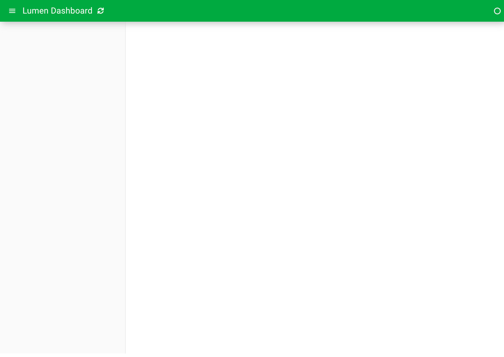
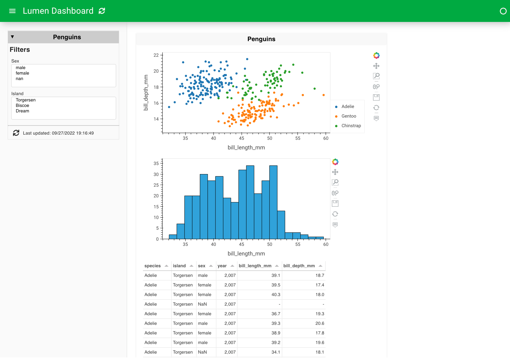

# {octicon}`tools;2em;sd-mr-1` Build a dashboard

```{admonition} What is the purpose of this page?
---
class: important
---
This tutorial is meant to get your hands dirty with building a Lumen dashboard. Don't worry about understanding everything just yet - your only obligation is to complete the steps as directed.
```

You will build a simple Lumen dashboard and deploy it in your browser. The result will look something like this:


## 1. Create a YAML file

Open your favorite text editor and create an empty file called `penguins.yaml`.

## 2. Add a data source

The first thing that is needed is a source of data. Insert and save the text below to add a remote file source. This will tell Lumen to fetch the [Palmer Penguins dataset](https://allisonhorst.github.io/palmerpenguins/):

```{code-block} yaml
sources:
  penguin_source:
    type: file
    tables:
      penguin_table: https://raw.githubusercontent.com/rfordatascience/tidytuesday/master/data/2020/2020-07-28/penguins.csv
```

Once you have saved your file, open a terminal and navigate to the location of this file.

In the terminal, launch the file with:

``` bash
lumen serve penguins.yaml --show --autoreload
```

By using `--autoreload`, the dashboard automatically updates the application whenever we make changes to the YAML file.

What you should see in your browser should now match what is on the `Preview` tab:

::::{tab-set}

:::{tab-item} YAML
:sync: yaml

```{code-block} yaml
sources:
  penguin_source:
    type: file
    tables:
      penguin_table: https://raw.githubusercontent.com/rfordatascience/tidytuesday/master/data/2020/2020-07-28/penguins.csv
```
:::

:::{tab-item} Preview
:sync: preview

:::

::::

So far, this returns an empty dashboard because we haven't yet specified a view - so let's add one!

## 3. Specify a table view

The simplest view to add is a table with the raw data. This gives us a good idea of what we are working with and the available fields.

::::{tab-set}

:::{tab-item} YAML
:sync: yaml

``` {code-block} yaml
:emphasize-lines: 7-12

sources:
  penguin_source:
    type: file
    tables:
      penguin_table: https://raw.githubusercontent.com/rfordatascience/tidytuesday/master/data/2020/2020-07-28/penguins.csv

layouts:
  - title: Penguins
    source: penguin_source
    views:
      - type: table
        table: penguin_table

```
:::

:::{tab-item} Preview
:sync: preview

:::

::::

## 4. Create a plot view

The table gives us a primer of the data source, but to start understanding patterns in the data, we have to visualize it. There is a wide range of views to chose from but for now we will create an [hvPlot](https://hvplot.holoviz.org/) view. This is as easy as replacing the `table` type with a `hvplot` type.

::::{tab-set}

:::{tab-item} YAML
:sync: yaml
```{code-block} yaml
---
emphasize-lines: 11
---
sources:
  penguin_source:
    type: file
    tables:
      penguin_table: https://raw.githubusercontent.com/rfordatascience/tidytuesday/master/data/2020/2020-07-28/penguins.csv

layouts:
  - title: Penguins
    source: penguin_source
    views:
      - type: hvplot
        table: penguin_table
```
:::

:::{tab-item} Preview
:sync: preview

:::

::::

## 5. Make a scatter plot

This plot is a bit overwhelming, so instead of plotting everything in one plot, we can plot `bill_length_mm` on the x-axis and `bill_depth_mm` on the y-axis. Furthermore, we can color based on the species and change the kind of the plot to scatter.

::::{tab-set}

:::{tab-item} YAML
:sync: yaml
``` {code-block} yaml
:emphasize-lines: 13-17
sources:
  penguin_source:
    type: file
    tables:
      penguin_table: https://raw.githubusercontent.com/rfordatascience/tidytuesday/master/data/2020/2020-07-28/penguins.csv

layouts:
  - title: Penguins
    source: penguin_source
    views:
      - type: hvplot
        table: penguin_table
        x: bill_length_mm
        y: bill_depth_mm
        kind: scatter
        color: species
```
:::

:::{tab-item} Preview
:sync: preview

:::

::::

## 6. Manipulate the data

Let's now set up two filter widgets based on two fields of the data - 'sex' and 'island'. Since we don't need all of the data columns, let's also add a transform to select only a subset of the data.

::::{tab-set}

:::{tab-item} YAML
:sync: yaml
``` {code-block} yaml
:emphasize-lines: 7-18

sources:
  penguin_source:
    type: file
    tables:
      penguin_table: https://raw.githubusercontent.com/rfordatascience/tidytuesday/master/data/2020/2020-07-28/penguins.csv

pipelines:
  penguin_pipeline:
    source: penguin_source
    table: penguin_table
    filters:
      - type: widget
        field: sex
      - type: widget
        field: island
    transforms:
      - type: columns
        columns: ['species', 'island', 'sex', 'year', 'bill_length_mm', 'bill_depth_mm']

layouts:
  - title: Penguins
    pipeline: penguin_pipeline
    views:
      - type: hvplot
        x: bill_length_mm
        y: bill_depth_mm
        kind: scatter
        color: species
```
:::

:::{tab-item} Preview
:sync: preview

:::

::::

## 7. Expand the view types

We can even expand the views with a histogram and a table.

::::{tab-set}

:::{tab-item} YAML
:sync: yaml
``` {code-block} yaml
:emphasize-lines: 29-34

sources:
  penguin_source:
    type: file
    tables:
      penguin_table: https://raw.githubusercontent.com/rfordatascience/tidytuesday/master/data/2020/2020-07-28/penguins.csv

pipelines:
  penguin_pipeline:
    source: penguin_source
    table: penguin_table
    filters:
      - type: widget
        field: sex
      - type: widget
        field: island
    transforms:
      - type: columns
        columns: ['species', 'island', 'sex', 'year', 'bill_length_mm', 'bill_depth_mm']

layouts:
  - title: Penguins
    pipeline: penguin_pipeline
    views:
      - type: hvplot
        x: bill_length_mm
        y: bill_depth_mm
        kind: scatter
        color: species
      - type: hvplot
        kind: hist
        y: bill_length_mm
      - type: table
        show_index: false

```
:::

:::{tab-item} Preview
:sync: preview

:::

::::

## 8. Customize the appearance and behavior

The default layout we get is less than ideal for this case since it cuts off one of our plots, leaves a lot of empty space, and does not resize responsively. We can get responsive plots by adding `sizing_mode` to the layout and `responsive` to the views. By changing the `layout` and `height`, we can further customize how the dashboard looks.

::::{tab-set}

:::{tab-item} YAML
:sync: yaml
``` {code-block} yaml
:emphasize-lines: 23-25, 32-33, 37-38, 43

sources:
  penguin_source:
    type: file
    tables:
      penguin_table: https://raw.githubusercontent.com/rfordatascience/tidytuesday/master/data/2020/2020-07-28/penguins.csv

pipelines:
  penguin_pipeline:
    source: penguin_source
    table: penguin_table
    filters:
      - type: widget
        field: sex
      - type: widget
        field: island
    transforms:
      - type: columns
        columns: ['species', 'island', 'sex', 'year', 'bill_length_mm', 'bill_depth_mm']

layouts:
  - title: Penguins
    pipeline: penguin_pipeline
    layout: [[0], [1, 2]]
    sizing_mode: stretch_width
    height: 800
    views:
      - type: hvplot
        x: bill_length_mm
        y: bill_depth_mm
        kind: scatter
        color: species
        responsive: true
        height: 400
      - type: hvplot
        kind: hist
        y: bill_length_mm
        responsive: true
        height: 300
      - type: table
        show_index: false
        height: 300
```
:::

:::{tab-item} Preview
:sync: preview

:::

::::

## 9. Add a title and theme

Final step - let's use a `config` section to give our dashboard a more descriptive title and change the overall theme to dark. Note that we can also set our table to dark by adding a new *theme* parameter at the bottom.

::::{tab-set}

:::{tab-item} YAML
:sync: yaml
``` {code-block} yaml
:emphasize-lines: 1-3, 46

config:
  title: Palmer Penguins
  theme: dark

sources:
  penguin_source:
    type: file
    tables:
      penguin_table: https://raw.githubusercontent.com/rfordatascience/tidytuesday/master/data/2020/2020-07-28/penguins.csv

pipelines:
  penguin_pipeline:
    source: penguin_source
    table: penguin_table
    filters:
      - type: widget
        field: sex
      - type: widget
        field: island
    transforms:
      - type: columns
        columns: ['species', 'island', 'sex', 'year', 'bill_length_mm', 'bill_depth_mm']

layouts:
  - title: Penguins
    pipeline: penguin_pipeline
    layout: [[0], [1, 2]]
    sizing_mode: stretch_width
    height: 800
    views:
      - type: hvplot
        x: bill_length_mm
        y: bill_depth_mm
        kind: scatter
        color: species
        responsive: true
        height: 400
      - type: hvplot
        kind: hist
        y: bill_length_mm
        responsive: true
        height: 300
      - type: table
        show_index: false
        height: 300
        theme: midnight

```
:::

:::{tab-item} Preview
:sync: preview

:::

::::

Congratulations! You have created your first Lumen dashboard and know a bit more about penguins!

```{note}
This is just a simple example of how to build a dashboard with Lumen. The next step is to review the core concepts of what we just achieved so you can generalize these steps to create your own dashboard.
```
