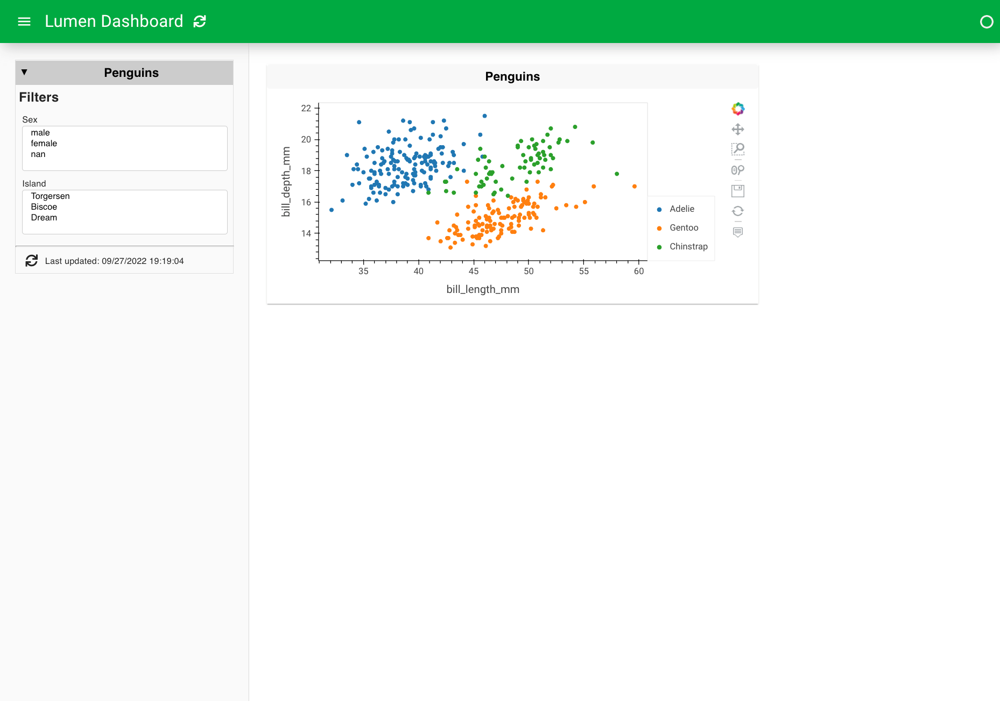

# {octicon}`tools;2em;sd-mr-1` Build a dashboard
:::{admonition} What is the purpose of this page?
:class: important
This tutorial is meant to get your hands dirty with building a Lumen dashboard. Don't worry about understanding everything just yet - your only obligation is to complete the steps as directed.
:::

You will build a simple Lumen dashboard and deploy it in your browser. The result will look something like this:

:::::{grid} 1

::::{grid-item}

:::{card}
:img-background: ../_static/getting_started/build_app_07.png
:::

::::

:::::

## Building the dashboard
This section will walk through the steps to creating the app.
Create a file named `penguins.yaml`.
The first thing which is needed is a source. Here we will add file source that will fetch data about individual penguins of three different and various measurement about them (such as the length of their bill).

Then launch the app with `lumen serve penguins.yaml --autoreload` in your terminal and open `http://localhost:5006` in your browser of choice.
By using `--autoreload`, the dashboard automatically refreshes and updates the application whenever we make changes to the YAML file.


::::{tab-set}
:::{tab-item} YAML
``` {code-block} yaml

sources:
  penguin_source:
    type: file
    tables:
      penguin_table: https://raw.githubusercontent.com/rfordatascience/tidytuesday/master/data/2020/2020-07-28/penguins.csv
```
:::

:::{tab-item} Preview


:::
::::

This returns an empty dashboard because we don't have a targeted view.
The simplest view to add is a table with the penguin's table in it.


::::{tab-set}
:::{tab-item} YAML
``` {code-block} yaml
:emphasize-lines: 7-12

sources:
  penguin_source:
    type: file
    tables:
      penguin_table: https://raw.githubusercontent.com/rfordatascience/tidytuesday/master/data/2020/2020-07-28/penguins.csv

targets:
  - title: Penguins
    source: penguin_source
    views:
      - type: table
        table: penguin_table

```
:::

:::{tab-item} Preview


:::
::::


The table gives a good understanding of the data, but to really understand it, we have to visualize it.
This can be done with a [hvplot](https://hvplot.holoviz.org/) view and is as easy as replacing the table type with a hvplot type.

::::{tab-set}
:::{tab-item} YAML
``` {code-block} yaml
:emphasize-lines: 11

sources:
  penguin_source:
    type: file
    tables:
      penguin_table: https://raw.githubusercontent.com/rfordatascience/tidytuesday/master/data/2020/2020-07-28/penguins.csv

targets:
  - title: Penguins
    source: penguin_source
    views:
      - type: hvplot
        table: penguin_table
```
:::

:::{tab-item} Preview


:::
::::


This plot is a bit overwhelming, so instead of plotting everything in one plot, we can plot `bill_length_mm` on the x-axis and `bill_depth_mm` on the y-axis.
Furthermore, we can color based on the species and change the kind of the plot to scatter.

::::{tab-set}
:::{tab-item} YAML

``` {code-block} yaml
:emphasize-lines: 13-17
sources:
  penguin_source:
    type: file
    tables:
      penguin_table: https://raw.githubusercontent.com/rfordatascience/tidytuesday/master/data/2020/2020-07-28/penguins.csv

targets:
  - title: Penguins
    source: penguin_source
    views:
      - type: hvplot
        table: penguin_table
        x: bill_length_mm
        y: bill_depth_mm
        kind: scatter
        color: species
```
:::

:::{tab-item} Preview


:::
::::


Let's now set up two filters based on sex and the island of the penguins, which is done by adding a pipeline with these filters. Since we aren't using all of the data columns, let's also add a transform to select only a subset of the data.

::::{tab-set}
:::{tab-item} YAML

``` {code-block} yaml
:emphasize-lines: 7-18

sources:
  penguin_source:
    type: file
    tables:
      penguin_table: https://raw.githubusercontent.com/rfordatascience/tidytuesday/master/data/2020/2020-07-28/penguins.csv

pipelines:
  penguin_pipeline:
    source: penguin_source
    table: penguin_table
    filters:
      - type: widget
        field: sex
      - type: widget
        field: island
    transforms:
      - type: columns
        columns: ['species', 'island', 'sex', 'year', 'bill_length_mm', 'bill_depth_mm']

targets:
  - title: Penguins
    pipeline: penguin_pipeline
    views:
      - type: hvplot
        x: bill_length_mm
        y: bill_depth_mm
        kind: scatter
        color: species
```
:::

:::{tab-item} Preview


:::
::::

We can even expand the views with a histogram and table.

::::{tab-set}
:::{tab-item} YAML

``` {code-block} yaml
:emphasize-lines: 29-34

sources:
  penguin_source:
    type: file
    tables:
      penguin_table: https://raw.githubusercontent.com/rfordatascience/tidytuesday/master/data/2020/2020-07-28/penguins.csv

pipelines:
  penguin_pipeline:
    source: penguin_source
    table: penguin_table
    filters:
      - type: widget
        field: sex
      - type: widget
        field: island
    transforms:
      - type: columns
        columns: ['species', 'island', 'sex', 'year', 'bill_length_mm', 'bill_depth_mm']

targets:
  - title: Penguins
    pipeline: penguin_pipeline
    views:
      - type: hvplot
        x: bill_length_mm
        y: bill_depth_mm
        kind: scatter
        color: species
      - type: hvplot
        kind: hist
        y: bill_length_mm
      - type: table
        show_index: false

```
:::

:::{tab-item} Preview


:::
::::


The default layout we get is less than ideal for this case since it cuts off one of our plots, leaves a lot of empty space and does not resize responsively.
We can get responsive plots by adding `sizing_mode` to the target and `responsive` to the views, and by changing the `layout` and `height`, we can customize how the dashboard looks and feels.

::::{tab-set}
:::{tab-item} YAML

``` {code-block} yaml
:emphasize-lines: 23-25, 32-33, 37-38, 43

sources:
  penguin_source:
    type: file
    tables:
      penguin_table: https://raw.githubusercontent.com/rfordatascience/tidytuesday/master/data/2020/2020-07-28/penguins.csv

pipelines:
  penguin_pipeline:
    source: penguin_source
    table: penguin_table
    filters:
      - type: widget
        field: sex
      - type: widget
        field: island
    transforms:
      - type: columns
        columns: ['species', 'island', 'sex', 'year', 'bill_length_mm', 'bill_depth_mm']

targets:
  - title: Penguins
    pipeline: penguin_pipeline
    layout: [[0], [1, 2]]
    sizing_mode: stretch_width
    height: 800
    views:
      - type: hvplot
        x: bill_length_mm
        y: bill_depth_mm
        kind: scatter
        color: species
        responsive: true
        height: 400
      - type: hvplot
        kind: hist
        y: bill_length_mm
        responsive: true
        height: 300
      - type: table
        show_index: false
        height: 300
```
:::

:::{tab-item} Preview


:::
::::

Using `config`, we can also give a more descriptive title and change the theme to dark.

::::{tab-set}
:::{tab-item} YAML

``` {code-block} yaml
:emphasize-lines: 1-3

config:
  title: Palmer Penguins
  theme: dark

sources:
  penguin_source:
    type: file
    tables:
      penguin_table: https://raw.githubusercontent.com/rfordatascience/tidytuesday/master/data/2020/2020-07-28/penguins.csv

pipelines:
  penguin_pipeline:
    source: penguin_source
    table: penguin_table
    filters:
      - type: widget
        field: sex
      - type: widget
        field: island
    transforms:
      - type: columns
        columns: ['species', 'island', 'sex', 'year', 'bill_length_mm', 'bill_depth_mm']

targets:
  - title: Penguins
    pipeline: penguin_pipeline
    layout: [[0], [1, 2]]
    sizing_mode: stretch_width
    height: 800
    views:
      - type: hvplot
        x: bill_length_mm
        y: bill_depth_mm
        kind: scatter
        color: species
        responsive: true
        height: 400
      - type: hvplot
        kind: hist
        y: bill_length_mm
        responsive: true
        height: 300
      - type: table
        show_index: false
        height: 300

```
:::

:::{tab-item} Preview


:::
::::


:::{note}
This is just a simple example of how to build a dashboard with Lumen. The next step is to review the core concepts of what we just acheived!
:::
