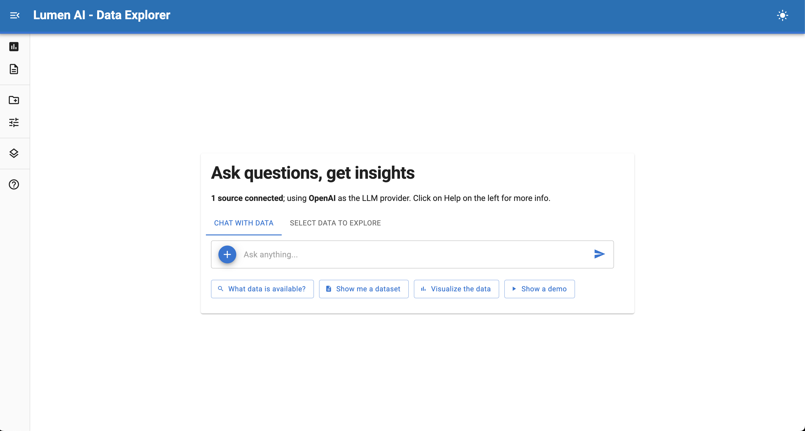
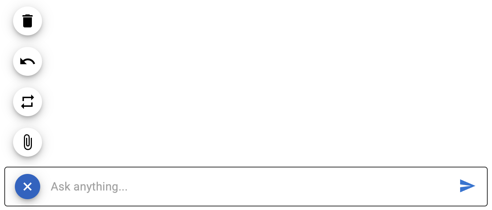
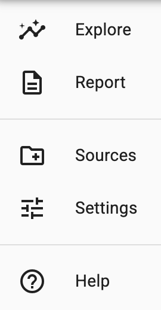
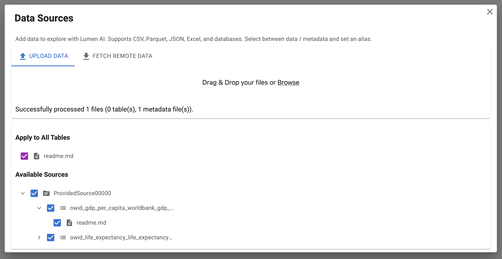
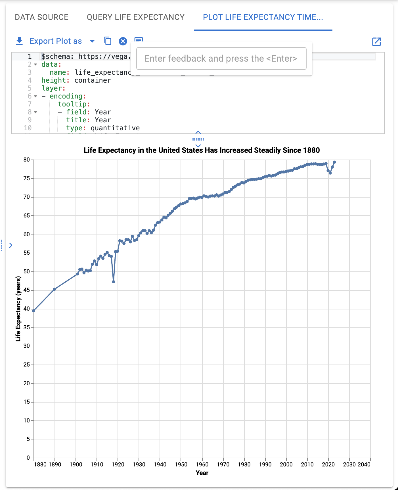
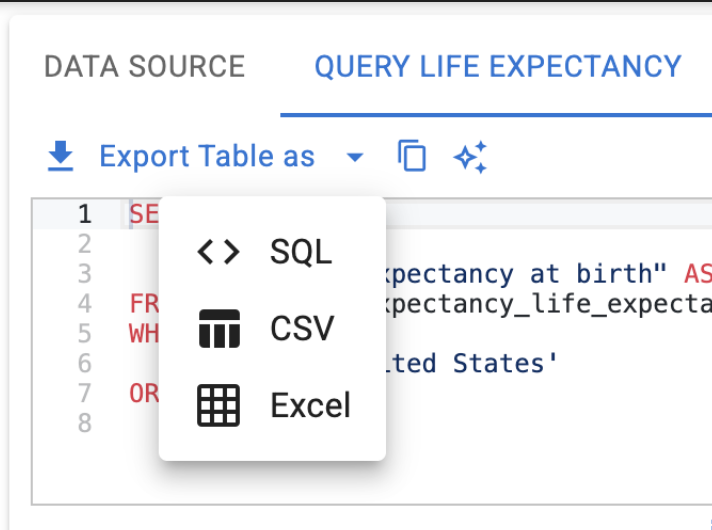
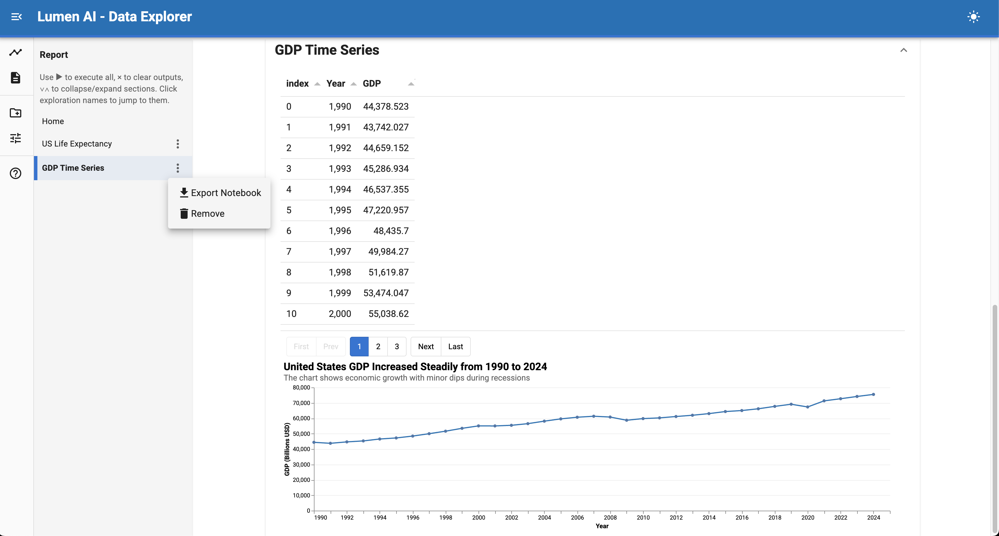
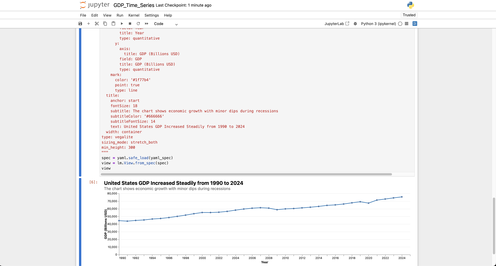

# :material-map: Navigating the Lumen UI

Lumen Explorer combines data exploration and AI-powered analysis in one split-screen interface. This guide shows you where everything is and how to use it.

## Get started

### The splash screen

When you open Lumen Explorer, you'll see two main tabs to get started:

**Chat with data** — Ask questions about your data in plain English. The AI will generate queries and visualizations automatically.

**Select data to explore** — Pick a specific table from your connected sources and start an exploration.

**Quick action suggestions** — Below the chat input, you'll see helpful starter prompts like "What data is available?", "Show me a dataset", "Visualize the data", and "Show a demo". Click any of these to get started quickly.

### The chat panel

The chat interface is where you interact with Lumen AI. The input area provides several built-in actions:

**Undo** — Remove the last message and its response.

**Rerun** — Re-execute the last query to regenerate results.

**Clear** — Delete all messages and start fresh.

**Upload files** — Attach files directly to add new data sources or provide context.

### The navigation menu

The left sidebar provides quick access to all major features:

**Explore** — Main chat and analysis mode (default view)

**Report** — Consolidated view of all explorations

**Sources** — Manage data connections

**Settings** — Configure LLM and analysis options

**Help** — Access interface documentation

### Adding data sources

Click **Sources** from the left sidebar to manage your data:

**Upload data** — Drag and drop files or click **Browse**. Supports CSV, Parquet, JSON, Excel, and more.

**Fetch remote data** — Enter URLs (one per line) and press Shift+Enter to download files from the web.

**Classify files** — Choose **data** (queryable tables) or **metadata** (documentation for the AI)

**Control visibility** — Toggle tables on/off to control what the AI can access. Apply metadata to specific tables or all tables at once.

All connections persist within your current session across multiple explorations.

## The results screen

Once you start analyzing, the results screen displays your outputs:

**Exploration sidebar** — On the left, navigate between different explorations and follow-ups.

**Result tabs** — On the right, switch between different analysis outputs (data tables, visualizations, etc.) Use the Data Source tab to explore the original data with [Graphic Walker](https://docs.kanaries.net/graphic-walker).

**Code editor** — Review and modify SQL queries or visualization specs, which will update views in real-time.

**Interactive views** — View data tables with sorting, filtering, and pagination. Visualizations support tooltips.

**Export options** — Download tables as CSV or Excel files or download visualizations as PNG, PDF, etc.

### Understanding explorations

Each SQL query that returns data creates a new **exploration** — a persistent workspace for that analysis:

**Top-level explorations** — New independent questions start here

**Nested explorations** — Follow-up questions appear under their parent

**Exploration tree** — Navigate between explorations in the left panel

**Persistent context** — Each exploration captures the conversation, queries, and visualizations

### Revising and refining

When you need to adjust your analysis, Lumen provides tools to refine and iterate on your results without starting from scratch.

For plots, there are also annotation controls that allow you to highlight key insights directly on the visualization.

### Settings and control options

Use **Settings** in the left sidebar to configure analysis behavior:

**Chain of Thought** — Shows AI reasoning steps (disabled by default)

**SQL Planning** — AI plans queries before executing (disabled by default)

**Validation Step** — AI validates results for correctness (disabled by default)

**LLM Configuration** — Choose and configure your language model

## Exporting and sharing

### Export tables and visualizations

Above every code editor, you'll find export options:

- **Export Table** — Download data tables as CSV or Excel files.

- **Export Visualization** — Save visualizations as PNG, PDF, SVG, etc.

### Export to Jupyter notebooks

Export the current exploration as a Jupyter notebook under the exploration sidebar.

Exported notebooks include all questions, SQL queries, and visualizations, ready to run or share.

### Report mode

In Report Mode, export everything as one comprehensive notebook under the Report sidebar.

Switch to **Report** mode from the left sidebar to see all your explorations in a consolidated view. This provides an overview of all your analysis work in one place.

## Next steps

Once you're comfortable with the interface, try the quick action buttons on the splash screen. Then move on to asking more complex questions — the AI handles the SQL while you focus on insights.

**Next:** [Using Lumen AI →](using_lumen_ai.md)
