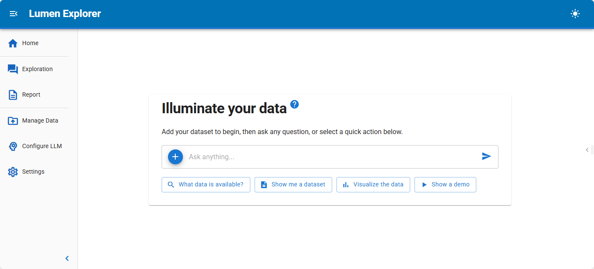
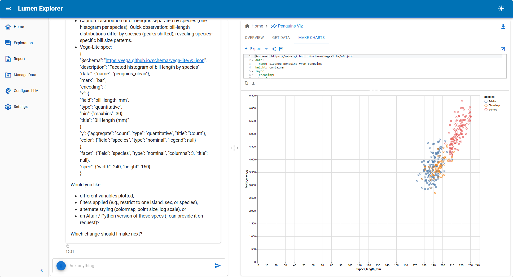
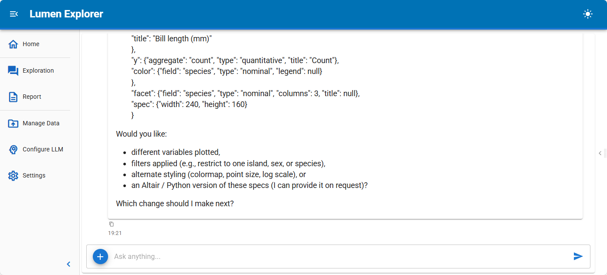
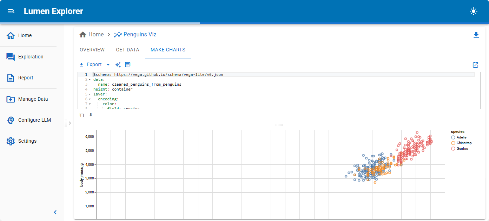
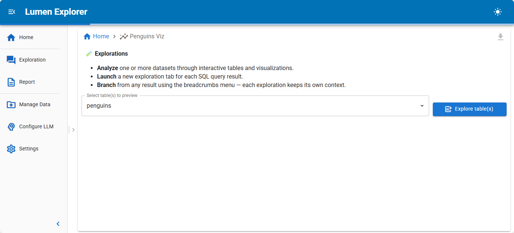
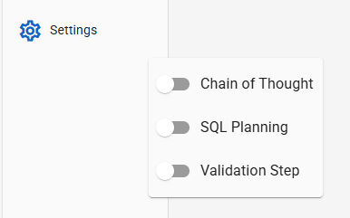

# :material-map: Navigating the Lumen UI

Lumen Explorer combines data exploration and AI-powered analysis in one split-screen interface. This guide shows you where everything is and how to use it.

## Get started

### Your interface at a glance

When you open Lumen Explorer, you'll see the *Chat Panel* where you can drag and drop data and ask questions.

Hidden on the right you will find the *Sessions Panel* where you manage your sessions.

When the AI start responding to your first question or task the *Results Panel* will appear on the right instead of the *Sessions Panel*.

**Chat panel** — Drag and drop data and ask questions about your data in plain English. The AI will generate queries and visualizations automatically.

**Results area** — View interactive tables, charts, and analysis results. Use Graphic Walker to filter, sort, and explore visually. Appears when you ask your first question.

**Sessions panel** Track all your sessions. Each exploration is a separate session, so you can branch off previous results and compare different approaches. Appends as you ask more questions.

### Ask questions

You can ask the AI about your data in two ways:

**Type a direct question** — Enter any question in the "Ask anything..." text box. For example: "What are the top 5 customers by revenue?" or "Show me sales trends over time." Hit enter or click the send arrow.

**Use quick action buttons** — Below the text box, you'll find preset buttons that handle common tasks without typing:

- **What data is available?** — Get an instant summary of your dataset's structure and contents.
- **Show me a dataset** — Display a dataset and its columns.
- **Visualize the data** — Generate an automatic visualization to explore patterns and distributions.
- **Show a demo** — See a pre-built example of what Lumen can do (appears when demo mode is enabled).

### Interact with messages

The chat interface provides several built-in actions:

**Undo** — Remove the last message and its response.

**Rerun** — Re-execute the last query to regenerate results.

**Clear** — Delete all messages and start a new conversation.

**Upload files** — You can attach files directly in the chat input to add new data sources or provide additional context.

**Select LLM** — Click the sparkle icon (✨) in the chat input area to configure your LLM provider or switch models.

## Work with results

### Navigate the sidebar

The left sidebar provides quick access to all major features:

**Home** — Your starting point. This is where all sessions begin. Switch back here anytime.

**Exploration** — The main chat and analysis mode (default view).

**Report** — Switch to report mode to see all explorations in a consolidated view for exporting.

**Manage Data** — Add new data sources (CSV, Parquet, JSON, etc.) or view connected sources.

**Configure LLM** — Change your AI model provider or adjust model settings.

**Settings** — Toggle Chain of Thought, SQL Planning, and Validation Step options.

### Control how analysis runs

The settings menu (⚙️ icon in the left sidebar) lets you toggle three analysis features:

**Chain of Thought** — When enabled, the AI shows its reasoning steps. Use this when you want to understand *how* the AI arrived at an answer. Disabled by default.

**SQL Planning** — When enabled, the AI plans its SQL query before executing it. This improves accuracy for complex questions. Disabled by default.

**Validation Step** — When enabled, the AI double-checks results for correctness. This catches data errors early. Disabled by default.

Simply click the toggle next to each option to turn it on or off.

### Organize your explorations

Each time you run a SQL query that returns data, a new "exploration" is created. The breadcrumbs at the top show your current location.

**Home** — Your starting point. All initial questions begin here.

**Individual explorations** — Each SQL query result gets its own exploration with a descriptive title (e.g., "Top Customers by Revenue"). Click breadcrumbs to navigate between them.

**Remove explorations** — Click the trash icon (🗑️) next to any exploration to delete it.

### View results

When an analysis completes, you'll see:

**Overview tab** — An interactive table powered by Graphic Walker. Here you can sort, filter, and download data.

**SQL panel** (in the left pane) — The exact SQL query used to fetch the data, along with controls to modify or re-run it.

**Additional tabs** — Visualizations, charts, or summaries appear as separate tabs depending on what the AI generated.

**Pop-out views** — Click the "Open in new pane" icon on any result to view it alongside other results for comparison.

## Save and share

### Export and download

At the top right of the screen, click **Export Notebook** to save your current exploration as a Jupyter notebook. This includes all your questions, SQL queries, and visualizations so you can run them again or share them with others.

If you're in Report Mode (accessible via the left sidebar), you can export all explorations as a single comprehensive notebook.

### Manage your data

Click **Manage Data** from the left sidebar to:

- **Add Sources** — Upload CSV, Parquet, JSON files or connect to databases
- **View Sources** — See all currently connected data sources and their tables
- Remove data sources you no longer need

All data connections persist within your current session, so you can reference the same datasets across multiple explorations.

### Next steps

Once you're comfortable with the interface, try the quick action buttons to get a feel for what's possible. Then move on to asking more complex questions in the chat. The AI will handle the SQL—you just focus on what you want to learn.
