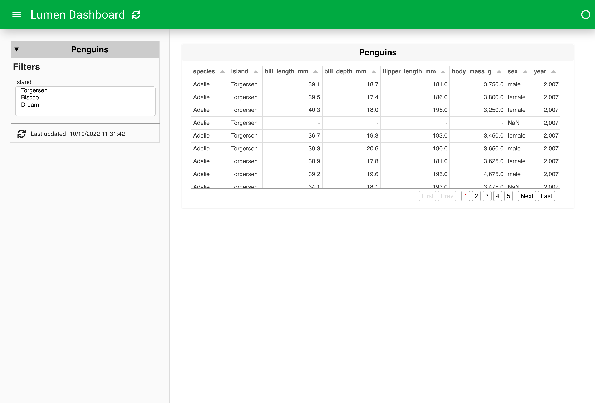
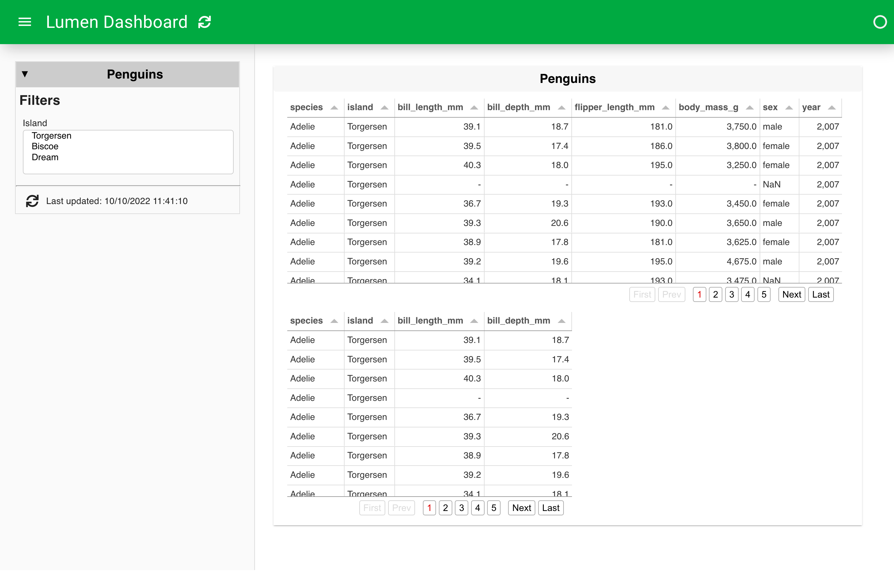

# Branch a pipeline in YAML

:::{admonition} What does this guide solve?
:class: important
This guide shows you how to build branching pipelines in the YAML specification, allowing for views of the same source data at different steps in processing.
:::

## Overview
See the Background page on [Pipeline Branching](../background/pipeline_branching.md).

## Initiating a simple dashboard
Let's first create a simple dashboard without a branch to ensure that things are working properly.

```{code-block} yaml
sources:
  penguin_source:
    type: file
    tables:
      penguin_table: https://raw.githubusercontent.com/rfordatascience/tidytuesday/master/data/2020/2020-07-28/penguins.csv

pipelines:
  penguin_pipeline:
    source: penguin_source
    table: penguin_table
    filters:
      - type: widget
        field: island

targets:
  - title: Penguins
    sizing_mode: stretch_width
    views:
      - type: table
        pipeline: penguin_pipeline
        show_index: false
        height: 300
```


## Add a branch
Now let's add a new pipeline that branches from the existing pipeline. We can accomplish this by adding a `pipeline:` parameter that refers back to the name of the first pipeline. In our example, our new pipeline, called `branch_sort`, has a `pipeline:` parameter that points back to `penguin_pipeline`.

```{code-block} yaml
:emphasize-lines: 16-20

sources:
  penguin_source:
    type: file
    tables:
      penguin_table: https://raw.githubusercontent.com/rfordatascience/tidytuesday/master/data/2020/2020-07-28/penguins.csv

pipelines:
  penguin_pipeline:
    source: penguin_source
    table: penguin_table
    filters:
      - type: widget
        field: island
  branch_sort:
    pipeline: penguin_pipeline
    transforms:
      - type: columns
        columns: ['species', 'island', 'bill_length_mm', 'bill_depth_mm']
```
## Refer to the branch in a new view
Finally, we can create a new view that displays the additional data manipulation steps present on our branch. Below, we simply specify a new table view with a `pipeline:` parameter that refers to our new `branch_sort`.

```{code-block} yaml
:emphasize-lines: 30-33

sources:
  penguin_source:
    type: file
    tables:
      penguin_table: https://raw.githubusercontent.com/rfordatascience/tidytuesday/master/data/2020/2020-07-28/penguins.csv

pipelines:
  penguin_pipeline:
    source: penguin_source
    table: penguin_table
    filters:
      - type: widget
        field: island
  branch_sort:
    pipeline: penguin_pipeline
    transforms:
      - type: columns
        columns: ['species', 'island', 'bill_length_mm', 'bill_depth_mm']

targets:
  - title: Penguins
    sizing_mode: stretch_width
    views:
      - type: table
        pipeline: penguin_pipeline
        show_index: false
        height: 300
      - type: table
        pipeline: branch_sort
        show_index: false
        height: 300
```

