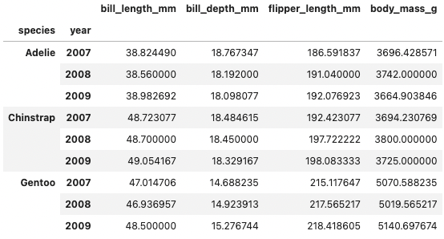

# Branch a pipeline in Python

:::{admonition} What does this guide solve?
:class: important
When working with Lumen in Python, you can build branching pipelines that allow you have different processing steps and views on the same source data. For instance, you may want to display a table of filtered data alongside a view of aggregated data.
:::

## Overview
The primary tool to create a branch of a Lumen pipeline is to use the `pipeline.chain` method. By chaining the `Pipeline` we can apply new processing steps while retaining the shared computations up to that point.


## Initiating the pipeline
Let's start by creating a pipeline up to a branching point. See the [Build a dashboard in Python](ht_pipeline_python) how-to guide for a walkthrough of these initial steps.

```python
from lumen.pipeline import Pipeline
from lumen.sources import FileSource

data_url = 'https://raw.githubusercontent.com/rfordatascience/tidytuesday/master/data/2020/2020-07-28/penguins.csv'

pipeline = Pipeline(source=FileSource(tables={'penguins': data_url}), table='penguins')

pipeline.add_filter('widget', field='species')
pipeline.add_filter('widget', field='island')
pipeline.add_filter('widget', field='sex')
pipeline.add_filter('widget', field='year')

pipeline.data
```


## Branching the pipeline
At this point, we will create a branch of our pipeline by using the `pipeline.chain` method, and apply a new transform that aggregates the data, only on this branch. We assign the result to a new `Pipeline` variable so that we can refer to it seperately from the original `pipeline`. 

```python
from lumen.transforms import Aggregate

agg_pipeline = pipeline.chain(transforms=[Aggregate(method='mean', by=['species', 'year'])])

agg_pipeline.data
```

