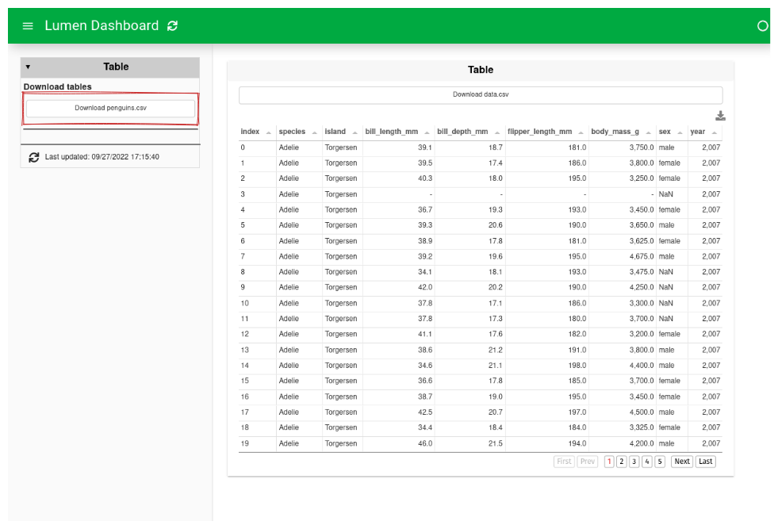
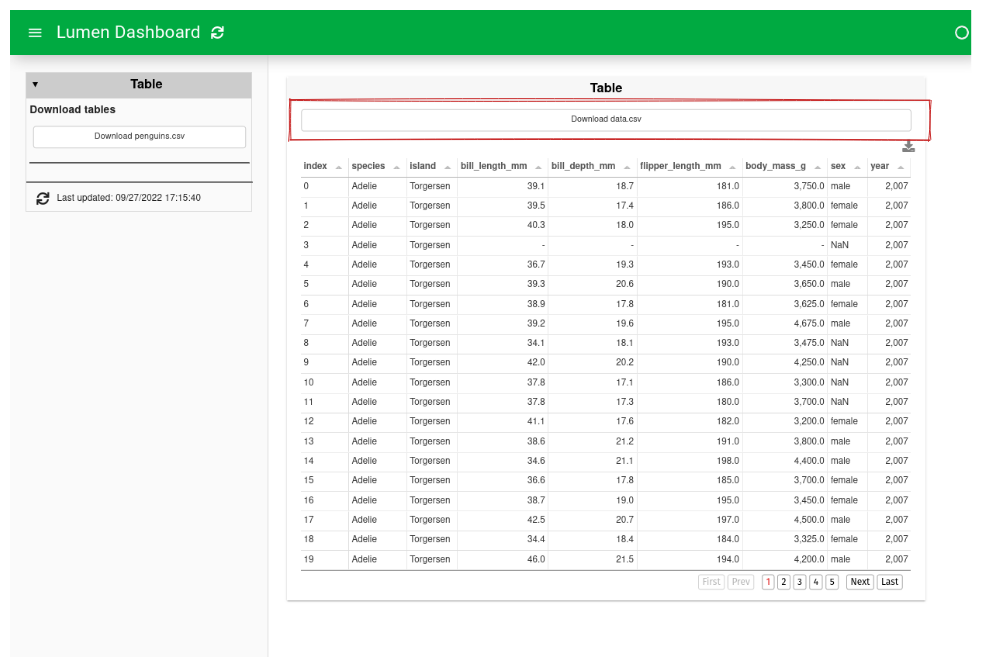
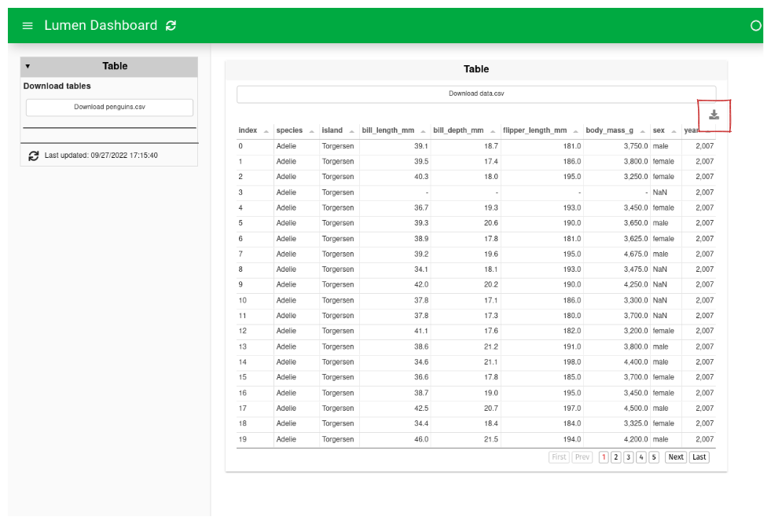

# How to download data

```{admonition} What does this guide solve?
---
class: important
---
This guide will show you how to enable your dashboard's viewer to download data
```

## Download data
There are several different ways to let a user download data.
This guide will show you three ways to do it.


::::{tab-set}
:::{tab-item} Sidebar Download

``` {code-block} yaml
:emphasize-lines: 10
sources:
  penguins:
    type: file
    tables:
      penguins: https://raw.githubusercontent.com/rfordatascience/tidytuesday/master/data/2020/2020-07-28/penguins.csv

layouts:
  - title: Table
    source: penguins
    download: csv
    views:
      - type: download
        format: csv
      - type: table
        table: penguins
        download: csv
```


:::

:::{tab-item} View Download

``` {code-block} yaml
:emphasize-lines: 12-13
sources:
  penguins:
    type: file
    tables:
      penguins: https://raw.githubusercontent.com/rfordatascience/tidytuesday/master/data/2020/2020-07-28/penguins.csv

layouts:
  - title: Table
    source: penguins
    download: csv
    views:
      - type: download
        format: csv
      - type: table
        table: penguins
        download: csv
```


:::

:::{tab-item} Table Download

``` {code-block} yaml
:emphasize-lines: 16
sources:
  penguins:
    type: file
    tables:
      penguins: https://raw.githubusercontent.com/rfordatascience/tidytuesday/master/data/2020/2020-07-28/penguins.csv

layouts:
  - title: Table
    source: penguins
    download: csv
    views:
      - type: download
        format: csv
      - type: table
        table: penguins
        download: csv
```


:::
::::

```{note}
The YAML specification for the example is the same, but the line used to create the specific download button is emphasized in the code and highlighted with a red box in the preview of the dashboard.
```
