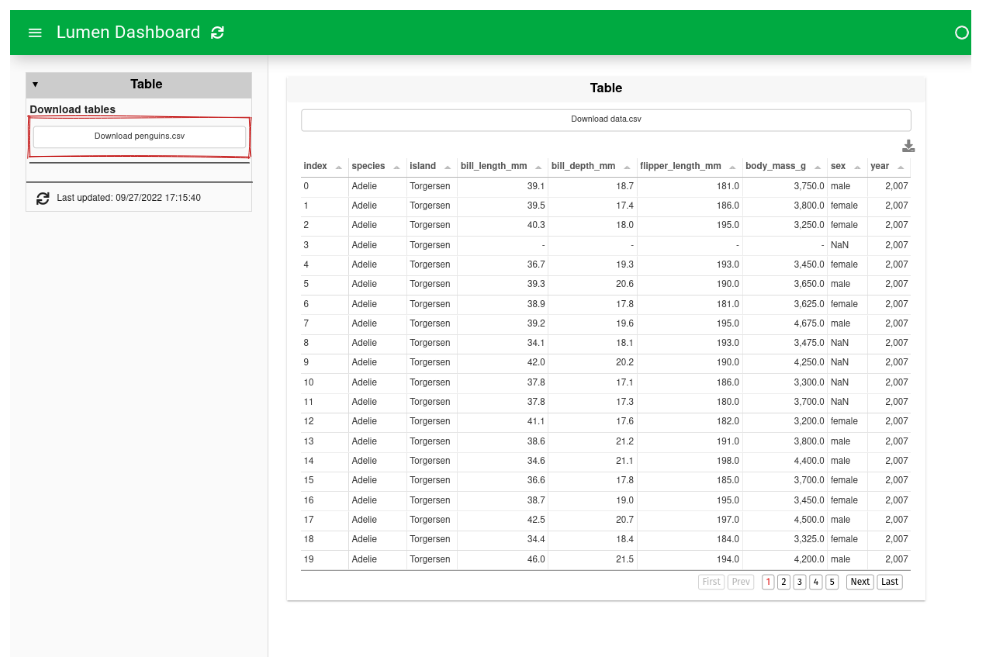
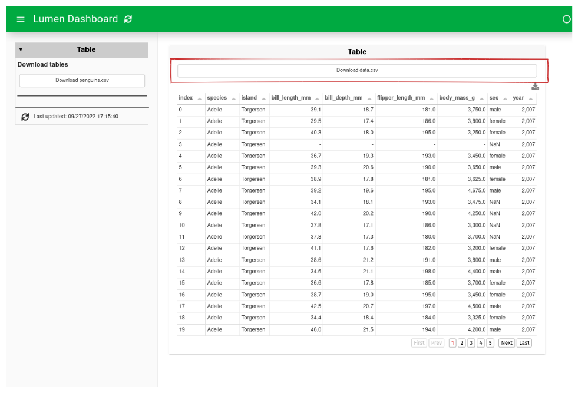
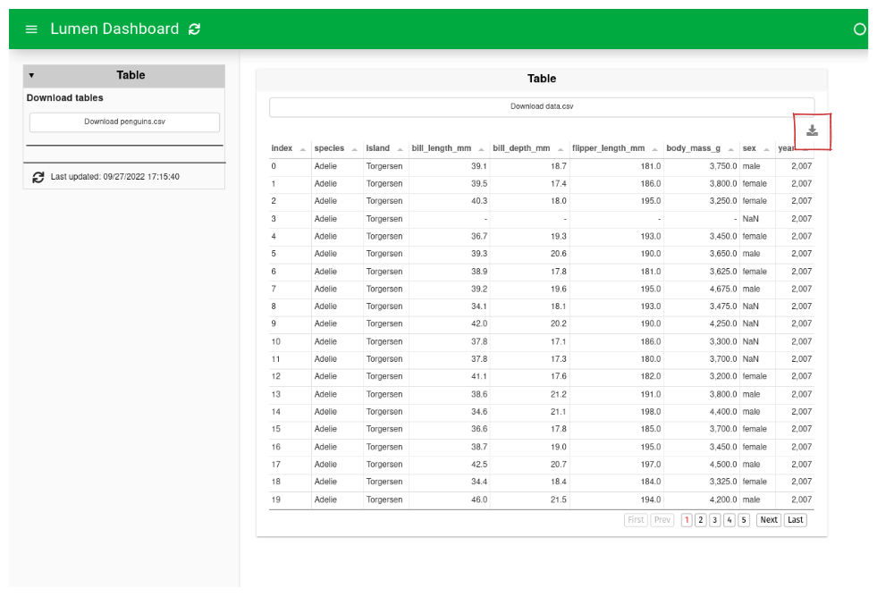

# How to download data

:::{admonition} What does this guide solve?
:class: important
This guide will go through how to let a user download data
:::

## Download data
There are several different ways to let a user download data.
This guide will show you three ways to do it.


::::{tab-set}
:::{tab-item} Method 1
``` {code-block} yaml
:emphasize-lines: 10
sources:
  penguins:
    type: file
    tables:
      penguins: https://raw.githubusercontent.com/rfordatascience/tidytuesday/master/data/2020/2020-07-28/penguins.csv

targets:
  - title: Table
    source: penguins
    download: csv
    views:
      - type: download
        format: csv
      - type: table
        table: penguins
        download: csv
```


:::

:::{tab-item} Method 2
``` {code-block} yaml
:emphasize-lines: 12-13
sources:
  penguins:
    type: file
    tables:
      penguins: https://raw.githubusercontent.com/rfordatascience/tidytuesday/master/data/2020/2020-07-28/penguins.csv

targets:
  - title: Table
    source: penguins
    download: csv
    views:
      - type: download
        format: csv
      - type: table
        table: penguins
        download: csv
```


:::

:::{tab-item} Method 3
``` {code-block} yaml
:emphasize-lines: 16
sources:
  penguins:
    type: file
    tables:
      penguins: https://raw.githubusercontent.com/rfordatascience/tidytuesday/master/data/2020/2020-07-28/penguins.csv

targets:
  - title: Table
    source: penguins
    download: csv
    views:
      - type: download
        format: csv
      - type: table
        table: penguins
        download: csv
```


:::
::::

:::{note}
The YAML specification for the example is the same, but the line used to create the specific download button is emphasized in the code and highlighted with a red box in the preview of the dashboard.
:::
