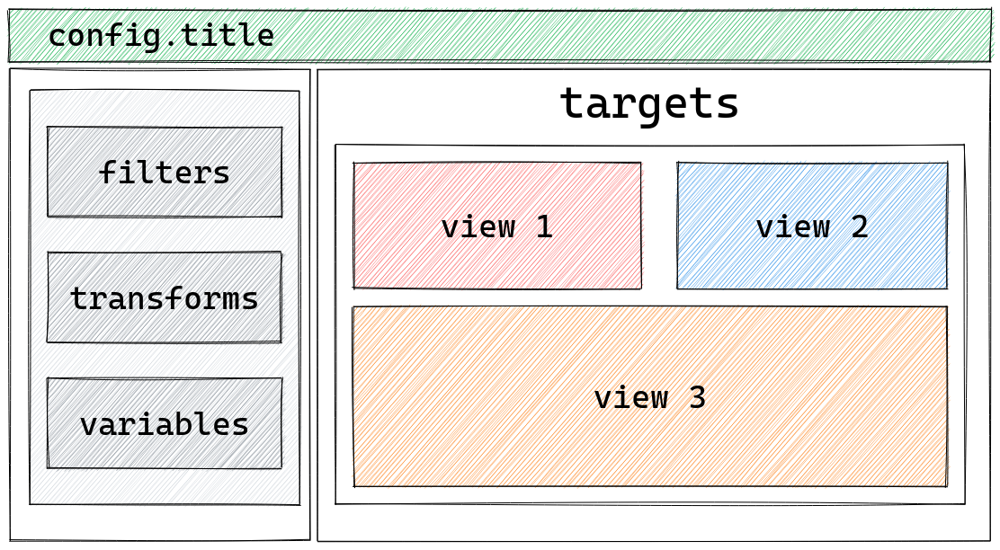

# How to define views

:::{admonition} What does this guide solve?
:class: important
This guide will go through how to define views on your dashboard
:::

## Defining views
A view is the final output of a dashboard.
Views are located in the target area and can be a table or numerous kinds of plots by utilizing the [Holoviz ecosystem](https://holoviz.org/).



Below is an example of two views a [hvplot](https://hvplot.holoviz.org/) and a table.

::::{tab-set}
:::{tab-item} Specification (YAML)
:sync: yaml
``` {code-block} yaml
:emphasize-lines: 10-14
sources:
  penguin_source:
    type: file
    tables:
      penguin_table: https://raw.githubusercontent.com/rfordatascience/tidytuesday/master/data/2020/2020-07-28/penguins.csv

targets:
  - title: Table
    source: penguin_source
    views:
      - type: hvplot
        table: penguin_table
      - type: table
        table: penguin_table
```
_The non-emphasized lines are only there to see the table when running `lumen serve file.yaml`._

:::

:::{tab-item} Pipeline (Python)
:sync: python
``` {code-block} python
:emphasize-lines: 14
import panel as pn
from lumen.pipeline import Pipeline
from lumen.views import Table, hvPlotView

pn.extension("tabulator")

data_url = "https://raw.githubusercontent.com/rfordatascience/tidytuesday/master/data/2020/2020-07-28/penguins.csv"
pipeline = Pipeline.from_spec(
    {
        "source": {"type": "file", "tables": {"penguin_table": data_url}},
    }
)

pn.Column(hvPlotView(pipeline=pipeline), Table(pipeline=pipeline))
```
_The non-emphasized lines are only there to have a table to cache when running the code_
:::
::::


:::{note}
The different views of Lumen can be found [here](../../reference/view/index.md).
:::
