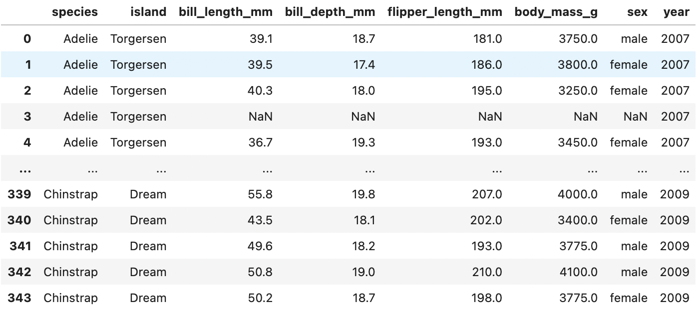
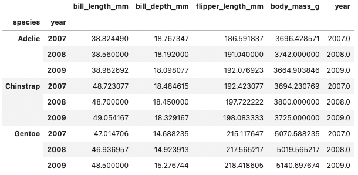

# Build a dashboard in Python

:::{admonition} What does this guide solve?
:class: important
Although the primary interface for building a Lumen dashboard is the `YAML specification file`, this guide shows you an alternate approaches for building with Python. To learn more, visit the [Lumen in Python](../conceptual/lumen_python) Conceptual Guide.
:::


## Overview
When building with Lumen in Python, the main object that defines a dashboard is the `Pipeline`. With this Pipeline object, you can specify the data source, filters, and transforms. There are two approaches to add these specifications to a `Pipeline` object, declaratively or programmatically. While the declarative approach is more compact, the programmatic approach allows you to seperate the pipeline creation steps.

## Declaratively specifying a pipeline

The declarative specification approach looks similar to a YAML file hierarchy, but consists of nested Python dictionary and list objects.

```python
import lumen
from lumen.pipeline import Pipeline

data_url = 'https://raw.githubusercontent.com/rfordatascience/tidytuesday/master/data/2020/2020-07-28/penguins.csv'

pipeline = Pipeline.from_spec({
    'source': {
        'type': 'file',
        'tables': {
            'penguins': data_url
        }
    },
    'filters': [
        {'type': 'widget', 'field': 'species'},
        {'type': 'widget', 'field': 'island'},
        {'type': 'widget', 'field': 'sex'}, 
        {'type': 'widget', 'field': 'year'}
    ],
    'transforms': [
        {'type': 'aggregate', 'method': 'mean', 'by': ['species', 'sex', 'year']}
    ]
})
```

## Programmatically specifying a pipeline

The programmatic specification approach uses Lumen objects to build the pipeline step by step.


First, add a valid `Source` to your `Pipeline`. A common choice is `FileSource`, which can load CSV, Excel, JSON and Parquet files, but see the [Source Reference](../architecture//source.html#:~:text=Source%20queries%20data.-,Source%20types%23,-class%20lumen.sources) for all options.

```python
from lumen.pipeline import Pipeline
from lumen.sources import FileSource

data_url = 'https://raw.githubusercontent.com/rfordatascience/tidytuesday/master/data/2020/2020-07-28/penguins.csv'

pipeline = Pipeline(source=FileSource(tables={'penguins': data_url}), table='penguins')
```
:::{admonition} Preview the data
:class: note
At any point after defining the source in your pipeline, you can inspect the data in a notebook with `pipeline.data`
:::

```python
pipeline.data
```



Next, you can add `widgets` for certain columns of your source. When displaying the dashboard, these widgets will allows your dashboard users to `filter` the data. See the [Filter Reference](../architecture/filter) for all options.

```python
# Filters
pipeline.add_filter('widget', field='species')
pipeline.add_filter('widget', field='island')
pipeline.add_filter('widget', field='sex')
pipeline.add_filter('widget', field='year')
```

Now you can apply a `transform` to the data, such as computing the mean of certain columns. See the [Transform Reference](../architecture/transform) for more.

```python
pipeline.add_transform('aggregate', method='mean', by=['species', 'year'])

pipeline.data
```


## Displaying the dashboard

Once your pipeline has been specified, you can use the `Panel` package to define the layout of your widgets and views, and then you can serve your dashboard within a notebook or from a Python script. See Panel's [Documentation](https://panel.holoviz.org/getting_started/index) to learn more about Panel components and deployment.

The simplest approach is to render the widgets with the `pipeline.control_panel` property alongside Lumen view components (e.g. `Table`, `hvPlotUIView`).

```python
from lumen.views import Table, hvPlotUIView
import panel as pn
pn.extension('tabulator', template='fast')

pn.Row(
    pipeline.control_panel.servable(area='sidebar'),
    pn.Tabs(
        ('Plot', hvPlotUIView(pipeline=pipeline, kind='scatter', x='bill_length_mm', y='bill_depth_mm', by='species')),
        ('Table', Table(pipeline=agg_pipeline))
    ).servable()
)
```

**TODO: ADD DASHBOARD PREVIEW HERE**

Related Resources:
* [Display data at different stages of the pipeline](ht_chain_python)
* [Apply SQL transforms while loading from source](ht_sql_transform)