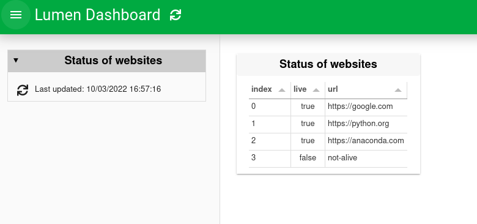
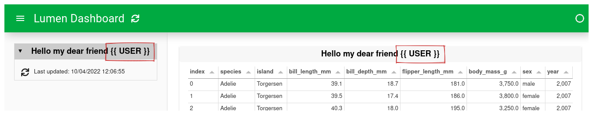
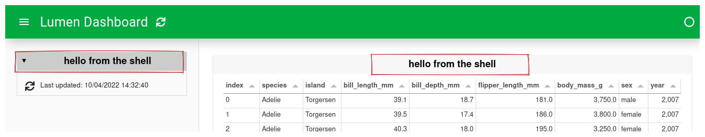

# How to use variables

:::{admonition} What does this guide solve?
:class: important
This guide shows you how to use one of the advanced features of Lumen: Variables.
:::

## Overview
Variables are one of the most powerful features of Lumen.
This guide will give you an overview of three different types of variables and how to reference them in the YAML specification.

As a rule of thumb, internal variables are referenced with a starting dollar sign `$`, whereas external references use double curly brackets before and after `{{ }}`.

## Variables


## Sources as variables
Below is a small example of using a source as a variable.
The example consists of two sources:
The first is a CSV file with a single column containing different website URLs.
The second is a live source that checks whether the URLs from the first source are alive or dead.

::::{tab-set}
:::{tab-item} YAML

``` {code-block} yaml
:emphasize-lines: 7

sources:
  csv:
    type: file
    files: [websites.csv]
  live:
    type: live
    urls: $csv.websites.url

targets:
- title: Status of websites
  source: live
  views:
    - type: table
```
:::

:::{tab-item} Preview



:::

:::{tab-item} CSV

_Save in the same folder as the YAML specification file and name it `websites.csv`._

``` {code-block} csv
url
https://google.com
https://python.org
https://anaconda.com
not-alive
```

:::
::::

The reference to the variable is built up as follows:
1) The name of the source to reference, `csv` in this case.
2) The table's name `websites`, which is the filename without an extension.
3) Which column of the table to look at `url`.

These three parts are combined into the following variable `$csv.websites.url`.


## External variables (templating)
The last way to reference variables is by using external variables.
There are six ways to do this, all of which use [Jinja2 templating](https://palletsprojects.com/p/jinja/) with the double curly brackets notation.

| Method               | How                    |
|----------------------|------------------------|
| Environment variable | `{{ env("USER") }}`    |
| Request cookies      | `{{ cookie("USER") }}` |
| Request header       | `{{ header("USER") }}` |
| OAuth user token     | `{{ oauth("USER") }}`  |


Furthermore, CLI arguments or shell commands can be used. See the sections below.

### Variables with the command line
To pass CLI arguments `--template-vars` should be used with `lumen serve`.

::::{tab-set}
:::{tab-item} YAML

``` {code-block} yaml
:emphasize-lines: 9
sources:
  source:
    type: file
    tables:
      table: https://raw.githubusercontent.com/rfordatascience/tidytuesday/master/data/2020/2020-07-28/penguins.csv


targets:
- title: Hello my dear friend {{ USER }}
  source: source
  views:
    - type: table
      table: table
```
:::

:::{tab-item} Correct Preview
Ran with `lumen serve cli_example.yml --template-vars="{'USER': 'lumen_user'}"`


:::

:::{tab-item} Faulty Preview
Ran with `lumen serve cli_example.yml`




:::
::::


### Variables with a shell command

The shell command is done by `{{ shell(COMMAND) }}` and then uses the output of the command.
It is worth noting that the output will be trimmed of any trailing whitespace.
As a very simple example `echo` can be used as the shell command.

::::{tab-set}
:::{tab-item} YAML

``` {code-block} yaml
:emphasize-lines: 9
sources:
  source:
    type: file
    tables:
      table: https://raw.githubusercontent.com/rfordatascience/tidytuesday/master/data/2020/2020-07-28/penguins.csv


targets:
- title: {{ shell("echo hello from the shell") }}
  source: source
  views:
    - type: table
      table: table
```
:::

:::{tab-item}  Preview


:::

::::
