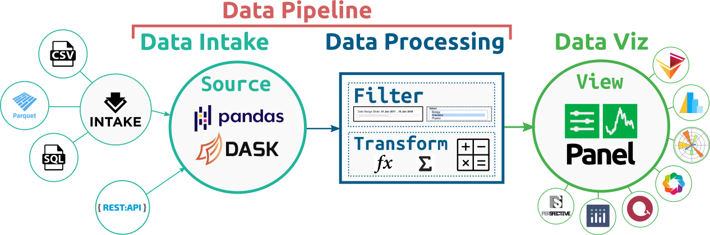
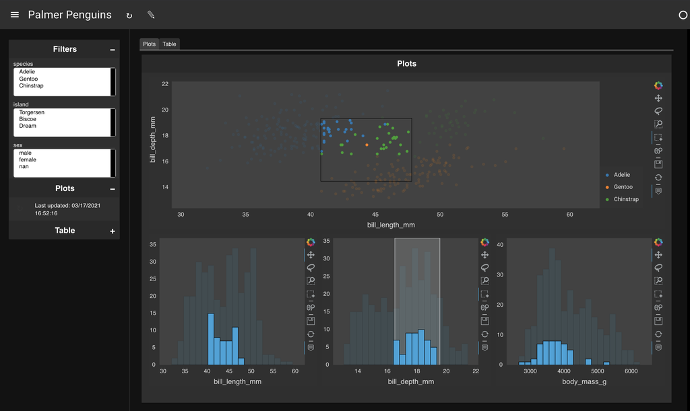
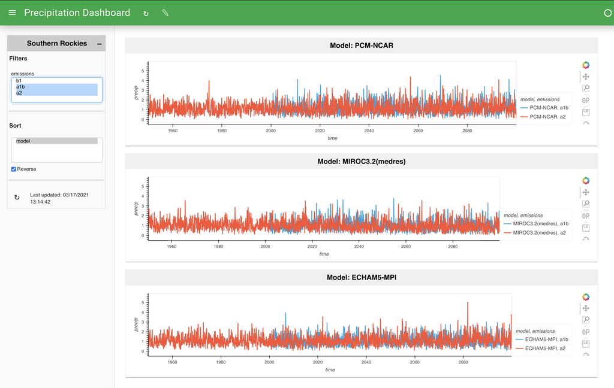

# Welcome to Lumen!



The Lumen project provides a framework for visual analytics, which allows users to build data-driven dashboards from a simple yaml specification. The power of Lumen comes from the ability to leverage the powerful data intake, data processing and data visualization libraries available in the PyData ecosystem.

- **Data Intake**: A flexible system for declaring data sources with strong integration with [Intake](https://intake.readthedocs.io/en/latest/), allows Lumen to query data from a wide range of sources including many file formats such as CSV or Parquet but also SQL and many others.
- **Data Proccessing**: Internally Lumen stores data as DataFrame objects, allowing users to leverage familiar APIs for filtering and transforming data using [Pandas](https://pandas.pydata.org/) while also providing the ability to scale these transformations out to a cluster thanks to [Dask](https://dask.org/).
- **Data Visualization**: Since Lumen is built on [Panel](https://panel.holoviz.org) all the most popular plotting libraries and many other components such as powerful datagrids and BI indicators are supported.

The core strengths of Lumen include:

- **Flexibility**: The design of Lumen allows flexibly combining data intake, data processing and data visualization into a simple declarative pipeline.
- **Extensibility**: Every part of Lumen is designed to be extended letting you define custom Source, Filter, Transform and View components.
- **Scalability**: Lumen is designed with performance in mind and supports scalable Dask DataFrames out of the box, letting you scale to datasets larger than memory or even scale out to a cluster.
- **Security**: Lumen ships with a wide range of OAuth providers out of the box, making it a breeze to add authentication to your applications.

## Examples

   <table>
     <tr>
       <td><a href="./gallery/bikes.html"><b>London Bike Points</b><br></a></td>
       <td><a href="./gallery/nyc_taxi.html"><b>NYC Taxi</b><br></a></td>
     </tr>
     <tr>
	   <td><a href="./gallery/penguins.html"><b>Palmer Penguins</b><br></a></td>
       <td><a href="./gallery/precip.html"><b>Precipitation</b><br></a></td>
     <tr>
   </table>


## Architecture

Lumen is organized into a small number of simple object types which can be easily subclassed and extended:

* `Source`: A `Source` provides any number of tables along with a JSON schema describing the contents of those tables.
* `Filter`: A `Filter` object is given the schema of a field in one of the tables and generates queries which filter the data supplied by a `Source`.
* `View`: A `View` can query a table from a `Source` and generates a viewable representation.
* `Transform`: A `Transform` can apply arbitrary transformation to the tables.

## Getting started

Lumen works with Python 3 and above on Linux, Windows, or Mac. The recommended way to install Lumen is using the [`conda`](https://conda.pydata.org/docs/) command provided by [Anaconda](https://docs.continuum.io/anaconda/install) or [`Miniconda`](https://conda.pydata.org/miniconda.html):

    conda install -c pyviz lumen

or using PyPI:

    pip install lumen

Once installed you will be able to start a Lumen server by running:

    lumen serve dashboard.yaml --show

This will open a browser serving the application or dashboard declared by your yaml file in a browser window. During development it is very helpful to use the `--autoreload` flag, which will automatically refresh and update the application in your browser window, whenever you make an edit to the dashboard yaml specification. In this way you can quickly iterate on your dashboard.

Try it out! Click on one of the examples below, copy the yaml specification and launch your first Lumen application.

```{toctree}
---
hidden: true
---
Home <self>
Dashboard Specification <dashboard>
Gallery <gallery/index>
Architecture <architecture/index>
REST Specification <rest>
```
