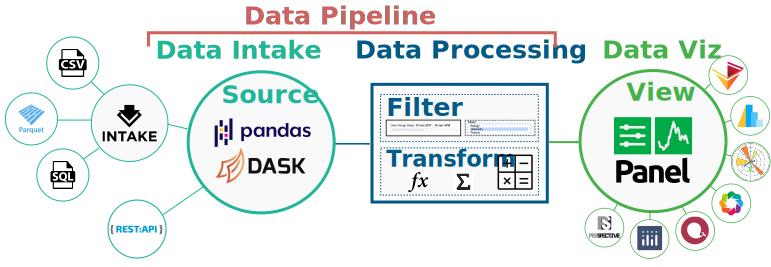

# Welcome to Lumen!



The Lumen project provides a framework to build data-driven dashboards
from a simple yaml specification. It is designed to query data from
any source, filter it in various ways and then provide views of that
information, which can be anything from a simply indicator to a table
or a plot.

Since Lumen is built on [Panel](https://panel.holoviz.org) it supports
a wide range of plotting libraries and other components to explore and
visualize data. Thanks to integration with
[Intake](https://intake.readthedocs.io/en/latest/), lightweight
package for finding, investigating, loading and disseminating data,
Lumen can query data from a wide range of sources including many file
formats such as CSV or Parquet but also SQL and many others.

Lumen is organized into a small number of simple object types which
can be easily subclassed and extended:

* `Source`: A `Source` provides any number of tables along with a JSON schema describing the contents of those tables.
* `Filter`: A `Filter` object is given the schema of a field in one of the tables and generates queries which filter the data supplied by a `Source`.
* `View`: A `View` can query a table from a `Source` and generates a viewable representation.
* `Transform`: A `Transform` can apply arbitrary transformation to the tables.


## Examples

   <table>
     <tr>
       <td><a href="./gallery/bikes.html"><b>London Bike Points</b><br></a></td>
       <td><a href="./gallery/nyc_taxi.html"><b>NYC Taxi</b><br></a></td>
     </tr>
     <tr>
	   <td><a href="./gallery/penguins.html"><b>Palmer Penguins</b><br></a></td>
       <td><a href="./gallery/precip.html"><b>Precipitation</b><br></a></td>
     <tr>
   </table>


```{toctree}
---
maxdepth: 2
caption: Contents
---
Home <self>
Dashboard Specification <dashboard>
Gallery <gallery/index>
Architecture <architecture/index>
REST Specification <rest>
```
